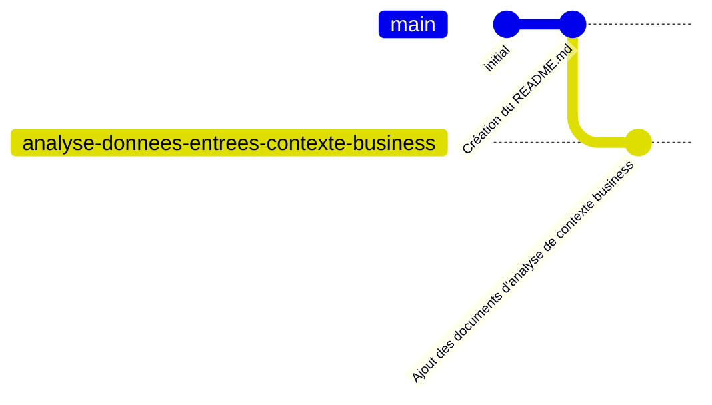

# Système de réservation de ressources

Ce projet contient une implémentation pas à pas d'un système de réservation de ressources (salles, véhicules, équipements) tel que décrit dans le cahier des charges (CCTP) fourni. Cette implémentation est réalisée à des fins de démonstration de la programmation basée sur la documentation en utilisant l'outil [Cline](https://github.com/cline/cline) et le LLM (Large Language Model - modèle de langage avancé capable de comprendre et générer du texte de façon proche de celle d'un humain) Anthropic Claude 3.7 Sonnet sur [Amazon BedRock](https://aws.amazon.com/fr/bedrock/claude/).

## Programmation basée sur la documentation et HST

La programmation basée sur la documentation (Documentation-Based Programming) est une approche de développement logiciel qui place les documents de spécification et de conception au cœur du processus de développement. Cette méthode s'appuie sur des documents de conception détaillés pour guider l'implémentation, garantissant ainsi que le code produit respecte fidèlement les exigences et l'architecture prévues.

L'approche HST (Hierarchical Semantic Tree) fournit un cadre structuré pour organiser et naviguer dans la documentation du projet. Elle utilise une hiérarchie de fichiers HSTC.md qui contiennent des résumés des documents enfants, créant ainsi une structure arborescente navigable qui permet de comprendre rapidement l'architecture et la conception du projet.

Pour utiliser cette approche avec Cline, le system prompt doit être chargé avec le contenu de ce [fichier de référence](https://github.com/jcjorel/cline-best-practices/blob/master/DOCUMENT_BASED_PROGRAMMING_SYSTEM_PROMPT.md).

## Prérequis

Cette démo utilise :
- L'intégration VSCode pour WSL2 avec Ubuntu 24.04
- La commande `aws configure` doit être pré-configurée avec des credentials AWS valides pour permettre l'accès à Amazon BedRock et aux fonctionnalités des modèles Claude
- Le serveur MCP perplexity-mcp nécessite une clé d'API Perplexity valide (Voir la [documentation officielle](https://docs.perplexity.ai/guides/getting-started) pour obtenir une clé)

## Serveurs MCP (Model Context Protocol)

Cline est épaulé par des serveurs Model Context Protocol (MCP) qui étendent ses capacités. Ces serveurs sont un prérequis pour l'utilisation optimale de l'environnement de développement. Tous les serveurs MCP ont été installés depuis la marketplace Cline, à l'exception de perplexity-mcp qui a été installé depuis [https://github.com/jsonallen/perplexity-mcp](https://github.com/jsonallen/perplexity-mcp).

Les serveurs MCP utilisés dans ce projet sont :

- **perplexity-mcp** : Permet d'effectuer des recherches web via Perplexity AI avec filtrage par récence.
- **Core Server** : Fournit des fonctionnalités fondamentales pour la compréhension des requêtes utilisateur.
- **awslabs.cdk-mcp-server** : Offre des conseils et des recommandations pour l'utilisation du CDK AWS.
- **awslabs.cost-analysis-mcp-server** : Permet d'analyser les coûts des projets CDK et de récupérer des informations de tarification AWS.
- **awslabs.aws-documentation-mcp-server** : Permet de rechercher et convertir la documentation AWS en format markdown.
- **FireCrawl** : Offre des capacités avancées de navigation web et d'extraction de contenu.
- **Git Tools** : Fournit des fonctionnalités de gestion de git, comme l'affichage de l'état du dépôt, des différences, la création de branches, etc.
- **Nova Canvas** : Permet de générer des images à l'aide d'Amazon Nova Canvas en utilisant des descriptions textuelles ou des palettes de couleurs.

Ces serveurs fournissent des outils et des ressources supplémentaires qui sont essentiels pour la mise en œuvre du projet selon l'approche basée sur la documentation.

## Structure des branches Git

Le projet est organisé avec différentes branches correspondant aux étapes de développement:

Au fil du développement, la structure des branches évoluera pour inclure des branches dédiées à chaque étape d'implémentation.

## Étapes d'implémentation

### Étape 0 : Mise en place projet

Cette étape préliminaire consiste à configurer l'environnement de développement et à mettre en place la structure initiale du projet. Elle comprend :
- La configuration des outils de développement (VSCode, WSL2, Ubuntu 24.04)
- La mise en place des serveurs MCP pour étendre les capacités de Cline
- La création de la documentation initiale du projet
- L'établissement de la structure de base du dépôt Git

**Conversations capturées :**
- [Création du README (22/04/2025)](coding_assistant/captured_chats/20250422-0822-readme_creation.md) - Mise en place du fichier README.md avec la description du projet et de l'approche basée sur la documentation

### Étape 1 : Analyse des besoins

L'analyse des besoins s'est concentrée sur l'étude du contexte business du système de réservation de ressources à partir du CCTP (Cahier des Clauses Techniques Particulières) et l'élaboration de documents de vision.

**Documents clés produits :**
- [46_CCTP_F_grpmt_logiciel_ressource_1389713110489.md](doc/46_CCTP_F_grpmt_logiciel_ressource_1389713110489.md) - Reformulation du CCTP original en format markdown
- [CONTEXTE_BUSINESS_CCTP.md](doc/CONTEXTE_BUSINESS_CCTP.md) - Analyse détaillée du contexte business extrait du CCTP
- [PR-FAQ.md](doc/PR-FAQ.md) - Document Press Release/FAQ décrivant le produit final selon la méthodologie Amazon
- [WORKING_BACKWARDS.md](doc/WORKING_BACKWARDS.md) - Document de vision "Working Backwards" décrivant l'expérience utilisateur cible

**Conversations capturées :**
- [Reformulation du CCTP PDF en Markdown (22/04/2025)](coding_assistant/captured_chats/20250422-1016-reformulation_cctp_pdf_en_markdown.md) - Conversion du CCTP du format PDF au format Markdown
- [Analyse du contexte business CCTP (22/04/2025)](coding_assistant/captured_chats/20250422-1031-analyse_contexte_business_cctp.md) - Extraction et analyse du contexte business à partir du CCTP

### Étape 2 : Conception du système

*À venir - Lien vers la conversation capturée*

### Étape 3 : Implémentation des fonctionnalités de base

*À venir - Lien vers la conversation capturée*

### Étape 4 : Implémentation des fonctionnalités avancées

*À venir - Lien vers la conversation capturée*

### Étape 5 : Intégration avec les systèmes existants

*À venir - Lien vers la conversation capturée*

### Étape 6 : Finalisation et tests

*À venir - Lien vers la conversation capturée*
