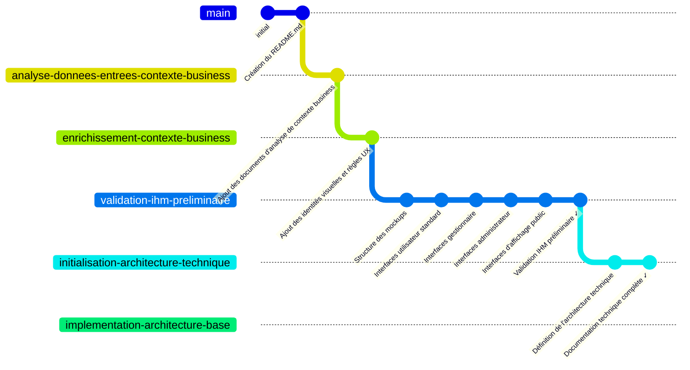

# Système de réservation de ressources

Ce projet contient une implémentation pas à pas d'un système de réservation de ressources (salles, véhicules, équipements) tel que décrit dans le cahier des charges (CCTP) fourni. Cette implémentation est réalisée à des fins de démonstration de la programmation basée sur la documentation en utilisant l'outil [Cline](https://github.com/cline/cline) et le LLM (Large Language Model - modèle de langage avancé capable de comprendre et générer du texte de façon proche de celle d'un humain) Anthropic Claude 3.7 Sonnet sur [Amazon BedRock](https://aws.amazon.com/fr/bedrock/claude/).

## Programmation basée sur la documentation et HST

La programmation basée sur la documentation (Documentation-Based Programming) est une approche de développement logiciel qui place les documents de spécification et de conception au cœur du processus de développement. Cette méthode s'appuie sur des documents de conception détaillés pour guider l'implémentation, garantissant ainsi que le code produit respecte fidèlement les exigences et l'architecture prévues.

L'approche HST (Hierarchical Semantic Tree) fournit un cadre structuré pour organiser et naviguer dans la documentation du projet. Elle utilise une hiérarchie de fichiers HSTC.md qui contiennent des résumés des documents enfants, créant ainsi une structure arborescente navigable qui permet de comprendre rapidement l'architecture et la conception du projet.

Pour utiliser cette approche avec Cline, le system prompt doit être chargé avec le contenu de ce [fichier de référence](https://github.com/jcjorel/cline-best-practices/blob/master/DOCUMENT_BASED_PROGRAMMING_SYSTEM_PROMPT.md).

## Prérequis

Cette démo utilise :
- L'intégration VSCode pour WSL2 avec Ubuntu 24.04
- La commande `aws configure` doit être pré-configurée avec des credentials AWS valides pour permettre l'accès à Amazon BedRock et aux fonctionnalités des modèles Claude
- Le serveur MCP perplexity-mcp nécessite une clé d'API Perplexity valide (Voir la [documentation officielle](https://docs.perplexity.ai/guides/getting-started) pour obtenir une clé)

## Serveurs MCP (Model Context Protocol)

Cline est épaulé par des serveurs Model Context Protocol (MCP) qui étendent ses capacités. Ces serveurs sont un prérequis pour l'utilisation optimale de l'environnement de développement. Tous les serveurs MCP ont été installés depuis la marketplace Cline, à l'exception de perplexity-mcp qui a été installé depuis [https://github.com/jsonallen/perplexity-mcp](https://github.com/jsonallen/perplexity-mcp).

Les serveurs MCP utilisés dans ce projet sont :

- **perplexity-mcp** : Permet d'effectuer des recherches web via Perplexity AI avec filtrage par récence.
- **Core Server** : Fournit des fonctionnalités fondamentales pour la compréhension des requêtes utilisateur.
- **awslabs.cdk-mcp-server** : Offre des conseils et des recommandations pour l'utilisation du CDK AWS.
- **awslabs.cost-analysis-mcp-server** : Permet d'analyser les coûts des projets CDK et de récupérer des informations de tarification AWS.
- **awslabs.aws-documentation-mcp-server** : Permet de rechercher et convertir la documentation AWS en format markdown.
- **FireCrawl** : Offre des capacités avancées de navigation web et d'extraction de contenu.
- **Git Tools** : Fournit des fonctionnalités de gestion de git, comme l'affichage de l'état du dépôt, des différences, la création de branches, etc.
- **Nova Canvas** : Permet de générer des images à l'aide d'Amazon Nova Canvas en utilisant des descriptions textuelles ou des palettes de couleurs.

Ces serveurs fournissent des outils et des ressources supplémentaires qui sont essentiels pour la mise en œuvre du projet selon l'approche basée sur la documentation.

## Structure des branches Git

Le projet est organisé avec différentes branches correspondant aux étapes de développement:

Au fil du développement, la structure des branches évoluera pour inclure des branches dédiées à chaque étape d'implémentation.

## Étapes d'implémentation

### Étape 1 : Création du projet (branche `master`)

Cette étape initiale consiste à configurer l'environnement de développement et à mettre en place la structure initiale du projet. Elle comprend :
- La configuration des outils de développement (VSCode, WSL2, Ubuntu 24.04)
- La mise en place des serveurs MCP pour étendre les capacités de Cline
- La création de la documentation initiale du projet (README.md)

**Conversations capturées :**
- [Création du README (22/04/2025)](coding_assistant/captured_chats/20250422-0822-readme_creation.md) - Mise en place du fichier README.md avec la description du projet et de l'approche basée sur la documentation

### Étape 2 : Analyse du contexte business (branche `analyse-donnees-entrees-contexte-business`)

Cette étape s'est concentrée sur l'étude du contexte business du système de réservation de ressources à partir du CCTP (Cahier des Clauses Techniques Particulières) et l'élaboration de documents de vision.

**Documents clés produits :**
- [46_CCTP_F_grpmt_logiciel_ressource_1389713110489.md](doc/46_CCTP_F_grpmt_logiciel_ressource_1389713110489.md) - Reformulation du CCTP original en format markdown
- [CONTEXTE_BUSINESS_CCTP.md](doc/CONTEXTE_BUSINESS_CCTP.md) - Analyse détaillée du contexte business extrait du CCTP
- [PR-FAQ.md](doc/PR-FAQ.md) - Document Press Release/FAQ décrivant le produit final selon la méthodologie Amazon
- [WORKING_BACKWARDS.md](doc/WORKING_BACKWARDS.md) - Document de vision "Working Backwards" décrivant l'expérience utilisateur cible

**Conversations capturées :**
- [Reformulation du CCTP PDF en Markdown (22/04/2025)](coding_assistant/captured_chats/20250422-1016-reformulation_cctp_pdf_en_markdown.md) - Conversion du CCTP du format PDF au format Markdown
- [Analyse du contexte business CCTP (22/04/2025)](coding_assistant/captured_chats/20250422-1031-analyse_contexte_business_cctp.md) - Extraction et analyse du contexte business à partir du CCTP

### Étape 3 : Enrichissement du contexte business (branche `enrichissement-contexte-business`)

Cette étape a permis d'enrichir le contexte business avec des ressources visuelles et UX pour les différentes entités impliquées dans le projet.

**Documents clés produits :**
- [UX_DESIGN.md](doc/UX_DESIGN.md) - Règles détaillées d'usage des logos dans l'interface utilisateur
- [identites_visuelles/](doc/identites_visuelles/) - Documents d'identité visuelle de chaque entité
  - [INDEX.md](doc/identites_visuelles/INDEX.md) - Index des identités visuelles avec diagramme des relations
  - Documents individuels pour Plaine Commune, Saint-Denis, DSIM, etc.
- [logos/](doc/logos/) - Logos SVG avec fond transparent pour utilisation dans les mockups

**Conversations capturées :**
- [Création branche enrichissement contexte business (22/04/2025)](coding_assistant/captured_chats/20250422-1050-creation_branche_enrichissement_contexte_business.md) - Création de la branche Git pour le travail d'enrichissement
- [Identités visuelles et UX logos (22/04/2025)](coding_assistant/captured_chats/20250422-1147-identites_visuelles_et_ux_logos.md) - Création des documents d'identité visuelle, des logos SVG et des règles UX

### Étape 4 : Validation IHM préliminaire (branche `validation-ihm-preliminaire`)

Cette étape visait à valider en amont les interfaces utilisateur du projet avant de procéder à leur implémentation complète. Cette validation préliminaire a permis au donneur d'ordre d'évaluer à la fois la forme (aspect visuel, ergonomie) et le fond (fonctionnalités, workflows) des interfaces proposées.

**Objectifs atteints :**
- Création d'une bibliothèque de composants UI réutilisables conforme aux identités visuelles
- Implémentation des maquettes HTML/CSS pour l'ensemble des interfaces utilisateur:
  - **Utilisateurs standards**: connexion, accueil, recherche, détail de ressource, confirmation de réservation, historique
  - **Gestionnaires**: tableau de bord, liste des demandes, détail des demandes, statistiques
  - **Administrateurs**: configuration système, gestion des ressources, gestion des utilisateurs, paramétrage des workflows
  - **Affichage public**: écran d'information pour hall d'accueil, planning journalier

**Documents clés produits :**
- [IHM_MOCKUPS.md](doc/mockups/IHM_MOCKUPS.md) - Spécifications détaillées de l'interface utilisateur
- [mockups/index.html](doc/mockups/index.html) - Point d'entrée pour naviguer entre les différentes maquettes
- [mockups/components/components-library.html](doc/mockups/components/components-library.html) - Bibliothèque de composants UI réutilisables

**Conversations capturées :**
- [Validation IHM préliminaire (22/04/2025)](coding_assistant/captured_chats/20250422-1315-validation_ihm_preliminaire.md) - Mise en place de la structure pour les mockups
- [Validation IHM administrateur (22/04/2025)](coding_assistant/captured_chats/20250422-1530-validation_ihm_administrateur.md) - Implémentation des interfaces administrateur

Cette approche a permis d'obtenir la validation formelle du donneur d'ordre, évitant ainsi des corrections coûteuses plus tard dans le cycle de développement, et assurant que le produit final répondra pleinement aux attentes des utilisateurs et du donneur d'ordre.

### Étape 5 : Initialisation de l'architecture technique (branche `initialisation-architecture-technique`) ✓

Cette étape a défini et mis en place l'architecture technique qui servira de fondation à l'implémentation du système de réservation de ressources. L'objectif était d'établir une structure solide répondant aux exigences techniques et aux contraintes définies dans le CCTP.

**Objectifs atteints :**
- Définition de l'architecture globale du système (backend, frontend, base de données)
- Établissement des choix technologiques détaillés adaptés aux contraintes des collectivités
- Documentation des principes d'architecture et des patterns de conception
- Mise en place de la structure de documentation HSTC (Hierarchical Semantic Tree Context)
- Création d'une documentation technique complète et cohérente

**Documents clés produits :**
- [DESIGN.md](doc/DESIGN.md) - Architecture détaillée du système avec diagrammes et justifications des choix techniques
- [DATA_MODEL.md](doc/DATA_MODEL.md) - Modélisation complète des données avec schémas et requêtes optimisées
- [API.md](doc/API.md) - Documentation complète des endpoints API REST et structure des échanges
- [SECURITY.md](doc/SECURITY.md) - Architecture de sécurité et mesures de protection des données
- [CONFIGURATION.md](doc/CONFIGURATION.md) - Système de configuration avec paramétrage par environnement
- [DOCUMENT_RELATIONSHIPS.md](doc/DOCUMENT_RELATIONSHIPS.md) - Documentation des relations entre les différents documents
- [GENAI_HEADER_TEMPLATE.txt](coding_assistant/GENAI_HEADER_TEMPLATE.txt) et [GENAI_FUNCTION_TEMPLATE.txt](coding_assistant/GENAI_FUNCTION_TEMPLATE.txt) - Templates pour la documentation du code

**Conversations capturées :**
- [Initialisation architecture technique (22/04/2025)](coding_assistant/captured_chats/20250422-1736-initialisation_architecture_technique.md) - Création de la branche Git et mise à jour du README pour la nouvelle étape
- [Création documentation technique (22/04/2025)](coding_assistant/captured_chats/20250422-2318-creation_documentation_technique.md) - Élaboration des documents d'architecture technique détaillés

Cette étape a permis d'établir une documentation technique robuste qui servira de référence tout au long du développement du projet, assurant ainsi la cohérence de l'implémentation avec les exigences définies et l'architecture prévue.

## Prochaine étape

La prochaine étape (branche `implementation-architecture-base`) consistera à mettre en place l'infrastructure de base du projet selon l'architecture technique définie. Elle comprendra:

1. La mise en place de l'environnement de développement avec Docker Compose
2. La configuration initiale des services AWS (VPC, ECS, Aurora PostgreSQL)
3. La création des structures de base de données à partir du modèle de données défini
4. L'implémentation du squelette de l'API backend avec FastAPI
5. La configuration de l'authentification et des autorisations RBAC
6. La mise en place du frontend React avec Material-UI selon les maquettes validées

Cette étape posera les fondations techniques qui permettront ensuite l'implémentation progressive des fonctionnalités métier du système de réservation de ressources.
