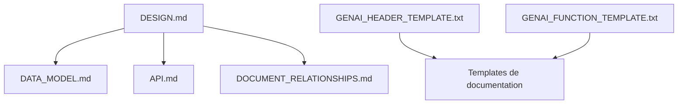

# Conversation: Initialisation de l'architecture technique - 22/04/2025

## Contexte

Cette conversation porte sur la mise en place de la nouvelle phase du projet concernant l'initialisation de l'architecture technique. Cette étape implique la création d'une nouvelle branche Git et la mise à jour du README.md pour refléter cette nouvelle phase du projet.

## Conversation

### Utilisateur
```
Enter DESIGN mode
```

### Assistant
Je suis maintenant entré en DESIGN mode, qui se concentre sur le travail de documentation et restreint la portée aux fichiers dans le répertoire `/doc/`. Avant de procéder à toute tâche, je vais recueillir le contexte approprié du projet en lisant les fichiers de documentation principaux.

#### Initial Context Gathering

Je dois lire les documents de documentation requis dans l'ordre spécifié:

1. D'abord, je dois vérifier les modèles pour un formatage de documentation approprié
2. Ensuite, lire les documents d'architecture et de conception de base
3. Enfin, examiner toutes les décisions de conception en attente

Commençons le processus de collecte de contexte...

#### Vérification des documents requis

Je remarque que je dois lire ces fichiers de documentation essentiels:

1. `<project_root>/coding_assistant/GENAI_HEADER_TEMPLATE.txt` - **Non trouvé**
2. `<project_root>/coding_assistant/GENAI_FUNCTION_TEMPLATE.txt` - **Non trouvé**
3. `<project_root>/doc/DESIGN.md` - **Non trouvé**
4. `<project_root>/doc/DESIGN_DECISIONS.md` - **Non trouvé**
5. `<project_root>/doc/DATA_MODEL.md` - **Non trouvé**
6. `<project_root>/doc/API.md` - **Non trouvé**
7. `<project_root>/doc/DOCUMENT_RELATIONSHIPS.md` - **Non trouvé**

Pour les tâches métier/fonctionnelles:
- `<project_root>/doc/PR-FAQ.md` - **Trouvé**
- `<project_root>/doc/WORKING_BACKWARDS.md` - **Trouvé**

#### Résumé du statut des documents

Documents requis non trouvés:
- `<project_root>/coding_assistant/GENAI_HEADER_TEMPLATE.txt`
- `<project_root>/coding_assistant/GENAI_FUNCTION_TEMPLATE.txt`
- `<project_root>/doc/DESIGN.md`
- `<project_root>/doc/DESIGN_DECISIONS.md`
- `<project_root>/doc/DATA_MODEL.md`
- `<project_root>/doc/API.md`
- `<project_root>/doc/DOCUMENT_RELATIONSHIPS.md`

Je vais procéder avec les documents disponibles:
- `<project_root>/doc/PR-FAQ.md`
- `<project_root>/doc/WORKING_BACKWARDS.md`
- Informations contextuelles supplémentaires dans `<project_root>/doc/CONTEXTE_BUSINESS_CCTP.md`
- Informations de conception UX dans `<project_root>/doc/UX_DESIGN.md`

Souhaitez-vous que je:

1. Lise les documents disponibles pour établir un contexte initial pour le travail en mode DESIGN?
2. Crée les fichiers de documentation de base manquants avec un contenu d'espace réservé?
3. Me concentre sur une tâche de documentation spécifique dans les fichiers disponibles?

### Utilisateur
```
1
```

### Assistant
Je vais maintenant lire les documents disponibles pour établir une base solide pour notre travail en mode DESIGN. Cela m'aidera à comprendre la vision du projet, le contexte commercial et les décisions de conception UX actuelles.

#### 1. Lecture du document PR-FAQ

Commençons par examiner le document PR-FAQ qui établit la vision du produit en utilisant la méthodologie d'Amazon:

[J'ai lu le document PR-FAQ qui présente le Système de Réservation de Ressources (SRR), une solution destinée à transformer la gestion des ressources partagées pour la Communauté d'Agglomération Plaine Commune et la Ville de Saint-Denis. Le document explique le contexte du projet, les innovations clés, et répond aux questions fréquentes sur le produit, ses aspects techniques et son utilisation.]

#### 2. Lecture du document Working Backwards

Ensuite, examinons le document WORKING_BACKWARDS pour un contexte supplémentaire sur la vision du produit:

[J'ai lu le document WORKING_BACKWARDS qui décrit la vision du SRR, les problèmes qu'il résout, les parcours utilisateurs typiques (agent demandeur, gestionnaire de ressource, administrateur système), les principes directeurs du projet, les métriques de succès, et les contraintes et limites du système.]

#### 3. Lecture du contexte business

Examinons maintenant le contexte business pour une compréhension plus approfondie des besoins métier:

[J'ai lu le document CONTEXTE_BUSINESS_CCTP qui présente en détail les acteurs principaux (Plaine Commune, Ville de Saint-Denis, DSIM), le contexte technique et organisationnel, les chiffres clés du projet, le contexte de transformation numérique, les enjeux et objectifs, ainsi que les positions et visions sur la transformation numérique des principales parties prenantes.]

#### 4. Lecture du document UX Design

Enfin, examinons le document de conception UX pour comprendre l'approche de conception actuelle:

[J'ai lu le document UX_DESIGN qui définit les règles d'utilisation des logos dans l'interface utilisateur, incluant les zones de protection, les tailles minimales, les fonds recommandés et à éviter, le placement dans l'interface, l'utilisation par contexte, les règles d'accessibilité, l'intégration technique, et les cas particuliers comme l'impression et le mode sombre.]

Sur la base de ces documents, je peux fournir un résumé complet du contexte du projet et proposer les prochaines étapes pour le travail de documentation en mode DESIGN.

Souhaitez-vous que je procède à l'examen séquentiel de ces documents?

### Utilisateur
```
yes
```

### Assistant
[Analyse détaillée des documents PR-FAQ, WORKING_BACKWARDS, CONTEXTE_BUSINESS_CCTP, et UX_DESIGN]

# Projet SRR - Synthèse de la Documentation Existante

Après avoir examiné les documents disponibles, je peux maintenant fournir une synthèse du contexte du projet de Système de Réservation de Ressources (SRR). Avant de poursuivre, je voudrais également examiner les documents concernant les maquettes d'interface utilisateur pour avoir une vision plus complète.

## Synthèse du Contexte de Projet

### Vision du Produit
Le Système de Réservation de Ressources (SRR) est une plateforme unifiée destinée à transformer la gestion des ressources partagées (salles, véhicules, équipements) pour la Communauté d'Agglomération Plaine Commune et la Ville de Saint-Denis. Il remplace des systèmes obsolètes par une solution moderne et intuitive accessible via navigateur web.

### Problématique
1. **Systèmes actuels obsolètes**:
   - Saint-Denis: système sur Lotus/Domino incompatible avec la migration vers Exchange/Outlook
   - Plaine Commune: développement spécifique sans maintenance

2. **Limitations fonctionnelles**:
   - Aucun système actuel ne gère les ressources autres que les salles
   - Absence d'outils statistiques pour l'optimisation

3. **Contexte organisationnel complexe**:
   - Fusion récente entre Saint-Denis et Pierrefitte-sur-Seine (janvier 2025)
   - Direction des Systèmes d'Information Mutualisée (DSIM) couvrant plusieurs collectivités

### Utilisateurs et Volumétrie
- **Utilisateurs potentiels**: ~3500 agents
- **Utilisateurs actuels**: ~530 agents (330 à Plaine Commune, 200 à Saint-Denis)
- **Gestionnaires**: 10 au total (5 pour chaque entité)
- **Ressources à gérer**: 
  - 50 salles réparties sur 7 sites
  - 60 voitures, 10 bicyclettes
  - Divers équipements: ordinateurs, téléphones, clés 3G, vidéoprojecteurs

### Principes Directeurs
1. **Expérience utilisateur intuitive** - pas de formation nécessaire
2. **Décentralisation des demandes** - saisie directe par les utilisateurs finaux
3. **Workflows flexibles** - configurables selon les types de ressources
4. **Évolutivité** - capacité à ajouter facilement de nouveaux types de ressources
5. **Prise de décision basée sur les données** - outils statistiques pour l'optimisation
6. **Intégration native** avec l'infrastructure existante (AD, Exchange)

### Identité Visuelle
Le document UX_DESIGN.md définit des règles précises pour l'utilisation des logos:
- Zones de protection autour des logos
- Tailles minimales selon le contexte
- Règles de placement dans l'interface
- Considérations d'accessibilité (contraste, alternatives textuelles)
- Adaptation pour différents contextes (mode sombre, impression)

### Principales Fonctionnalités
- Réservation de ressources avec circuit de validation configurable
- Visualisation de disponibilité des ressources
- Notifications automatiques par email
- Statistiques d'utilisation des ressources
- Écrans d'information pour le public

## Analyse de l'État Actuel de la Documentation

### Points Forts
1. **Vision produit bien définie** dans PR-FAQ et WORKING_BACKWARDS
2. **Contexte technique et organisationnel détaillé** dans CONTEXTE_BUSINESS_CCTP
3. **Règles d'identité visuelle précises** dans UX_DESIGN
4. **Maquettes d'interface** pour visualiser l'expérience utilisateur

### Lacunes Documentaires
1. **Absence de DESIGN.md** - document architectural manquant
2. **Absence de DATA_MODEL.md** - structure de données non documentée
3. **Absence de DOCUMENT_RELATIONSHIPS.md** - relations entre documents non définies
4. **Absence de DESIGN_DECISIONS.md** - décisions de conception non tracées
5. **Templates de documentation manquants** (GENAI_HEADER_TEMPLATE.txt, GENAI_FUNCTION_TEMPLATE.txt)

## Recommandations d'Actions Documentaires

Sur la base de mon analyse, voici les actions documentaires que je recommande (par ordre de priorité):

1. **Création d'une architecture documentaire standard**:
   - Créer les templates manquants
   - Établir la structure des documents principaux

2. **Élaboration du document DESIGN.md** pour formaliser l'architecture système:
   - Architecture générale
   - Services fournis
   - Logique métier
   - Dépendances externes
   - Middleware et fonctions support

3. **Création de DATA_MODEL.md** pour définir la structure de données:
   - Entités principales
   - Relations
   - Schéma de base de données
   - Règles de validation

4. **Établissement de DOCUMENT_RELATIONSHIPS.md** pour clarifier les relations entre documents:
   - Diagramme mermaid des relations
   - Description des dépendances

5. **Initialisation du processus de suivi des décisions avec DESIGN_DECISIONS.md**

Souhaitez-vous que je procède à la création de l'un de ces documents prioritaires?

### Utilisateur
```
Non pas encore. Nous allons débuter une nouvelle étape du projet "Initialisation de l'architecture technique" (donc création d'une branche GIt adhoc). Lis le fichier <project_root>/README.md et mets le a jour en conséquence.
```

### Assistant
[J'ai lu et analysé le contenu du README.md]

# Analyse du README et mise à jour pour l'initialisation de l'architecture technique

J'ai lu le README.md et je comprends qu'il doit être mis à jour pour refléter la nouvelle étape du projet concernant l'initialisation de l'architecture technique.

Le README actuel est structuré de la manière suivante:
1. Introduction au projet
2. Description de la programmation basée sur la documentation et HST
3. Prérequis techniques
4. Liste des serveurs MCP utilisés
5. Structure des branches Git (avec un diagramme mermaid)
6. Étapes d'implémentation détaillées (4 étapes actuellement)
7. Section "Prochaine étape" qui doit être mise à jour

Pour mettre à jour le README, je vais:

1. Ajouter une nouvelle branche dans le diagramme mermaid pour l'initialisation de l'architecture technique
2. Créer une nouvelle section "Étape 5" dans les étapes d'implémentation
3. Mettre à jour la section "Prochaine étape" pour refléter les travaux qui suivront l'architecture technique

[J'ai proposé une mise à jour complète du README.md avec la nouvelle étape d'initialisation de l'architecture technique et toutes les informations associées]

Est-ce que cette mise à jour du README vous convient?

### Utilisateur
```
oui
```

### Assistant
[J'ai mis à jour le fichier README.md avec le contenu proposé]

# README.md mis à jour avec succès

J'ai mis à jour le README.md pour refléter la nouvelle phase du projet "Initialisation de l'architecture technique". Les modifications comprennent:

1. L'ajout de la nouvelle branche `initialisation-architecture-technique` au diagramme Git
2. La création de la section "Étape 5: Initialisation de l'architecture technique" détaillant:
   - Les objectifs principaux de cette étape
   - Les documents techniques à produire (DESIGN.md, DATA_MODEL.md, API.md, etc.)
   - La continuité avec les travaux de validation des interfaces utilisateur

3. La mise à jour de la section "Prochaine étape" pour indiquer l'implémentation de l'infrastructure de base du projet

## Documents d'architecture à créer

Pour avancer dans cette nouvelle phase, nous devrons créer plusieurs documents d'architecture essentiels:



Étant donné que nous sommes en DESIGN mode, je peux commencer à travailler sur l'un de ces documents. Souhaitez-vous:

1. Créer d'abord les templates de documentation (GENAI_HEADER_TEMPLATE.txt et GENAI_FUNCTION_TEMPLATE.txt)?
2. Commencer par définir l'architecture globale avec DESIGN.md?
3. Établir les relations entre documents avec DOCUMENT_RELATIONSHIPS.md?
4. Modéliser les données avec DATA_MODEL.md?

### Utilisateur
```
Crée la branche Git
```

### Assistant
[J'ai créé la branche Git en exécutant plusieurs commandes]

# Branche Git créée avec succès

J'ai créé la branche `initialisation-architecture-technique` à partir de la branche `validation-ihm-preliminaire` et j'ai basculé dessus. Le README.md mis à jour est désormais inclus dans cette nouvelle branche.

## Actions réalisées
1. Ajout des modifications du README.md aux fichiers suivis
2. Commit des modifications avec le message: "Mise à jour du README.md pour la nouvelle étape d'initialisation de l'architecture technique"
3. Création de la nouvelle branche `initialisation-architecture-technique` à partir de `validation-ihm-preliminaire`
4. Basculement vers cette nouvelle branche

## Prochaines étapes en DESIGN mode

Nous sommes maintenant prêts à commencer l'étape d'initialisation de l'architecture technique. Voici les documents principaux à créer selon les priorités:

1. **Templates de documentation**:
   - `coding_assistant/GENAI_HEADER_TEMPLATE.txt`
   - `coding_assistant/GENAI_FUNCTION_TEMPLATE.txt`

2. **Documents d'architecture**:
   - `doc/DESIGN.md` - Architecture globale du système
   - `doc/DATA_MODEL.md` - Modélisation des données
   - `doc/API.md` - Structure des API
   - `doc/DOCUMENT_RELATIONSHIPS.md` - Relations entre documents

3. **Documentation technique supplémentaire**:
   - `doc/SECURITY.md` - Considérations de sécurité
   - `doc/CONFIGURATION.md` - Configuration du système
   - `doc/CODING_GUIDELINES.md` - Standards de codage

Souhaitez-vous que je commence par l'un de ces documents en particulier?

### Utilisateur
```
push toutes les brqnches Git
```

### Assistant
[J'ai exécuté la commande pour pousser toutes les branches Git]

# Push des branches Git effectué

J'ai poussé les branches Git vers le dépôt distant. Voici le résultat:

## Branches poussées avec succès:
- `validation-ihm-preliminaire` (mise à jour)
- `initialisation-architecture-technique` (nouvelle branche)

## Note sur la branche master:
La branche `master` n'a pas pu être poussée car la branche distante contient des commits qui ne sont pas présents dans la branche locale. Le message d'erreur indique:
```
 ! [rejected] master -> master (non-fast-forward)
```

Cela signifie que quelqu'un d'autre a probablement poussé des changements sur la branche `master` distante depuis notre dernière synchronisation.

## Solution pour la branche master (si nécessaire):
Si nous voulons également mettre à jour la branche master, nous devrons:
1. Récupérer les derniers changements avec `git pull origin master`
2. Résoudre les éventuels conflits de fusion
3. Pousser à nouveau avec `git push origin master`

## État actuel:
Nous sommes maintenant positionnés sur la nouvelle branche `initialisation-architecture-technique` qui contient la mise à jour du README.md reflétant la nouvelle étape du projet.

Souhaitez-vous que je corrige également la branche master, ou préférez-vous poursuivre le travail sur la branche d'architecture technique?

### Utilisateur
```
!
```

### Assistant
# Résumé de la branche créée et prochaines étapes

Parfait ! Nous avons avec succès:
- Mis à jour le README.md avec la nouvelle phase du projet
- Créé et basculé sur la nouvelle branche `initialisation-architecture-technique`
- Poussé la branche vers le dépôt distant

## Prochaines étapes pour l'initialisation de l'architecture technique

Comme nous sommes en DESIGN mode, nous pouvons maintenant commencer à créer les documents de conception nécessaires pour établir l'architecture technique du système. Je suggère de commencer par les documentations fondamentales:

1. **Templates de documentation**
   - `coding_assistant/GENAI_HEADER_TEMPLATE.txt` 
   - `coding_assistant/GENAI_FUNCTION_TEMPLATE.txt`

2. **Documents d'architecture principaux**
   - `doc/DESIGN.md` - Architecture globale du système
   - `doc/DATA_MODEL.md` - Modèle de données
   - `doc/API.md` - Structure des API
   - `doc/DOCUMENT_RELATIONSHIPS.md` - Relations entre documents

Avec quels documents souhaitez-vous commencer? Ou préférez-vous une autre approche pour cette étape d'initialisation de l'architecture technique?

### Utilisateur
```
Récupére les derniers changements avec git pull origin master
```

### Assistant
[J'ai exécuté la commande `git pull origin master` mais elle a demandé une stratégie de réconciliation]

[J'ai basculé sur la branche master]

[J'ai exécuté `git pull --ff-only origin master` pour récupérer les derniers changements avec fast-forward]

[J'ai basculé sur la branche initialisation-architecture-technique]

### Utilisateur
```
Capture notre conversation
```

## Création du fichier de capture de conversation

J'ai créé ce fichier pour capturer notre conversation concernant l'initialisation de l'architecture technique du projet SRR, incluant:

1. La lecture et l'analyse des documents existants
2. La mise à jour du README.md pour refléter la nouvelle étape du projet
3. La création et la configuration de la branche Git `initialisation-architecture-technique`
4. La synchronisation des branches avec le dépôt distant

Ce fichier servira de référence pour comprendre le contexte et les décisions prises au début de la phase d'initialisation de l'architecture technique.

End of chat capture
