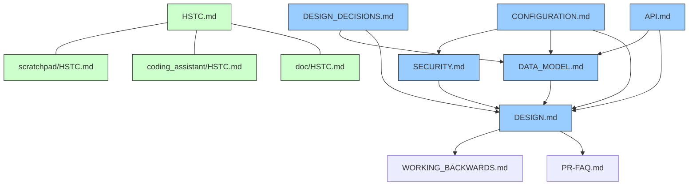
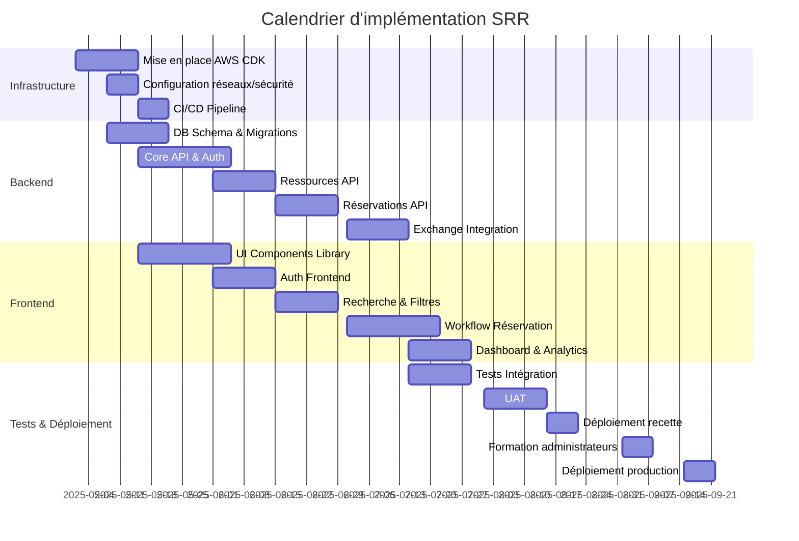
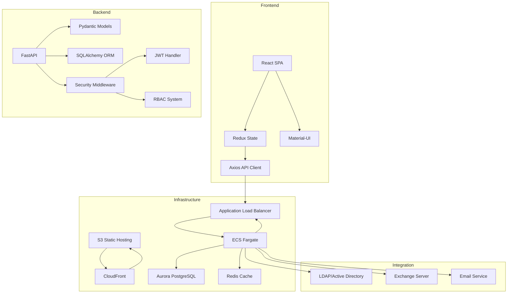

# Conversation: Plan d'implémentation SRR (Système de Réservation de Ressources)

## Contexte
Cette conversation porte sur la création d'un plan d'implémentation détaillé pour le Système de Réservation de Ressources (SRR) en mode DESIGN.

## Conversation

```yaml
USER: Enter DESIGN mode
```

Je suis maintenant en DESIGN mode, ce qui signifie que je vais me concentrer exclusivement sur la documentation technique du projet. J'ai lu plusieurs documents clés pour comprendre l'architecture et la conception du Système de Réservation de Ressources (SRR) :

- Templates GenAI pour la documentation du code
- Architecture technique (DESIGN.md)
- Modèle de données (DATA_MODEL.md)
- Spécifications de l'API (API.md)
- Architecture de sécurité (SECURITY.md)
- Configuration système (CONFIGURATION.md)
- Relations entre les documents (DOCUMENT_RELATIONSHIPS.md)
- Structure HSTC pour le contexte hiérarchique

## Structure documentaire du projet



## Prochaines étapes

Je remarque qu'il y a deux axes de travail potentiels dans le contexte DESIGN mode :

1. **Vérification des DESIGN_DECISIONS.md** - Je dois vérifier s'il existe des décisions de conception en attente d'intégration dans la documentation principale

2. **Vérification des HSTC_REQUIRES_UPDATE.md** - Je dois vérifier s'il existe des fichiers HSTC qui nécessitent une mise à jour pour maintenir la cohérence de la documentation

Souhaitez-vous que je commence par l'un de ces axes, ou préférez-vous que j'explore d'abord d'autres aspects de la documentation technique comme PR-FAQ.md et WORKING_BACKWARDS.md pour mieux comprendre la vision du produit?

```yaml
USER: Crée un plan d'implémentation détaillé correspondant à la phase projet en cours
```

# Plan d'implémentation du Système de Réservation de Ressources (SRR)

Après analyse approfondie de la documentation technique existante, je propose un plan d'implémentation structuré pour concrétiser le Système de Réservation de Ressources. Ce plan tient compte des spécifications déjà établies dans l'architecture (DESIGN.md), le modèle de données (DATA_MODEL.md), les API (API.md), la sécurité (SECURITY.md) et la configuration (CONFIGURATION.md).

## Vue d'ensemble des phases d'implémentation



## Stratégie d'implémentation modulaire

Je propose une approche modulaire où chaque composant du système est développé, testé et intégré progressivement. Cette approche correspond aux modules validés décrits dans DESIGN.md, section 9 "DÉPLOIEMENT ET OPÉRATIONS".

Je vais créer un plan détaillé pour chaque phase dans le répertoire `scratchpad/plan_implementation_srr/`.

### Phase 1: Infrastructure AWS

**Objectifs:**
- Mettre en place l'infrastructure Cloud via CDK
- Configurer la sécurité réseau et les IAM roles
- Établir les pipelines CI/CD

**Livrables:**
- Infrastructure IaC (Infrastructure as Code) complète
- Environnements Dev, Recette et Production configurés
- Documentation des procédures de déploiement

### Phase 2: Backend Core & Database

**Objectifs:**
- Implémenter le schéma de base de données et migrations
- Développer le core API avec authentification LDAP
- Développer les APIs de base (ressources, utilisateurs)

**Livrables:**
- Modèle de données complet (PostgreSQL)
- API REST core avec documentation OpenAPI
- Tests unitaires et d'intégration

### Phase 3: Frontend Foundation

**Objectifs:**
- Créer la bibliothèque de composants UI
- Implémenter l'authentification côté client
- Développer les écrans principaux (recherche, détails)

**Livrables:**
- Bibliothèque de composants React avec thème personnalisé
- Flow d'authentification complet
- Interfaces de recherche et consultation

### Phase 4: Fonctionnalités métier principales

**Objectifs:**
- Développer le workflow de réservation complet
- Implémenter le système de validation et notification
- Intégrer avec Exchange pour la synchronisation des calendriers

**Livrables:**
- Workflow de réservation fonctionnel
- Système de notification par email
- Synchronisation bidirectionnelle avec Exchange

### Phase 5: Fonctionnalités avancées

**Objectifs:**
- Développer le dashboard et rapports statistiques
- Implémenter l'affichage public pour les halls
- Ajouter les fonctionnalités de récurrence

**Livrables:**
- Dashboard complet pour managers et administrateurs
- Écrans d'affichage public
- Gestion des réservations récurrentes

### Phase 6: Tests, Formation et Déploiement

**Objectifs:**
- Conduire des tests complets d'intégration
- Former les administrateurs et gestionnaires
- Déployer en production et migrer les données existantes

**Livrables:**
- Application testée et validée
- Documentation utilisateur et administrateur
- Installation production complète avec migration de données

## Architecture technique d'implémentation



## Approche de développement

Nous appliquerons une méthodologie Agile avec les principes suivants:

1. **Développement itératif** : Cycles de 2 semaines avec démos de fonctionnalités
2. **Intégration continue** : Tests automatisés et déploiement continu
3. **Livraison incrémentale** : Chaque module est développé, testé et intégré séquentiellement
4. **Focus sur la qualité** : Code review, tests unitaires et d'intégration obligatoires

## Stratégie de tests

Nous mettrons en place une stratégie de tests complète:

- **Tests unitaires** : Pour les composants individuels (>80% de couverture)
- **Tests d'intégration** : Pour vérifier l'interaction entre composants
- **Tests E2E** : Pour valider les parcours utilisateurs complets
- **Tests de performance** : Pour garantir la réponse aux objectifs de performance
- **Tests de sécurité** : Pour vérifier l'absence de vulnérabilités

## Prochaine étape

Pour avancer sur ce plan d'implémentation, je propose de créer les documents détaillés suivants dans le répertoire scratchpad:

1. Plan détaillé de l'infrastructure AWS (CDK)
2. Spécifications d'implémentation du backend FastAPI
3. Architecture des composants frontend React
4. Structure des tests et validation 
5. Plan de déploiement et migration

Souhaitez-vous que je procède à la création de l'un de ces documents de planification détaillés en particulier, ou préférez-vous que je raffine d'abord ce plan d'implémentation global?

```yaml
USER: Capture notre conversation puis crèe le plan détaillé
```

End of chat capture
