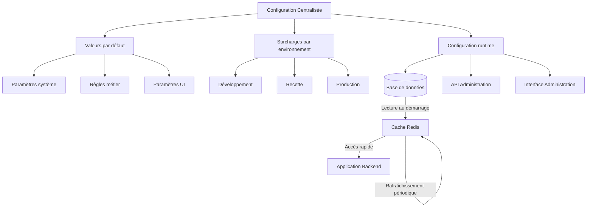

# CONFIGURATION - Système de Réservation de Ressources (SRR)

Ce document définit l'architecture de configuration du Système de Réservation de Ressources (SRR). Il sert de référence unique pour comprendre comment le système est configuré et paramétré dans les différents environnements de déploiement.

## Principes Généraux

La configuration du SRR suit les principes directeurs suivants:

1. **Centralisation Backend**: Toute la configuration est centralisée côté backend pour garantir la sécurité et la cohérence
   - Simplifie la gestion des configurations entre environnements
   - Sécurise les paramètres sensibles (non exposés au frontend)
   - Facilite les mises à jour sans nécessiter de redéploiement complet
   - Permet un audit centralisé des changements de configuration
2. **Hiérarchie de Paramètres**: Organisation en niveaux avec valeurs par défaut et surcharges spécifiques
3. **Séparation des Environnements**: Configuration distincte pour chaque environnement (développement, recette, production)
4. **Paramètres Dynamiques**: Certains paramètres peuvent être modifiés en temps réel sans redéploiement
5. **Audit des Modifications**: Traçabilité complète des changements de configuration

## Architecture de Configuration

Le système de configuration est structuré comme suit:



## Sources de Configuration

La configuration est gérée à travers plusieurs sources, par ordre de priorité:

1. **Base de données** (paramètres dynamiques modifiables en temps réel)
2. **Variables d'environnement** (spécifiques au déploiement)
3. **Fichiers de configuration** (par environnement)
4. **Valeurs par défaut codées** (fallback ultime)

## Structure des Paramètres

Les paramètres de configuration sont organisés hiérarchiquement par domaine fonctionnel:

### Paramètres Système

```json
{
  "system": {
    "logging": {
      "level": "INFO",
      "format": "json",
      "retention_days": 30
    },
    "performance": {
      "max_connections": 100,
      "connection_timeout_seconds": 30,
      "query_timeout_seconds": 10
    },
    "cache": {
      "enabled": true,
      "ttl_seconds": 300,
      "max_size_mb": 512
    },
    "async_jobs": {
      "max_workers": 5,
      "retry_attempts": 3,
      "backoff_factor": 1.5
    }
  }
}
```

### Paramètres Métier

```json
{
  "business": {
    "booking": {
      "max_duration_hours": 8,
      "min_duration_minutes": 30,
      "max_advance_booking_days": 60,
      "min_notice_minutes": 15
    },
    "approval": {
      "auto_approve_after_hours": 24,
      "reminder_intervals_hours": [4, 8, 16]
    },
    "recurrence": {
      "max_instances": 52,
      "allowed_patterns": ["daily", "weekly", "monthly"]
    },
    "quotas": {
      "max_active_bookings_per_user": 10,
      "max_bookings_per_week": 5
    }
  }
}
```

### Paramètres d'Interface

```json
{
  "ui": {
    "calendar": {
      "default_view": "week",
      "first_hour": 8,
      "last_hour": 19,
      "time_slot_minutes": 30
    },
    "notifications": {
      "display_duration_seconds": 5,
      "polling_interval_seconds": 60
    },
    "search": {
      "default_radius_km": 5,
      "max_results": 50,
      "autocomplete_threshold": 3
    },
    "localization": {
      "default_language": "fr",
      "date_format": "DD/MM/YYYY",
      "time_format": "HH:mm"
    }
  }
}
```

### Paramètres d'Intégration

```json
{
  "integrations": {
    "active_directory": {
      "sync_interval_hours": 24,
      "connection_timeout_seconds": 10,
      "group_mappings": {
        "SRR-Admins": "admin",
        "SRR-Managers": "resource_manager",
        "SRR-Users": "user",
        "SRR-Reception": "reception"
      }
    },
    "exchange": {
      "sync_enabled": true,
      "sync_interval_minutes": 15,
      "calendar_prefix": "SRR-",
      "use_exchange_online": false
    },
    "email": {
      "sender": "srr-noreply@plaine-commune.fr",
      "signature": "Système de Réservation de Ressources\nPlaine Commune / Ville de Saint-Denis",
      "max_retries": 3
    }
  }
}
```

## Gestion des Configurations par Environnement

### Développement

En environnement de développement:
- Mode debug activé
- Authentification simplifiée disponible
- Données de test pré-chargées
- Délais de timeout plus longs

### Recette

En environnement de recette:
- Configuration proche de la production
- Intégration avec les systèmes de test (AD de test, Exchange de test)
- Données anonymisées issues de la production

### Production

En environnement de production:
- Optimisation des performances
- Mesures de sécurité maximales
- Monitoring complet
- Haute disponibilité

## API de Configuration

Un service dédié permet de gérer la configuration dynamique. Les endpoints principaux sont:

| Endpoint | Méthode | Description | Rôle requis |
|----------|---------|-------------|------------|
| `/api/v1/config` | GET | Récupérer la configuration actuelle (filtrée selon droits) | Authentifié |
| `/api/v1/config/{section}` | GET | Récupérer une section spécifique | Authentifié |
| `/api/v1/admin/config` | GET | Récupérer la configuration complète | Admin |
| `/api/v1/admin/config` | PATCH | Modifier des paramètres spécifiques | Admin |
| `/api/v1/admin/config/history` | GET | Consulter l'historique des modifications | Admin |

## Paramètres Statiques vs Dynamiques

### Paramètres Statiques

Les paramètres statiques nécessitent un redéploiement du système pour être modifiés:

- URLs des services externes
- Configuration de sécurité fondamentale
- Structure de la base de données

### Paramètres Dynamiques

Les paramètres dynamiques peuvent être modifiés en temps réel via l'interface d'administration:

- Règles métier (durée max de réservation, délais de validation...)
- Textes et libellés de l'interface
- Seuils de notification et alertes
- Configuration des emails

## Implémentation Technique

### Backend (FastAPI)

Le système utilise Pydantic Settings pour la gestion de la configuration:

```python
from pydantic import BaseSettings
from functools import lru_cache

class SystemSettings(BaseSettings):
    logging_level: str = "INFO"
    logging_format: str = "json"
    logging_retention_days: int = 30
    # ... autres paramètres système

class BusinessSettings(BaseSettings):
    max_duration_hours: int = 8
    min_duration_minutes: int = 30
    max_advance_booking_days: int = 60
    # ... autres paramètres métier

class Settings(BaseSettings):
    system: SystemSettings = SystemSettings()
    business: BusinessSettings = BusinessSettings()
    # ... autres sections
    
    class Config:
        env_file = ".env"
        env_nested_delimiter = "__"

@lru_cache()
def get_settings():
    """Récupère la configuration avec cache"""
    settings = Settings()
    # Charge les surcharges depuis la BD et les applique
    return dynamic_settings_override(settings)
```

### Chargement Dynamique

Les paramètres dynamiques sont chargés depuis la base de données au démarrage et mis en cache:

```python
def dynamic_settings_override(settings: Settings) -> Settings:
    """Applique les surcharges depuis la base de données"""
    # Connexion à la base
    db_session = get_db_session()
    
    # Récupère les paramètres dynamiques
    dynamic_config = db_session.query(ConfigParameter).all()
    
    # Applique les surcharges
    for param in dynamic_config:
        apply_nested_config(settings, param.path, param.value)
        
    return settings

def apply_nested_config(obj, path, value):
    """Applique une valeur à un chemin imbriqué dans l'objet de configuration"""
    parts = path.split('.')
    for i, part in enumerate(parts[:-1]):
        if not hasattr(obj, part):
            setattr(obj, part, {})
        obj = getattr(obj, part)
    setattr(obj, parts[-1], value)
```

### Invalidation de Cache

Lors d'une modification de la configuration, le cache est invalidé:

```python
def update_config_parameter(path: str, value: Any) -> None:
    """Met à jour un paramètre de configuration"""
    db_session = get_db_session()
    
    # Enregistre la modification
    param = db_session.query(ConfigParameter).filter(ConfigParameter.path == path).first()
    if param:
        param.value = value
        param.updated_at = datetime.now()
    else:
        param = ConfigParameter(path=path, value=value)
        db_session.add(param)
    
    # Enregistre dans l'historique
    history = ConfigHistory(
        path=path,
        old_value=param.value if param else None,
        new_value=value,
        modified_by=get_current_user_id(),
        modified_at=datetime.now()
    )
    db_session.add(history)
    db_session.commit()
    
    # Invalide le cache
    get_settings.cache_clear()
    
    # Notification de modification aux instances
    notify_config_change(path, value)
```

## Sécurisation des Paramètres Sensibles

Les paramètres sensibles (mots de passe, clés API, etc.) sont gérés différemment:

1. Stockés dans AWS Secrets Manager
2. Référencés dans la configuration par des identifiants non-sensibles
3. Chargés en mémoire uniquement au besoin
4. Jamais exposés via les API ou les logs

Exemple de référence sécurisée:

```json
{
  "integrations": {
    "smtp": {
      "host": "smtp.example.com",
      "port": 587,
      "username": "srr-notifier",
      "password_secret_id": "srr/smtp/password"
    }
  }
}
```

## Validation de Configuration

À chaque démarrage, le système effectue une validation complète de la configuration:

1. Vérification des types et formats
2. Validation des contraintes (min/max, regex, etc.)
3. Vérification des dépendances entre paramètres
4. Test de connexion aux services externes
5. Journalisation des avertissements pour les paramètres non optimaux

En cas d'erreur critique, le démarrage est interrompu avec un message explicite.

## Audit et Historique

Toutes les modifications de configuration sont enregistrées:

| Champ | Description |
|-------|-------------|
| path | Chemin du paramètre modifié |
| old_value | Ancienne valeur |
| new_value | Nouvelle valeur |
| modified_by | Utilisateur ayant effectué la modification |
| modified_at | Date et heure de la modification |
| reason | Justification du changement |

Ces informations sont accessibles via l'interface d'administration et conservées pour audit.

## Propagation des Changements

Lorsqu'un paramètre dynamique est modifié, le changement est propagé:

1. Notification via Redis pub/sub à toutes les instances
2. Rafraîchissement du cache de configuration local
3. Application immédiate pour les nouveaux traitements
4. Notification aux administrateurs pour les changements critiques

## Documentation des Paramètres

La documentation complète des paramètres est disponible dans l'interface d'administration:

- Description et objectif de chaque paramètre
- Valeurs possibles et contraintes
- Impact sur le système
- Recommandations de configuration

## Bonnes Pratiques

### Pour les Administrateurs

1. Documenter la raison de chaque modification de configuration
2. Tester les changements en recette avant la production
3. Éviter de modifier plusieurs paramètres critiques simultanément
4. Vérifier l'impact des modifications avant de les appliquer

### Pour les Développeurs

1. Ajouter des valeurs par défaut raisonnables pour tous les nouveaux paramètres
2. Documenter exhaustivement chaque nouveau paramètre
3. Prévoir des mécanismes de fallback pour les paramètres critiques
4. Implémenter des validations rigoureuses pour éviter les configurations invalides

## Exemples de Configuration Spécifiques

### Configuration de Haute Disponibilité

```json
{
  "system": {
    "high_availability": {
      "enabled": true,
      "health_check_interval_seconds": 30,
      "failover_timeout_seconds": 10,
      "read_replica_enabled": true,
      "load_balancing_strategy": "round_robin"
    }
  }
}
```

### Configuration de Quotas et Limites

```json
{
  "quotas": {
    "max_bookings_per_resource_type": {
      "meeting_room": 3,
      "vehicle": 2,
      "equipment": 5
    },
    "max_duration_hours_per_type": {
      "meeting_room": 4,
      "vehicle": 24,
      "equipment": 48
    },
    "vip_users_override": true
  }
}
```

### Configuration des Notifications

```json
{
  "notifications": {
    "channels": {
      "email": {
        "enabled": true,
        "throttle_seconds": 300
      },
      "push": {
        "enabled": false
      },
      "in_app": {
        "enabled": true,
        "max_unread": 50
      }
    },
    "events": {
      "booking_created": ["email", "in_app"],
      "booking_approved": ["email", "in_app"],
      "booking_rejected": ["email", "in_app"],
      "booking_reminder": ["email"],
      "approval_pending": ["email", "in_app"]
    }
  }
}
```

## Valeurs par défaut des principaux paramètres

Ce tableau présente les valeurs par défaut des paramètres les plus couramment utilisés dans chaque environnement:

| Paramètre | Développement | Recette | Production |
|-----------|---------------|---------|------------|
| **Système** |
| logging.level | DEBUG | INFO | INFO |
| cache.ttl_seconds | 60 | 180 | 300 |
| async_jobs.max_workers | 2 | 3 | 5 |
| **Métier** |
| booking.max_advance_booking_days | 90 | 60 | 60 |
| booking.min_notice_minutes | 5 | 15 | 15 |
| approval.auto_approve_after_hours | N/A | 48 | 24 |
| quotas.max_bookings_per_week | 10 | 10 | 5 |
| **Intégration** |
| active_directory.sync_interval_hours | 24 | 12 | 6 |
| exchange.sync_interval_minutes | 30 | 15 | 15 |
| email.max_retries | 2 | 3 | 3 |
| **Frontend** |
| calendar.default_view | month | week | week |
| notifications.polling_interval_seconds | 120 | 90 | 60 |
