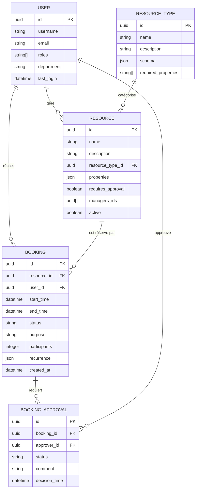

# DATA MODEL - Système de Réservation de Ressources (SRR)

Ce document définit le modèle de données du SRR. Il est la référence unique pour comprendre la structure et les relations des données dans le système, et sert de guide pour les développeurs travaillant sur le backend et le frontend.

## Vue d'ensemble du modèle de données

Le modèle de données du SRR est organisé autour des entités principales suivantes:



## Spécification détaillée des entités

### User (Utilisateur)

Cette entité représente un utilisateur du système, synchronisé avec l'Active Directory.

| Champ | Type | Description | Contraintes |
|-------|------|-------------|-------------|
| id | UUID | Identifiant unique | Clé primaire |
| username | VARCHAR(100) | Identifiant utilisateur (login AD) | Unique, Non null |
| email | VARCHAR(255) | Adresse email | Unique, Non null |
| full_name | VARCHAR(255) | Nom complet | Non null |
| roles | VARCHAR[] | Rôles dans le système | Non null |
| department | VARCHAR(255) | Service/département | Nullable |
| position | VARCHAR(255) | Poste/fonction | Nullable |
| phone | VARCHAR(20) | Numéro de téléphone | Nullable |
| last_login | TIMESTAMP WITH TZ | Dernière connexion | Nullable |
| created_at | TIMESTAMP WITH TZ | Date de création | Non null, Default: now() |
| updated_at | TIMESTAMP WITH TZ | Date de mise à jour | Non null, Default: now() |

#### Rôles disponibles:
- `admin` : Administrateur système
- `resource_manager` : Gestionnaire de ressources
- `user` : Utilisateur standard
- `reception` : Agent d'accueil
- `display` : Affichage public

#### Implémentation SQLAlchemy:

```python
class User(Base):
    """
    [Class intent]
    Représente un utilisateur du système SRR synchronisé avec l'Active Directory.
    
    [Design principles]
    Fournit une représentation locale des attributs utilisateur essentiels à l'application.
    Ne stocke pas les mots de passe puisque l'authentification est déléguée à l'AD.
    
    [Implementation details]
    Utilise UUID comme clé primaire pour garantir l'unicité globale et faciliter la synchronisation.
    """
    __tablename__ = "users"

    id = Column(UUID(as_uuid=True), primary_key=True, default=uuid.uuid4)
    username = Column(String(100), unique=True, nullable=False, index=True)
    email = Column(String(255), unique=True, nullable=False)
    full_name = Column(String(255), nullable=False)
    roles = Column(ARRAY(String), nullable=False, default=["user"])
    department = Column(String(255))
    position = Column(String(255))
    phone = Column(String(20))
    last_login = Column(DateTime(timezone=True))
    created_at = Column(DateTime(timezone=True), nullable=False, default=func.now())
    updated_at = Column(DateTime(timezone=True), nullable=False, default=func.now(), onupdate=func.now())

    # Relations
    bookings = relationship("Booking", back_populates="user")
    managed_resources = relationship("Resource", secondary="resource_managers")
    approvals = relationship("BookingApproval", back_populates="approver")
    
    __table_args__ = (
        Index('idx_users_roles', roles, postgresql_using="gin"),
    )
```

### ResourceType (Type de ressource)

Cette entité définit les différents types de ressources disponibles dans le système.

| Champ | Type | Description | Contraintes |
|-------|------|-------------|-------------|
| id | UUID | Identifiant unique | Clé primaire |
| name | VARCHAR(100) | Nom du type de ressource | Unique, Non null |
| description | TEXT | Description du type | Nullable |
| schema | JSONB | Schéma des propriétés spécifiques | Non null |
| required_properties | VARCHAR[] | Propriétés obligatoires | Non null |
| icon | VARCHAR(50) | Icône représentative | Nullable |
| color | VARCHAR(20) | Couleur associée | Nullable |
| created_at | TIMESTAMP WITH TZ | Date de création | Non null, Default: now() |
| updated_at | TIMESTAMP WITH TZ | Date de mise à jour | Non null, Default: now() |

#### Types de ressources prédéfinis:
- Salle de réunion
- Véhicule
- Matériel audiovisuel
- Matériel informatique
- Espace extérieur

#### Implémentation SQLAlchemy:

```python
class ResourceType(Base):
    """
    [Class intent]
    Définit les différents types de ressources disponibles dans le système.
    
    [Design principles]
    Utilise un schéma JSON flexible pour permettre des propriétés dynamiques selon le type.
    Centralise la définition des propriétés et contraintes par type de ressource.
    
    [Implementation details]
    Les ressources héritent des propriétés et contraintes définies dans leur type.
    Le schéma JSON définit les types, valeurs possibles et validations pour les propriétés.
    """
    __tablename__ = "resource_types"

    id = Column(UUID(as_uuid=True), primary_key=True, default=uuid.uuid4)
    name = Column(String(100), unique=True, nullable=False)
    description = Column(Text)
    schema = Column(JSONB, nullable=False)
    required_properties = Column(ARRAY(String), nullable=False, default=[])
    icon = Column(String(50))
    color = Column(String(20))
    created_at = Column(DateTime(timezone=True), nullable=False, default=func.now())
    updated_at = Column(DateTime(timezone=True), nullable=False, default=func.now(), onupdate=func.now())

    # Relations
    resources = relationship("Resource", back_populates="resource_type")
```

### Resource (Ressource)

Cette entité représente une ressource réservable dans le système.

| Champ | Type | Description | Contraintes |
|-------|------|-------------|-------------|
| id | UUID | Identifiant unique | Clé primaire |
| name | VARCHAR(100) | Nom de la ressource | Non null |
| description | TEXT | Description | Nullable |
| resource_type_id | UUID | Type de ressource | Clé étrangère, Non null |
| properties | JSONB | Propriétés spécifiques au type | Non null |
| requires_approval | BOOLEAN | Nécessite une validation | Non null, Default: false |
| location | VARCHAR(255) | Localisation | Nullable |
| capacity | INTEGER | Capacité (si applicable) | Nullable |
| availability_start | TIME | Heure de début disponibilité | Nullable |
| availability_end | TIME | Heure de fin disponibilité | Nullable |
| active | BOOLEAN | Ressource active | Non null, Default: true |
| created_at | TIMESTAMP WITH TZ | Date de création | Non null, Default: now() |
| updated_at | TIMESTAMP WITH TZ | Date de mise à jour | Non null, Default: now() |

#### Implémentation SQLAlchemy:

```python
class Resource(Base):
    """
    [Class intent]
    Représente une ressource réservable dans le système SRR.
    
    [Design principles]
    Combine des propriétés de base communes à toutes les ressources avec des propriétés 
    dynamiques spécifiques au type stockées en JSON.
    
    [Implementation details]
    Les propriétés JSON sont validées contre le schéma défini dans le type de ressource.
    Les propriétés essentielles fréquemment filtrées sont extraites en colonnes dédiées.
    """
    __tablename__ = "resources"

    id = Column(UUID(as_uuid=True), primary_key=True, default=uuid.uuid4)
    name = Column(String(100), nullable=False)
    description = Column(Text)
    resource_type_id = Column(UUID(as_uuid=True), ForeignKey("resource_types.id"), nullable=False)
    properties = Column(JSONB, nullable=False, default={})
    requires_approval = Column(Boolean, nullable=False, default=False)
    location = Column(String(255))
    capacity = Column(Integer)
    availability_start = Column(Time)
    availability_end = Column(Time)
    active = Column(Boolean, nullable=False, default=True)
    created_at = Column(DateTime(timezone=True), nullable=False, default=func.now())
    updated_at = Column(DateTime(timezone=True), nullable=False, default=func.now(), onupdate=func.now())
    
    # Relations
    resource_type = relationship("ResourceType", back_populates="resources")
    bookings = relationship("Booking", back_populates="resource")
    managers = relationship("User", secondary="resource_managers")
    
    __table_args__ = (
        Index('idx_resources_name_search', text("to_tsvector('french', name || ' ' || COALESCE(description, ''))"), postgresql_using="gin"),
        Index('idx_resources_properties', properties, postgresql_using="gin"),
    )
```

### ResourceManager (Table de liaison Gestionnaires de ressources)

Cette table de liaison définit les gestionnaires pour chaque ressource.

| Champ | Type | Description | Contraintes |
|-------|------|-------------|-------------|
| resource_id | UUID | ID de la ressource | Clé primaire, Clé étrangère |
| user_id | UUID | ID de l'utilisateur | Clé primaire, Clé étrangère |
| created_at | TIMESTAMP WITH TZ | Date de création | Non null, Default: now() |

#### Implémentation SQLAlchemy:

```python
class ResourceManager(Base):
    """
    [Class intent]
    Table de liaison définissant les gestionnaires pour chaque ressource.
    
    [Design principles]
    Implémente une relation many-to-many entre ressources et utilisateurs gestionnaires.
    
    [Implementation details]
    Table de jointure simple avec clé composite.
    """
    __tablename__ = "resource_managers"
    
    resource_id = Column(UUID(as_uuid=True), ForeignKey("resources.id"), primary_key=True)
    user_id = Column(UUID(as_uuid=True), ForeignKey("users.id"), primary_key=True)
    created_at = Column(DateTime(timezone=True), nullable=False, default=func.now())
```

### Booking (Réservation)

Cette entité représente une réservation de ressource.

| Champ | Type | Description | Contraintes |
|-------|------|-------------|-------------|
| id | UUID | Identifiant unique | Clé primaire |
| resource_id | UUID | Ressource réservée | Clé étrangère, Non null |
| user_id | UUID | Utilisateur réservant | Clé étrangère, Non null |
| start_time | TIMESTAMP WITH TZ | Date et heure de début | Non null |
| end_time | TIMESTAMP WITH TZ | Date et heure de fin | Non null |
| status | VARCHAR(20) | Statut de la réservation | Non null |
| purpose | TEXT | Motif de la réservation | Non null |
| participants | INTEGER | Nombre de participants | Nullable |
| recurrence | JSONB | Schéma de récurrence | Nullable |
| notes | TEXT | Notes complémentaires | Nullable |
| created_at | TIMESTAMP WITH TZ | Date de création | Non null, Default: now() |
| updated_at | TIMESTAMP WITH TZ | Date de mise à jour | Non null, Default: now() |

#### Statuts de réservation:
- `pending` : En attente de validation
- `confirmed` : Confirmée
- `rejected` : Rejetée
- `cancelled` : Annulée
- `in_progress` : En cours d'utilisation
- `completed` : Terminée

#### Implémentation SQLAlchemy:

```python
class Booking(Base):
    """
    [Class intent]
    Représente une réservation de ressource par un utilisateur.
    
    [Design principles]
    Implémente un workflow d'état permettant de suivre le cycle de vie complet d'une réservation.
    Supporte les réservations ponctuelles et récurrentes.
    
    [Implementation details]
    Les réservations récurrentes utilisent un modèle parent-enfant avec un schéma JSON définissant la récurrence.
    Les validations inter-entités garantissent qu'il n'y a pas de conflit de réservation.
    """
    __tablename__ = "bookings"

    id = Column(UUID(as_uuid=True), primary_key=True, default=uuid.uuid4)
    resource_id = Column(UUID(as_uuid=True), ForeignKey("resources.id"), nullable=False)
    user_id = Column(UUID(as_uuid=True), ForeignKey("users.id"), nullable=False)
    start_time = Column(DateTime(timezone=True), nullable=False)
    end_time = Column(DateTime(timezone=True), nullable=False)
    status = Column(String(20), nullable=False, default="pending")
    purpose = Column(Text, nullable=False)
    participants = Column(Integer)
    recurrence = Column(JSONB)
    parent_booking_id = Column(UUID(as_uuid=True), ForeignKey("bookings.id"))
    notes = Column(Text)
    created_at = Column(DateTime(timezone=True), nullable=False, default=func.now())
    updated_at = Column(DateTime(timezone=True), nullable=False, default=func.now(), onupdate=func.now())
    
    # Relations
    resource = relationship("Resource", back_populates="bookings")
    user = relationship("User", back_populates="bookings")
    approvals = relationship("BookingApproval", back_populates="booking")
    recurrent_bookings = relationship("Booking", foreign_keys=[parent_booking_id])
    
    __table_args__ = (
        Index('idx_bookings_resource_dates', resource_id, start_time, end_time),
        Index('idx_bookings_user', user_id),
        Index('idx_bookings_status', status),
        CheckConstraint('end_time > start_time', name='check_booking_end_after_start'),
    )
```

### BookingApproval (Validation de réservation)

Cette entité représente la validation d'une réservation par un gestionnaire.

| Champ | Type | Description | Contraintes |
|-------|------|-------------|-------------|
| id | UUID | Identifiant unique | Clé primaire |
| booking_id | UUID | Réservation concernée | Clé étrangère, Non null |
| approver_id | UUID | Valideur | Clé étrangère, Non null |
| status | VARCHAR(20) | Statut de la validation | Non null |
| comment | TEXT | Commentaire | Nullable |
| decision_time | TIMESTAMP WITH TZ | Date et heure de la décision | Non null, Default: now() |
| created_at | TIMESTAMP WITH TZ | Date de création | Non null, Default: now() |

#### Statuts de validation:
- `pending` : En attente
- `approved` : Approuvée
- `rejected` : Rejetée

#### Implémentation SQLAlchemy:

```python
class BookingApproval(Base):
    """
    [Class intent]
    Représente la validation d'une réservation par un gestionnaire.
    
    [Design principles]
    Implémente le processus d'approbation pour les ressources nécessitant validation.
    Conserve une trace auditable des décisions et leurs justifications.
    
    [Implementation details]
    Chaque approbation est liée à un booking et maintient son propre statut.
    Le système peut nécessiter plusieurs approbations selon le type de ressource.
    """
    __tablename__ = "booking_approvals"

    id = Column(UUID(as_uuid=True), primary_key=True, default=uuid.uuid4)
    booking_id = Column(UUID(as_uuid=True), ForeignKey("bookings.id"), nullable=False)
    approver_id = Column(UUID(as_uuid=True), ForeignKey("users.id"), nullable=False)
    status = Column(String(20), nullable=False, default="pending")
    comment = Column(Text)
    decision_time = Column(DateTime(timezone=True), nullable=False, default=func.now())
    created_at = Column(DateTime(timezone=True), nullable=False, default=func.now())
    
    # Relations
    booking = relationship("Booking", back_populates="approvals")
    approver = relationship("User", back_populates="approvals")
    
    __table_args__ = (
        Index('idx_booking_approvals_booking', booking_id),
        Index('idx_booking_approvals_approver', approver_id),
    )
```

### ResourceAvailability (Disponibilité exceptionnelle)

Cette entité définit des périodes de disponibilité ou indisponibilité exceptionnelles pour les ressources.

| Champ | Type | Description | Contraintes |
|-------|------|-------------|-------------|
| id | UUID | Identifiant unique | Clé primaire |
| resource_id | UUID | Ressource concernée | Clé étrangère, Non null |
| start_time | TIMESTAMP WITH TZ | Date et heure de début | Non null |
| end_time | TIMESTAMP WITH TZ | Date et heure de fin | Non null |
| is_available | BOOLEAN | Disponibilité | Non null, Default: false |
| reason | TEXT | Raison | Nullable |
| created_by | UUID | Créé par | Clé étrangère, Non null |
| created_at | TIMESTAMP WITH TZ | Date de création | Non null, Default: now() |

#### Implémentation SQLAlchemy:

```python
class ResourceAvailability(Base):
    """
    [Class intent]
    Définit des périodes de disponibilité ou indisponibilité exceptionnelles pour les ressources.
    
    [Design principles]
    Permet de gérer les exceptions aux horaires standards de disponibilité.
    Utilisé pour la maintenance, les fermetures exceptionnelles, etc.
    
    [Implementation details]
    Les périodes d'indisponibilité ont priorité sur les réservations standard.
    Le système vérifie ces périodes avant de permettre une réservation.
    """
    __tablename__ = "resource_availabilities"

    id = Column(UUID(as_uuid=True), primary_key=True, default=uuid.uuid4)
    resource_id = Column(UUID(as_uuid=True), ForeignKey("resources.id"), nullable=False)
    start_time = Column(DateTime(timezone=True), nullable=False)
    end_time = Column(DateTime(timezone=True), nullable=False)
    is_available = Column(Boolean, nullable=False, default=False)
    reason = Column(Text)
    created_by = Column(UUID(as_uuid=True), ForeignKey("users.id"), nullable=False)
    created_at = Column(DateTime(timezone=True), nullable=False, default=func.now())
    
    # Relations
    resource = relationship("Resource")
    creator = relationship("User")
    
    __table_args__ = (
        Index('idx_resource_availabilities_resource', resource_id),
        Index('idx_resource_availabilities_dates', start_time, end_time),
        CheckConstraint('end_time > start_time', name='check_availability_end_after_start'),
    )
```

## Schéma de récurrence pour les réservations

Pour les réservations récurrentes, un schéma JSON spécial est utilisé:

```json
{
  "type": "daily|weekly|monthly|custom",
  "interval": 1,                     // Répétition tous les X jours/semaines/mois
  "days_of_week": [1, 3, 5],         // Pour weekly: 0=dimanche, 6=samedi
  "day_of_month": 15,                // Pour monthly
  "position_in_month": "first|last", // Pour monthly (ex: "first Monday")
  "ends": {
    "type": "count|until|never",
    "count": 10,                     // Nombre d'occurrences
    "until": "2025-12-31"            // Date de fin
  },
  "exceptions": [                    // Dates exclues
    "2025-06-14T10:00:00Z"
  ]
}
```

## Schéma des propriétés des types de ressource

Exemple de schéma pour le type "Salle de réunion":

```json
{
  "properties": {
    "floor": {
      "type": "integer",
      "description": "Étage où se trouve la salle",
      "minimum": 0
    },
    "has_projector": {
      "type": "boolean",
      "description": "Présence d'un projecteur"
    },
    "has_videoconference": {
      "type": "boolean",
      "description": "Équipement pour visioconférence"
    },
    "layout": {
      "type": "string",
      "enum": ["u_shape", "classroom", "boardroom", "theater"],
      "description": "Configuration de la salle"
    },
    "accessibility": {
      "type": "boolean",
      "description": "Accessible PMR"
    }
  },
  "required": ["floor", "layout"]
}
```

## Stratégie d'indexation

Le SRR utilise une stratégie d'indexation optimisée pour les requêtes les plus fréquentes, cruciale pour maintenir des performances élevées, particulièrement pour les fonctions de recherche et de vérification de disponibilité qui sont intensivement utilisées:

### Types d'index utilisés

- **Index B-tree** : Utilisés pour les recherches par ID et les filtrages simples (ex: par statut, par utilisateur)
- **Index GIN** : Optimisés pour les recherches dans les propriétés JSON des ressources, permettant un filtrage efficace sur les caractéristiques spécifiques
- **Index textuels** : Appliqués sur les noms et descriptions pour les recherches full-text
- **Index composites** : Créés spécifiquement pour les vérifications rapides de disponibilité (ex: resource_id + start_time + end_time)

### Index principaux

| Table | Index | Type | Objectif |
|-------|-------|------|----------|
| users | username | B-tree | Recherche rapide par identifiant |
| users | roles | GIN | Recherche par rôles (array) |
| resources | resource_type_id | B-tree | Filtrage par type |
| resources | name_search | GIN (tsvector) | Recherche full-text |
| resources | properties | GIN | Recherche dans les propriétés JSON |
| bookings | resource_id, start_time, end_time | B-tree | Vérification des disponibilités |
| bookings | user_id | B-tree | Réservations d'un utilisateur |
| bookings | status | B-tree | Filtrage par statut |

## Évolution du schéma avec Alembic

Le projet utilise Alembic pour gérer les migrations de schéma de base de données. Voici le processus à suivre pour les évolutions de schéma:

1. Créer une nouvelle révision: `alembic revision --autogenerate -m "description"`
2. Examiner et ajuster le script généré dans `alembic/versions/`
3. Appliquer la migration: `alembic upgrade head`

Exemple de migration Alembic:

```python
"""Ajout du champ notes aux réservations

Revision ID: 3a1c35e8f5d2
Revises: 2c6ae9a6b4d1
Create Date: 2025-05-15 09:32:12.231824

"""
from alembic import op
import sqlalchemy as sa

# revision identifiers
revision = '3a1c35e8f5d2'
down_revision = '2c6ae9a6b4d1'
branch_labels = None
depends_on = None

def upgrade():
    op.add_column('bookings', sa.Column('notes', sa.Text(), nullable=True))

def downgrade():
    op.drop_column('bookings', 'notes')
```

## Règles d'intégrité et contraintes

1. **Conflit de réservations**: Une ressource ne peut pas être réservée simultanément par deux réservations différentes
2. **Validation temporelle**: La date de fin doit toujours être postérieure à la date de début
3. **État cohérent**: Les transitions d'état des réservations suivent un flux défini
4. **Propriétés obligatoires**: Les ressources doivent avoir les propriétés requises par leur type
5. **Validation de schéma**: Les propriétés JSON doivent correspondre au schéma défini par le type de ressource

## Requêtes fréquentes optimisées

### Vérification de disponibilité

```sql
SELECT 
    COUNT(*) = 0 AS is_available
FROM 
    bookings
WHERE 
    resource_id = :resource_id
    AND status NOT IN ('rejected', 'cancelled')
    AND (:start_time < end_time AND :end_time > start_time);
```

### Recherche de ressources disponibles

```sql
SELECT 
    r.*
FROM 
    resources r
WHERE 
    r.active = true
    AND r.resource_type_id = :resource_type_id
    AND r.capacity >= :min_capacity
    AND NOT EXISTS (
        SELECT 1
        FROM bookings b
        WHERE 
            b.resource_id = r.id
            AND b.status NOT IN ('rejected', 'cancelled')
            AND (:start_time < b.end_time AND :end_time > b.start_time)
    )
    AND NOT EXISTS (
        SELECT 1
        FROM resource_availabilities ra
        WHERE 
            ra.resource_id = r.id
            AND ra.is_available = false
            AND (:start_time < ra.end_time AND :end_time > ra.start_time)
    )
    AND (
        r.properties @> :required_properties
    );
```

### Dashboard utilisateur

```sql
SELECT 
    b.*,
    r.name AS resource_name,
    r.location,
    rt.name AS resource_type_name
FROM 
    bookings b
JOIN 
    resources r ON b.resource_id = r.id
JOIN 
    resource_types rt ON r.resource_type_id = rt.id
WHERE 
    b.user_id = :user_id
    AND b.status NOT IN ('cancelled', 'rejected')
    AND b.end_time > CURRENT_TIMESTAMP
ORDER BY 
    b.start_time ASC
LIMIT 10;
```

## Architecture de partition (Envisagée pour l'évolution)

Pour les déploiements à grande échelle, une stratégie de partition pourrait être implémentée:

1. **Partition horizontale des bookings** par plage de dates
   - Améliore les performances des requêtes sur périodes spécifiques
   - Facilite l'archivage des anciennes réservations

2. **Tables d'historique** pour les données archivées
   - Réservations terminées depuis plus de 12 mois
   - Utilisateurs inactifs
   - Logs d'audit des anciennes opérations

## Considérations de performance

1. **Taille estimée des données**:
   - ~5,000 utilisateurs
   - ~500 ressources
   - ~10,000 réservations par mois
   - Croissance annuelle: ~25%

2. **Points d'optimisation**:
   - Utilisation d'index GIN pour recherches complexes
   - Dénormalisation stratégique pour optimiser les requêtes fréquentes
   - Partitionnement pour les données historiques
   - Mise en cache Redis pour les ressources fréquemment consultées
