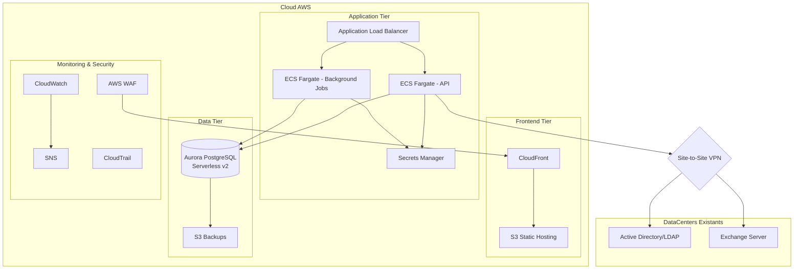
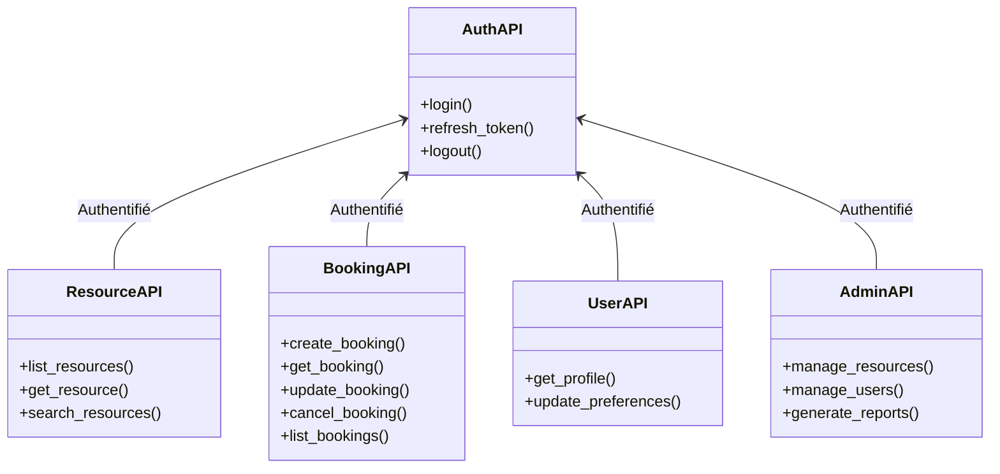
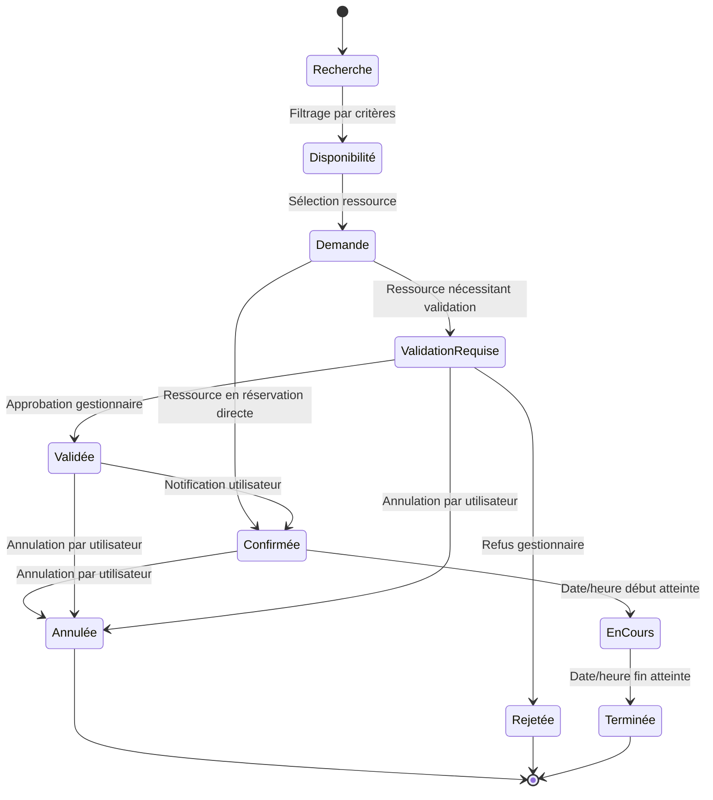
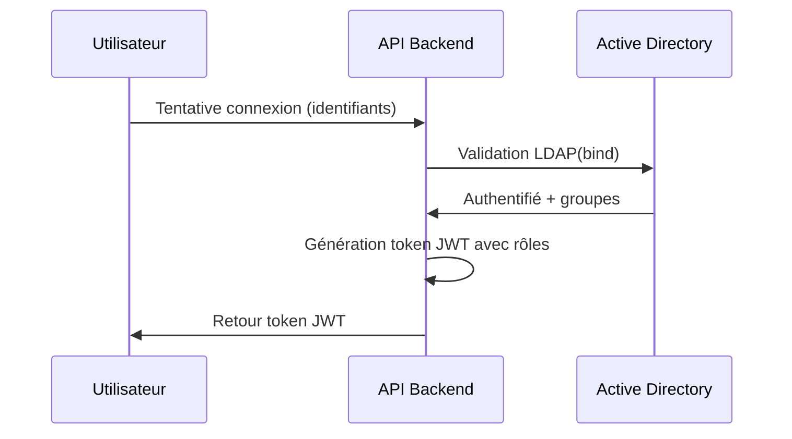
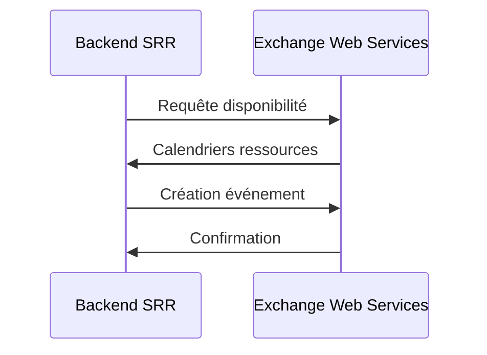
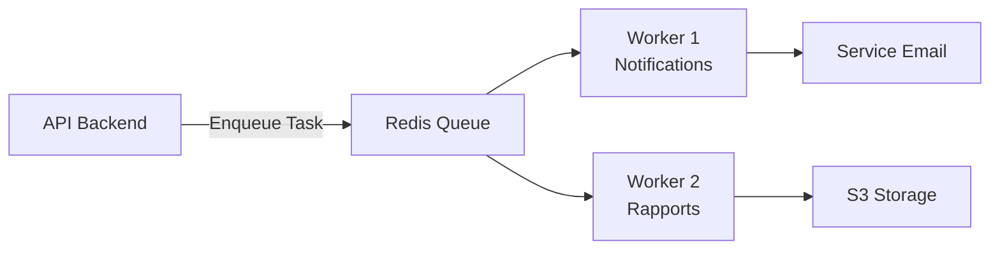
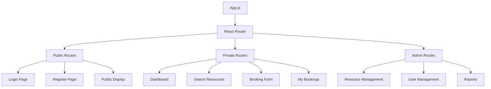
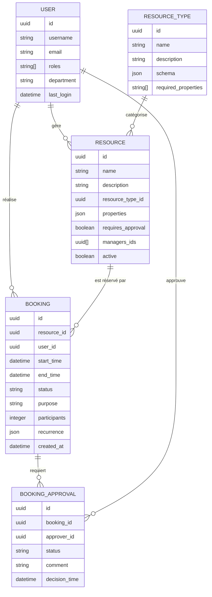
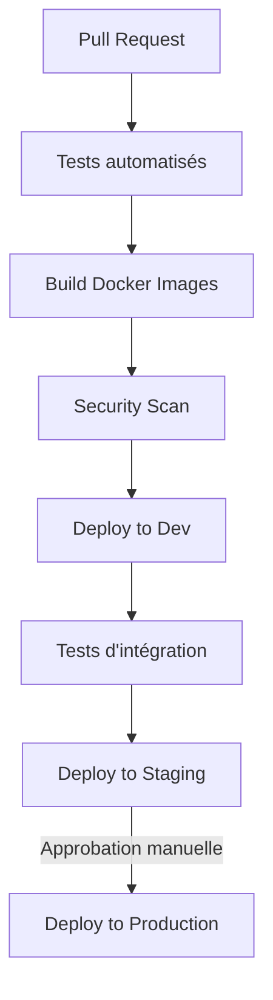

# DESIGN - Architecture du Système de Réservation de Ressources (SRR)

## 1. GENERAL ARCHITECTURE OVERVIEW

Le Système de Réservation de Ressources (SRR) est une application web moderne conçue pour optimiser la gestion et l'utilisation des ressources partagées au sein de la Communauté d'Agglomération Plaine Commune et de la Ville de Saint-Denis. L'architecture suit une approche KISS (Keep It Simple & Stupid) tout en garantissant haute disponibilité, sécurité et faible coût de maintenance.

### Vision Architecturale Globale



### Principes Architecturaux Fondamentaux

1. **Architecture en Couches** : Séparation claire entre frontend, backend et données
2. **Serverless First** : Utilisation de services serverless quand pertinents pour réduire les coûts
3. **Haute Disponibilité** : Architecture multi-AZ et réplication pour assurer la résilience
4. **Sécurité par Défaut** : Chiffrement des données en transit et au repos, moindre privilège
5. **Automatisation** : Infrastructure as Code via CDK Python pour un déploiement reproductible et fiable

### Environnements

L'architecture est déployée dans trois environnements distincts, chacun ayant son propre compte AWS :

| Environnement | Objectif | Particularités |
|---------------|----------|----------------|
| Développement | Développement et tests fonctionnels | Données simulées, authentification simplifiée |
| Recette | Tests d'intégration et validation | Clone de production avec données anonymisées |
| Production | Exploitation | Haute disponibilité, sauvegardes complètes |

## 2. PROVIDED SERVICES

Le SRR expose les services suivants :

### Interface Utilisateur Web

Interface web responsive accessible via navigateur standard, permettant aux utilisateurs finaux (agents des collectivités) de :

- Rechercher et réserver des ressources
- Gérer leurs réservations (modification, annulation)
- Suivre l'état de leurs demandes

### API REST

API REST principale sécurisée par JWT, exposant les fonctionnalités suivantes :



### Écrans d'Affichage Public

Interface pour les écrans d'information dans les zones d'accueil, permettant d'afficher :

- Les réservations en cours pour les salles
- Les événements à venir
- Les informations importantes pour les visiteurs

### Système de Notification

Notifications par email synchronisées avec Exchange, comprenant :

- Confirmation de réservation
- Rappels avant utilisation
- Alertes de changement d'état
- Notifications pour les valideurs

## 3. BUSINESS LOGIC

### Processus Métier Principaux



### Règles Métier

1. **Gestion des Conflits** : Empêche les réservations simultanées d'une même ressource
2. **Validation Conditionnelle** : Workflow de validation configurable par type de ressource
3. **Récurrence** : Gestion des réservations récurrentes (quotidien, hebdomadaire, mensuel)
4. **Quotas** : Limitation configurable du nombre de réservations par utilisateur/service
5. **Check-in/Check-out** : Suivi optionnel de l'utilisation réelle des ressources

### Moteur de Recherche et Filtrage

Le système implémente un moteur de recherche avancé permettant de filtrer les ressources selon :

- Type de ressource (salle, véhicule, équipement...)
- Disponibilité temporelle (date, heure, durée)
- Capacité et caractéristiques (taille, équipements...)
- Localisation (bâtiment, étage, ville...)
- Service propriétaire

### Gestion des Autorisations

Le système utilise un modèle RBAC (Role-Based Access Control) avec les rôles suivants :

| Rôle | Description | Permissions |
|------|-------------|------------|
| Administrateur | Administration globale du système | Toutes les permissions |
| Gestionnaire | Gestion des ressources d'un service | CRUD sur ressources, validation des demandes |
| Demandeur | Utilisateur standard | Recherche, réservation, annulation |
| Agent d'accueil | Personnel d'accueil | Visualisation planning, check-in |
| Écran public | Affichage dans les halls | Visualisation anonyme du planning journalier |

## 4. EXTERNAL DEPENDENCIES TOWARD COOPERATING SYSTEMS

### Intégration Active Directory / LDAP

L'authentification et les autorisations s'appuient sur Active Directory existant :



### Intégration Exchange

La synchronisation avec les calendriers Exchange permet de :

- Vérifier les conflits de disponibilité lors des réservations
- Créer des événements dans les calendriers des participants
- Mettre à jour les calendriers des ressources



### Points d'Intégration

| Système | Méthode d'intégration | Données échangées | Sécurité |
|---------|------------------------|------------------|----------|
| Active Directory | LDAP over SSL | Authentification, groupes | Certificats, VPN site-à-site |
| Exchange | EWS API | Calendriers, événements | Authentification NTLM, VPN |

## 5. MIDDLEWARE AND SUPPORT FUNCTIONS

### Logs et Monitoring

- **CloudWatch** : Centralisation des logs et métriques
- **X-Ray** : Traçage distribué pour identifier les goulots d'étranglement
- **Custom Metrics** : Métriques d'utilisation des ressources

### Jobs Asynchrones

Architecture de traitement asynchrone pour :
- Notifications par email
- Génération de rapports
- Synchronisation avec Exchange
- Nettoyage des données temporaires



### Cache

Stratégie de cache à multiples niveaux :

1. **Cache Client** : Pour les assets statiques et données de référence
2. **Redis** : Pour les résultats de recherche fréquents et sessions
3. **CloudFront** : Pour le contenu statique du frontend

### Sauvegardes et Restauration

- **Aurora Backups** : Sauvegardes automatiques journalières, conservation 35 jours
- **S3 Lifecycle** : Archivage des vieilles sauvegardes vers S3 Glacier
- **Point-in-Time Recovery** : Capacité de restauration à un moment précis

## 6. ARCHITECTURE FRONTEND

### Structure de l'Application React



### Composants UI

Basés sur Material-UI avec thème personnalisé aux couleurs des collectivités :

- **Système de Grille** : Layout responsive pour tous types d'écrans
- **Composants Réutilisables** : Formulaires, listes, tableaux, modales
- **Datepicker** : Sélecteur de date/heure optimisé pour la réservation
- **Notifications** : Système de toasts pour feedback utilisateur

### État de l'Application

Gestion d'état avec React Context API et hooks :

```jsx
// Exemple d'utilisation de Context API
const AuthContext = createContext();

function useAuth() {
  return useContext(AuthContext);
}

function AuthProvider({ children }) {
  const [currentUser, setCurrentUser] = useState(null);
  const [loading, setLoading] = useState(true);
  
  const login = async (credentials) => {
    // Logique d'authentification
  };
  
  const value = {
    currentUser,
    login,
    logout
  };
  
  return (
    <AuthContext.Provider value={value}>
      {!loading && children}
    </AuthContext.Provider>
  );
}
```

### Communication avec l'API

Utilisation d'Axios pour les appels API avec:

- **Interceptors** : Gestion automatique des tokens JWT
- **Retry Logic** : Tentatives automatiques en cas d'échec
- **Error Handling** : Traduction des erreurs API en messages utilisateur

## 7. ARCHITECTURE BACKEND

### Structure de l'Application FastAPI

```
backend/
├── alembic/            # Migrations de schéma
├── app/
│   ├── api/            # Endpoints API
│   │   ├── v1/
│   │   │   ├── auth.py
│   │   │   ├── resources.py
│   │   │   ├── bookings.py
│   │   │   └── admin.py
│   ├── core/           # Configuration, sécurité
│   │   ├── config.py
│   │   ├── security.py
│   │   └── errors.py
│   ├── db/             # Connexion DB
│   │   ├── session.py
│   │   └── base.py
│   ├── models/         # Modèles SQLAlchemy
│   │   ├── user.py
│   │   ├── resource.py
│   │   └── booking.py
│   ├── schemas/        # Schémas Pydantic
│   │   ├── user.py
│   │   ├── resource.py
│   │   └── booking.py
│   ├── services/       # Logique métier
│   │   ├── auth.py
│   │   ├── resource.py
│   │   └── booking.py
│   └── utils/          # Utilitaires
│       ├── email.py
│       └── ldap.py
├── tasks/              # Tâches asynchrones Celery
├── tests/              # Tests unitaires et d'intégration
├── main.py             # Point d'entrée
└── Dockerfile
```

### Middleware

- **CORS** : Configuration pour permettre les appels depuis le frontend
- **Authentication** : Validation JWT et extraction des droits utilisateur
- **Rate Limiting** : Limitation du nombre de requêtes par IP/utilisateur
- **Error Handling** : Gestion centralisée des exceptions

### Sécurité

- **Password Hashing** : Algorithme Argon2id pour le stockage sécurisé
- **JWT** : Tokens avec durée de validité courte et refresh tokens
- **HTTPS** : Chiffrement de toutes les communications
- **Input Validation** : Validation via Pydantic avant traitement
- **CSRF Protection** : Protection contre les attaques CSRF
- **Audit Trail** : Journalisation des actions sensibles

## 8. ARCHITECTURE DE DONNÉES

### Modèle Conceptuel

Le modèle de données est structuré autour de ces entités principales :



### Base de Données Aurora PostgreSQL Serverless v2

Configuration optimisée pour les besoins spécifiques du SRR :

- **ACU** : Min 2 ACU, Max 8 ACU avec ajustement automatique
- **Stockage** : Autoscaling avec seuil d'alerte à 80%
- **Auto-scaling** : Basé sur les métriques de CPU et connexions
- **Maintenance** : Fenêtre de maintenance programmée hors heures de travail

Cette solution a été choisie pour :
- L'adaptation automatique aux variations de charge
- La facturation à l'usage plutôt que sur la base d'instances provisionnées en permanence
- Le support des fonctionnalités PostgreSQL complètes, incluant les index GIN pour recherche dans les champs JSON
- La réplication multi-AZ automatique pour une haute disponibilité

### Indexation

Stratégie d'indexation pour les requêtes fréquentes :

| Table | Index | Type | Objectif |
|-------|-------|------|----------|
| resources | resource_type_id | B-tree | Recherche par type |
| bookings | resource_id + start_time | B-tree | Vérification disponibilité |
| bookings | user_id | B-tree | Réservations par utilisateur |
| bookings | start_time | B-tree | Réservations par période |

### Migrations avec Alembic

Gestion des évolutions de schéma via Alembic :

```python
# Exemple de migration Alembic
"""add_status_to_bookings

Revision ID: 3a1c35e8f5d2
Revises: 2c6ae9a6b4d1
Create Date: 2025-05-15 09:32:12.231824

"""
from alembic import op
import sqlalchemy as sa

# revision identifiers
revision = '3a1c35e8f5d2'
down_revision = '2c6ae9a6b4d1'
branch_labels = None
depends_on = None

def upgrade():
    op.add_column('bookings', sa.Column('status', sa.String(20), nullable=False, server_default='pending'))
    op.create_index(op.f('ix_bookings_status'), 'bookings', ['status'], unique=False)

def downgrade():
    op.drop_index(op.f('ix_bookings_status'), table_name='bookings')
    op.drop_column('bookings', 'status')
```

## 9. DÉPLOIEMENT ET OPÉRATIONS

### Infrastructure as Code avec CDK Python

Exemple de définition d'infrastructure avec CDK Python :

```python
from aws_cdk import (
    core,
    aws_ec2 as ec2,
    aws_ecs as ecs,
    aws_rds as rds,
    aws_elasticloadbalancingv2 as elbv2
)

class SrrInfrastructureStack(core.Stack):
    def __init__(self, scope: core.Construct, id: str, **kwargs) -> None:
        super().__init__(scope, id, **kwargs)
        
        # VPC
        vpc = ec2.Vpc(self, "SrrVpc", max_azs=2)
        
        # Aurora Serverless v2
        cluster = rds.ServerlessCluster(self, "Database",
            engine=rds.DatabaseClusterEngine.AURORA_POSTGRESQL,
            vpc=vpc,
            default_database_name="srr",
            scaling=rds.ServerlessScalingOptions(
                auto_pause=core.Duration.hours(1),
                min_capacity=rds.AuroraCapacityUnit.ACU_2,
                max_capacity=rds.AuroraCapacityUnit.ACU_8
            )
        )
        
        # ECS Cluster
        cluster = ecs.Cluster(self, "SrrCluster", vpc=vpc)
        
        # Load Balancer
        lb = elbv2.ApplicationLoadBalancer(
            self, "SrrLB",
            vpc=vpc,
            internet_facing=True
        )
        
        # ECS Service
        # ...
```

### CI/CD Pipeline

Pipeline d'intégration et déploiement continu :



### Environnement de Développement Local

```yaml
# docker-compose.yml
version: '3.8'

services:
  # Service Frontend
  frontend:
    build: ./frontend
    volumes:
      - ./frontend:/app
      - /app/node_modules
    ports:
      - "3000:3000"
    environment:
      - REACT_APP_API_URL=http://localhost:8000
      - NODE_ENV=development
    command: npm start
    depends_on:
      - api

  # Service API
  api:
    build: ./backend
    volumes:
      - ./backend:/app
    ports:
      - "8000:8000"
    environment:
      - DATABASE_URL=postgresql://postgres:password@db:5432/srr_dev
      - REDIS_URL=redis://redis:6379/0
      - DEBUG=True
      - MOCK_AUTH=True
      - MOCK_EXCHANGE=True
    command: uvicorn main:app --reload --host 0.0.0.0 --port 8000
    depends_on:
      - db
      - redis

  # Service Worker (tâches asynchrones)
  worker:
    build: ./backend
    volumes:
      - ./backend:/app
    environment:
      - DATABASE_URL=postgresql://postgres:password@db:5432/srr_dev
      - REDIS_URL=redis://redis:6379/0
    command: celery -A tasks worker --loglevel=info
    depends_on:
      - redis
      - db

  # Base de données PostgreSQL
  db:
    image: postgres:14
    volumes:
      - postgres_data:/var/lib/postgresql/data
    environment:
      - POSTGRES_PASSWORD=password
      - POSTGRES_DB=srr_dev
    ports:
      - "5432:5432"

  # Redis pour cache et broker de messages
  redis:
    image: redis:alpine
    volumes:
      - redis_data:/data
    ports:
      - "6379:6379"

  # Service mock pour simuler AD/LDAP et Exchange
  mock-services:
    build: ./mock-services
    volumes:
      - ./mock-services:/app
    ports:
      - "8080:8080"
    environment:
      - MOCK_USERS_FILE=/app/data/users.json
      - MOCK_RESOURCES_FILE=/app/data/resources.json

volumes:
  postgres_data:
  redis_data:
```

### Validation Modulaire

Chaque module architectural sera développé et validé séparément selon cette structure :

| Module | Dépendances | Tests de validation |
|--------|-------------|---------------------|
| 1. Infrastructure AWS | Aucune | ✓ Provisionnement automatisé<br>✓ Sécurité réseau<br>✓ Monitoring |
| 2. DB Schema | Infrastructure | ✓ Migrations<br>✓ Rollbacks<br>✓ Performance |
| 3. Core API | DB Schema | ✓ CRUD basique<br>✓ Authentification<br>✓ Performance |
| 4. UI Components | Aucune | ✓ Responsive<br>✓ Accessibilité<br>✓ Style guide |
| 5. Ressources API | Core API | ✓ CRUD ressources<br>✓ Règles validation<br>✓ Recherche |
| 6. Auth Frontend | Core API, UI Components | ✓ Login AD<br>✓ Gestion sessions<br>✓ Permissions |
| 7. Réservations | UI Components, Ressources API | ✓ Workflow réservation<br>✓ Validation<br>✓ Notifications |
| 8. Exchange Integration | Core API | ✓ Synchro calendriers<br>✓ Conflits<br>✓ Performance |
| 9. Dashboard | Réservations | ✓ KPIs<br>✓ Filtres<br>✓ Export |

Le statut de validation sera maintenu dans un fichier VALIDATION_STATUS.md dédié.

## 10. SÉCURITÉ

### Modèle de Menaces

| Menace | Mesures d'atténuation |
|--------|------------------------|
| Accès non autorisé | Authentification AD, JWT, RBAC, audit |
| Injection SQL | ORM, requêtes paramétrées, validation des entrées |
| XSS | Échappement des sorties, Content Security Policy |
| CSRF | Tokens CSRF, SameSite cookies |
| DDoS | WAF, rate limiting, CloudFront |
| Fuite de données | Chiffrement au repos et en transit |

### Gestion des Secrets

- **AWS Secrets Manager** : Stockage des identifiants et clés API
- **Rotation Automatique** : Renouvellement périodique des secrets
- **Principe du moindre privilège** : Accès limité aux secrets selon le besoin

### Audit et Conformité

- **Journalisation** : Toutes les actions sont journalisées avec l'identité utilisateur
- **Piste d'audit** : Conservation des logs d'accès et modifications pendant 1 an
- **Alertes** : Détection et notification des activités suspectes

## 11. PERFORMANCES ET MISE À L'ÉCHELLE

### Objectifs de Performance

| Métrique | Objectif |
|----------|----------|
| Temps de réponse API moyen | < 200ms |
| Temps de chargement page | < 2s (95ème percentile) |
| Concurrent users | 500 utilisateurs simultanés |
| Disponibilité | > 99.5% |

### Stratégies de Mise à l'Échelle

- **Frontend** : Scaling via CloudFront global edge network
- **API** : Auto-scaling ECS basé sur CPU et métriques de requêtes
- **Database** : Aurora Serverless v2 auto-scaling basé sur capacité
- **Caching** : Redis pour réduire la charge sur la base de données

### Optimisations

- **GraphQL** : Considéré pour la V2 pour réduire les allers-retours API
- **Edge Computing** : Lambdas@Edge pour optimisations régionales
- **Server-Side Rendering** : Pour améliorer les performances sur mobile
