# DOCUMENT RELATIONSHIPS

Ce document décrit les relations et dépendances entre les différents documents de documentation du projet. Il sert de guide pour comprendre comment les documents sont liés et quels documents doivent être consultés ensemble pour une compréhension complète d'un aspect particulier du système.

## Diagramme de Relations

```mermaid
graph TD
    %% Documents principaux
    DESIGN[DESIGN.md] --> PR-FAQ[PR-FAQ.md]
    DESIGN --> WORKING_BACKWARDS[WORKING_BACKWARDS.md]
    DATA_MODEL[DATA_MODEL.md] --> DESIGN
    API[API.md] --> DESIGN
    API --> DATA_MODEL
    
    %% Documents de conception
    DESIGN_DECISIONS[DESIGN_DECISIONS.md] --> DESIGN
    DESIGN_DECISIONS --> DATA_MODEL
    
    %% Documents UX/UI
    UX_DESIGN[UX_DESIGN.md] --> DESIGN
    UX_DESIGN --> IV_INDEX[identites_visuelles/INDEX.md]
    
    %% Identités visuelles
    IV_INDEX --> IV_PC[identites_visuelles/PLAINE_COMMUNE.md]
    IV_INDEX --> IV_SD[identites_visuelles/SAINT_DENIS.md]
    IV_INDEX --> IV_DSIM[identites_visuelles/DSIM.md]
    IV_INDEX --> IV_PS[identites_visuelles/PIERREFITTE_SUR_SEINE.md]
    IV_INDEX --> IV_PCD[identites_visuelles/PLAINE_COMMUNE_DEVELOPPEMENT.md]
    
    %% Maquettes
    MOCKUPS[doc/mockups/IHM_MOCKUPS.md] --> UX_DESIGN
    MOCKUPS --> WORKING_BACKWARDS
    
    %% Documents de sécurité
    SECURITY[SECURITY.md] --> DESIGN
    
    %% Documents de configuration
    CONFIGURATION[CONFIGURATION.md] --> DESIGN
    CONFIGURATION --> DATA_MODEL
    CONFIGURATION --> SECURITY
    
    %% Document de statut de validation
    VALIDATION_STATUS[VALIDATION_STATUS.md] --> DESIGN
    
    %% Style de noeuds
    classDef existing fill:#9cf,stroke:#333,stroke-width:1px;
    classDef pending fill:#fcf,stroke:#333,stroke-width:1px;
    classDef mockup fill:#cfc,stroke:#333,stroke-width:1px;
    
    %% Application des styles
    class DESIGN,PR-FAQ,WORKING_BACKWARDS,UX_DESIGN,IV_INDEX,IV_PC,IV_SD,IV_DSIM,IV_PS,IV_PCD,DATA_MODEL,API,SECURITY,CONFIGURATION,DESIGN_DECISIONS existing;
    class VALIDATION_STATUS pending;
    class MOCKUPS mockup;
```

## Relations Documentaires Détaillées

### DESIGN.md
- **Dépend de**: 
  - PR-FAQ.md - Topic: Vision du produit et besoins utilisateurs - Scope: large
  - WORKING_BACKWARDS.md - Topic: Parcours utilisateur et principes directeurs - Scope: large
- **Impacte**: 
  - DATA_MODEL.md - Topic: Structure de données - Scope: spécifique
  - API.md - Topic: Interfaces de programmation - Scope: spécifique
  - SECURITY.md - Topic: Modèle de sécurité - Scope: spécifique
  - CONFIGURATION.md - Topic: Paramètres de configuration - Scope: spécifique
  - VALIDATION_STATUS.md - Topic: État de validation des modules - Scope: spécifique

### DATA_MODEL.md
- **Dépend de**: 
  - DESIGN.md - Topic: Architecture système - Scope: large
- **Impacte**: 
  - API.md - Topic: Structure des objets échangés - Scope: spécifique
  - CONFIGURATION.md - Topic: Paramètres liés aux données - Scope: étroit

### API.md
- **Dépend de**: 
  - DESIGN.md - Topic: Architecture système - Scope: large
  - DATA_MODEL.md - Topic: Structure de données - Scope: spécifique
- **Impacte**: 
  - Frontend (non documenté) - Topic: Intégration API - Scope: spécifique

### UX_DESIGN.md
- **Dépend de**: 
  - DESIGN.md - Topic: Architecture système - Scope: étroit (sections sur l'interface utilisateur)
  - identites_visuelles/INDEX.md - Topic: Identités visuelles - Scope: large
- **Impacte**: 
  - doc/mockups/IHM_MOCKUPS.md - Topic: Implémentation des maquettes - Scope: spécifique

### identites_visuelles/INDEX.md
- **Dépend de**: Aucune dépendance documentaire
- **Impacte**: 
  - UX_DESIGN.md - Topic: Règles d'application des identités visuelles - Scope: étroit

### doc/mockups/IHM_MOCKUPS.md
- **Dépend de**: 
  - UX_DESIGN.md - Topic: Règles de design - Scope: large
  - WORKING_BACKWARDS.md - Topic: Parcours utilisateur - Scope: spécifique
- **Impacte**: 
  - Frontend (non documenté) - Topic: Implémentation de l'interface - Scope: spécifique

### DESIGN_DECISIONS.md
- **Dépend de**: 
  - DESIGN.md - Topic: Architecture système - Scope: large
  - DATA_MODEL.md - Topic: Structure de données - Scope: spécifique (pour les décisions liées aux données)
- **Impacte**: 
  - Tous les documents techniques - Topic: Implémentation des décisions - Scope: variable selon la décision

### SECURITY.md
- **Dépend de**: 
  - DESIGN.md - Topic: Architecture système - Scope: étroit (sections sur la sécurité)
- **Impacte**: 
  - CONFIGURATION.md - Topic: Paramètres de sécurité - Scope: étroit
  - Implémentation du code (non documenté) - Topic: Mesures de sécurité - Scope: spécifique

### CONFIGURATION.md
- **Dépend de**: 
  - DESIGN.md - Topic: Architecture système - Scope: spécifique (paramètres configurables)
  - DATA_MODEL.md - Topic: Structure de données - Scope: étroit (configuration du schéma)
  - SECURITY.md - Topic: Paramètres de sécurité - Scope: étroit
- **Impacte**: 
  - Déploiement (non documenté) - Topic: Paramètres d'environnement - Scope: spécifique

### VALIDATION_STATUS.md
- **Dépend de**: 
  - DESIGN.md - Topic: Architecture modulaire - Scope: spécifique (critères de validation)
- **Impacte**:
  - Aucun document (mais impacte le processus de développement)

## Guide d'Utilisation des Relations Documentaires

### Lors de Modifications de Documents

1. Lorsqu'un document est modifié, **tous les documents qui en dépendent** doivent être revus pour assurer la cohérence
2. Les modifications qui créent des incohérences doivent être:
   - Soit propagées aux documents impactés
   - Soit réajustées pour maintenir la cohérence

### Pour les Nouveaux Documents

1. Identifier les documents existants dont le nouveau document dépendra
2. Mettre à jour ce fichier DOCUMENT_RELATIONSHIPS.md pour refléter les nouvelles relations
3. Mettre à jour le diagramme mermaid pour visualiser les nouvelles relations

### Pour la Compréhension Globale

Pour obtenir une compréhension complète d'un aspect du système, suivre les relations documentaires:
1. Commencer par le document principal concernant l'aspect d'intérêt
2. Consulter tous les documents dont il dépend pour le contexte général
3. Consulter tous les documents qui en dépendent pour les détails d'implémentation

## Maintenance du Document

Ce document doit être maintenu à jour lorsque:
1. De nouveaux documents sont créés
2. Des documents existants sont significativement modifiés
3. Des relations entre documents évoluent

La maintenance inclut la mise à jour du diagramme mermaid et des descriptions détaillées des relations.
