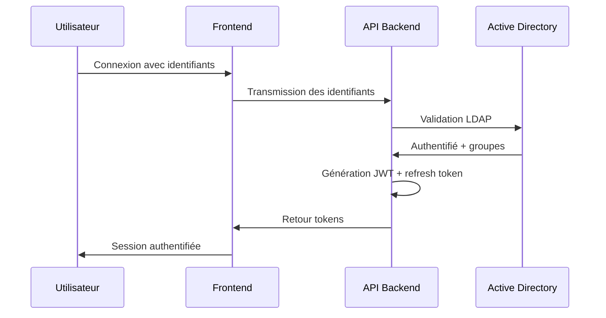

# SECURITY - Système de Réservation de Ressources (SRR)

Ce document définit l'architecture de sécurité et les mesures de protection mises en place pour le Système de Réservation de Ressources (SRR). Il sert de référence pour comprendre comment le système protège les données et assure l'intégrité des opérations.

## Modèle de Menaces

### Menaces Identifiées

Le SRR est conçu pour faire face aux menaces suivantes:

| Menace | Description | Niveau de risque |
|--------|-------------|-----------------|
| Accès non autorisé | Tentative d'accès au système sans authentification valide | Élevé |
| Élévation de privilèges | Utilisateur tentant d'accéder à des fonctionnalités réservées à d'autres rôles | Élevé |
| Injection SQL | Tentative d'altérer les requêtes SQL via les entrées utilisateur | Moyen |
| Cross-Site Scripting (XSS) | Injection de scripts malveillants dans les pages web | Moyen |
| Cross-Site Request Forgery (CSRF) | Forcer un utilisateur authentifié à exécuter des actions non désirées | Moyen |
| Attaques par déni de service | Surcharge du système pour le rendre indisponible | Faible |
| Fuite de données | Extraction non autorisée de données sensibles | Élevé |
| Altération de données | Modification non autorisée des données (réservations, ressources) | Élevé |

### Périmètre de Sécurité

```mermaid
flowchart TD
    Internet((Internet)) --> WAF[AWS WAF]
    WAF --> CloudFront[CloudFront]
    CloudFront --> S3[S3 Frontend]
    CloudFront --> ALB[Application Load Balancer]
    ALB --> ECS[ECS Fargate API]
    
    subgraph "Zone de confiance AWS"
        ECS --> SecretsManager[Secrets Manager]
        ECS --> Aurora[Aurora PostgreSQL]
        ECS --> VPN{VPN Site-to-Site}
    end
    
    VPN --> AD[Active Directory]
    VPN --> Exchange[Exchange Server]
    
    subgraph "Surveillance et Audit"
        CloudWatch[CloudWatch] --> SNS[SNS Alertes]
        CloudTrail[CloudTrail]
        ECS --> Audit[Logs d'Audit]
    end
    
    style Internet fill:#f9f9f9,stroke:#333,stroke-width:1px
    style "Zone de confiance AWS" fill:#e6f7ff,stroke:#333,stroke-width:1px
    style "Surveillance et Audit" fill:#fff2e6,stroke:#333,stroke-width:1px
```

## Authentication et Autorisation

### Authentification

Le SRR utilise un système d'authentification à plusieurs niveaux:

1. **Authentification Principale**
   - Intégration avec Active Directory via LDAP over SSL
   - Les mots de passe ne sont jamais stockés dans le SRR
   - Connexion via VPN site-à-site sécurisée

2. **Gestion des Sessions**
   - Utilisation de JSON Web Tokens (JWT) avec une durée de vie limitée (1 heure)
   - Refresh tokens pour renouveler la session sans re-authentification
   - Invalidation des tokens lors de la déconnexion

3. **Authentification Multi-facteurs**
   - Support optionnel du MFA pour les rôles administratifs
   - Intégration avec les solutions MFA existantes de l'organisation

Exemple de flux d'authentification:



### Autorisation (RBAC)

Le système utilise un modèle RBAC (Role-Based Access Control) avec les rôles suivants:

| Rôle | Description | Permissions |
|------|-------------|------------|
| Administrateur | Administration globale du système | Toutes les permissions |
| Gestionnaire | Gestion des ressources d'un service | CRUD sur leurs ressources, validation des demandes |
| Demandeur | Utilisateur standard | Recherche, réservation, annulation de ses propres réservations |
| Agent d'accueil | Personnel d'accueil | Visualisation planning, check-in/check-out |
| Écran public | Affichage dans les halls | Visualisation anonyme du planning journalier |

Règles d'autorisation principales:

1. Vérification des permissions à deux niveaux:
   - Middleware général pour les contrôles de rôle
   - Vérifications spécifiques pour les opérations sur les ressources

2. Propriété des ressources:
   - Les utilisateurs ne peuvent modifier que leurs propres réservations
   - Les gestionnaires ne peuvent gérer que les ressources dont ils sont responsables

3. Délégation:
   - Mécanisme de délégation temporaire de droits (ex: pendant les congés)
   - Traçabilité complète des actions effectuées en délégation

## Protection des Données

### Données en Transit

Toutes les communications sont chiffrées:

- **HTTPS** avec TLS 1.3 obligatoire
- Certificats gérés via AWS Certificate Manager
- Configuration HTTPS stricte avec HSTS
- Perfect Forward Secrecy pour protéger les sessions passées

### Données au Repos

Chiffrement systématique:

- Aurora PostgreSQL avec chiffrement activé (clés gérées par AWS KMS)
- Backups S3 chiffrés
- Volumes EBS chiffrés
- Rotation automatique des clés selon calendrier défini

### Classification des Données

| Type de données | Niveau de sensibilité | Mesures spécifiques |
|-----------------|----------------------|---------------------|
| Informations personnelles (noms, emails) | Modéré | Accès restreint, journalisation des consultations |
| Plannings de réservation | Modéré | Visibles uniquement par les personnes concernées |
| Données d'authentification | Élevé | Jamais stockées en clair, transmises via canaux chiffrés |
| Configuration système | Élevé | Accès restreint aux administrateurs, audit des modifications |

### Rétention et Suppression

- Conservation des données de réservation pendant 3 ans
- Anonymisation après la période de rétention
- Purge complète sur demande d'effacement
- Logs d'audit conservés 1 an minimum

## Sécurité des Applications

### Développement Sécurisé

Le SRR est développé selon les principes suivants:

1. **Secure by Design**
   - Modèle de menaces mis à jour à chaque évolution majeure
   - Revues de sécurité du code avant déploiement
   - Utilisation de bibliothèques sécurisées et maintenues

2. **Pratiques de codage sécurisé**
   - Validation stricte des entrées utilisateur (via Pydantic)
   - Requêtes paramétrées avec ORM pour prévenir les injections SQL
   - Échappement des sorties pour prévenir les XSS

3. **Tests de sécurité**
   - Tests automatisés des vulnérabilités connues
   - Tests de pénétration annuels
   - Analyse statique du code

### Protection contre les Attaques Courantes

| Attaque | Mesures de protection |
|---------|------------------------|
| Injection SQL | ORM avec requêtes paramétrées, validation des entrées |
| XSS | Échappement des sorties, Content Security Policy |
| CSRF | Tokens anti-CSRF, SameSite cookies |
| Clickjacking | Headers X-Frame-Options, frame-ancestors CSP |
| Enumeration d'identifiants | Rate limiting, réponses génériques |

### Gestion des Dépendances

- Analyse automatique des dépendances (OWASP Dependency Check)
- Mise à jour régulière des bibliothèques
- Utilisation de sources fiables pour les packages

## Sécurité de l'Infrastructure

### Configuration Réseau

- Segmentation réseau via VPCs et subnets
- Accès Internet sortant uniquement via NAT Gateway
- Règles de security groups restrictives
- Network ACLs pour une défense en profondeur

### Durcissement des Systèmes

- Images de conteneurs minimales basées sur Alpine
- Principe du moindre privilège pour les permissions
- Suppression des services et ports non nécessaires
- WAF devant l'Application Load Balancer

### Gestion des Secrets

Tous les secrets sont gérés via AWS Secrets Manager:

- Identifiants de base de données
- Clés d'API
- Certificats et clés privées
- Identifiants pour les systèmes externes

Rotation automatique des secrets tous les 90 jours ou après incident.

### Surveillance et Détection

- Monitoring en temps réel via CloudWatch
- Alertes sur les comportements anormaux
- Analyse des logs par patterns de sécurité
- Dashboards de sécurité pour les administrateurs

## Gestion des Incidents

### Processus de Réponse

1. **Détection**
   - Systèmes automatisés de détection
   - Remontée d'incidents par les utilisateurs
   - Monitoring proactif

2. **Confinement**
   - Isolation des systèmes compromis
   - Blocage temporaire des accès si nécessaire
   - Sauvegarde des preuves

3. **Éradication**
   - Suppression des accès non autorisés
   - Correction des vulnérabilités exploitées
   - Nettoyage des systèmes affectés

4. **Récupération**
   - Restauration des services
   - Vérification de l'intégrité des données
   - Tests de sécurité post-incident

5. **Leçons apprises**
   - Analyse post-incident
   - Mise à jour des procédures
   - Renforcement des défenses

### Communication en cas d'Incident

- Matrice d'escalade définie
- Modèles de communication préparés
- Processus de notification des parties prenantes

## Conformité et Audit

### Journalisation

- Journalisation complète des actions utilisateur
- Horodatage précis (NTP synchronisé)
- Stockage centralisé des logs
- Protection contre la falsification

Exemple de structure de log:
```json
{
  "timestamp": "2025-04-22T22:30:00Z",
  "user_id": "550e8400-e29b-41d4-a716-446655440000",
  "username": "jdupont",
  "action": "BOOKING_CREATE",
  "resource_id": "550e8400-e29b-41d4-a716-446655440010",
  "details": {
    "booking_id": "550e8400-e29b-41d4-a716-446655440300",
    "start_time": "2025-06-15T10:30:00Z",
    "end_time": "2025-06-15T12:00:00Z"
  },
  "ip_address": "192.168.1.100",
  "user_agent": "Mozilla/5.0...",
  "status": "SUCCESS"
}
```

### Audit

- Piste d'audit complète pour toutes les opérations sensibles
- Conservation des logs pendant 12 mois minimum
- Rapports d'audit périodiques
- Revue des droits d'accès trimestrielle

### Tests et Validation

| Type de test | Fréquence | Responsable |
|--------------|-----------|-------------|
| Tests de pénétration | Annuel | Prestataire externe |
| Scan de vulnérabilités | Mensuel | Équipe sécurité |
| Revue de code sécurité | À chaque merge request | Développeurs |
| Test de restauration | Trimestriel | Équipe ops |

## Plans de Continuité et Reprise

### Objectifs

- **RPO (Recovery Point Objective)**: 15 minutes maximum
- **RTO (Recovery Time Objective)**: 4 heures maximum

### Stratégie de Sauvegarde

- Sauvegardes automatiques quotidiennes
- Réplication cross-AZ en temps réel
- Conservation des sauvegardes pendant 35 jours
- Test de restauration trimestriel

### Scénarios de Reprise

1. **Panne d'une zone de disponibilité**
   - Basculement automatique sur la seconde AZ
   - Aucune intervention manuelle requise

2. **Corruption de données**
   - Restauration depuis le dernier point de sauvegarde valide
   - Réconciliation des données si nécessaire

3. **Compromission de sécurité**
   - Isolement du système compromis
   - Déploiement d'une nouvelle instance propre
   - Restauration des données après validation

## Formation et Sensibilisation

### Programme de Sensibilisation

- Formation obligatoire pour tous les utilisateurs du système
- Modules spécifiques pour les administrateurs et gestionnaires
- Rappels réguliers sur les bonnes pratiques

### Documentation Utilisateur

- Guide de sécurité pour les utilisateurs
- Procédures de signalement des incidents
- FAQ sur les questions de sécurité courantes

## Responsabilités Partagées

| Partie prenante | Responsabilités de sécurité |
|-----------------|------------------------------|
| Équipe de développement | Développement sécurisé, correction des vulnérabilités |
| Équipe d'exploitation | Maintenance des systèmes, application des correctifs |
| AWS | Sécurité de l'infrastructure cloud sous-jacente |
| Utilisateurs finaux | Protection de leurs identifiants, signalement des comportements suspects |
| DSIM | Surveillance globale, audits de sécurité, gestion des politiques |

## Évolutions et Améliorations

Le modèle de sécurité est en constante évolution. Les améliorations planifiées incluent:

- Intégration d'un système de détection d'anomalies basé sur l'apprentissage automatique
- Renforcement de l'authentification avec support systématique de MFA
- Chiffrement de bout en bout pour les communications critiques
- Mise en place d'un programme de bug bounty interne
