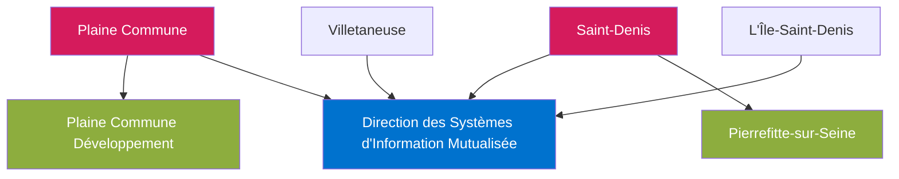

# Index des Identités Visuelles

Ce dossier contient les identités visuelles des principales entités impliquées dans le projet de système de réservation de ressources pour Plaine Commune et la ville de Saint-Denis.

## Entités principales

### [Plaine Commune](./PLAINE_COMMUNE.md)
**Type d'organisation** : Établissement Public Territorial (EPT)
- Regroupe 9 communes de Seine-Saint-Denis
- Environ 450 000 habitants
- Président : Mathieu Hanotin

### [Ville de Saint-Denis](./SAINT_DENIS.md)
**Type d'organisation** : Commune (avec commune nouvelle)
- Maire : Mathieu Hanotin (depuis 2020)
- Fusion récente avec Pierrefitte-sur-Seine (2025)
- 3000 agents municipaux

### [Direction des Systèmes d'Information Mutualisée (DSIM)](./DSIM.md)
**Type d'organisation** : Direction mutualisée
- Créée en janvier 2011
- Gère les SI de quatre collectivités
- Couvre 220 sites et 5 500 postes

### [Pierrefitte-sur-Seine](./PIERREFITTE_SUR_SEINE.md)
**Type d'organisation** : Commune déléguée
- Désormais rattachée à Saint-Denis
- Fusion officialisée en juin 2024
- Effective depuis janvier 2025

### [Plaine Commune Développement](./PLAINE_COMMUNE_DEVELOPPEMENT.md)
**Type d'organisation** : Structure de développement territorial
- 1,4 milliard d'euros d'investissements
- 3,2 millions de m² de programmes immobiliers

## Structure hiérarchique et relations



## Utilisation des logos SVG

Les logos SVG inclus dans chaque document d'identité visuelle peuvent être utilisés de plusieurs façons :

### 1. Incorporation directe en HTML

```html
<div class="logo">
    <!-- Coller ici le code SVG -->
</div>
```

### 2. Sauvegarde comme fichier SVG

1. Copiez le code SVG du logo
2. Créez un fichier avec extension `.svg`
3. Collez le code et sauvegardez
4. Utilisez comme n'importe quelle image

### 3. Conversion en autres formats

Pour convertir les SVG en PNG, JPG ou autres formats pour utilisation dans des contextes où le SVG n'est pas supporté, utilisez des outils comme:
- Inkscape
- SVGOMG
- SVG Converter en ligne

## Notes importantes

- Tous les logos ont été conçus avec un fond transparent pour faciliter leur intégration dans divers contextes
- Les couleurs utilisées correspondent aux identités visuelles officielles ou inférées des entités concernées
- Les fichiers SVG sont entièrement modifiables pour s'adapter aux différents besoins du projet
