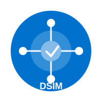

# Logos SVG des entités du projet

Ce répertoire contient les logos SVG des principales entités impliquées dans le projet de système de réservation de ressources pour Plaine Commune et la ville de Saint-Denis.

## Contenu du dossier

- **plaine_commune.svg** - Logo de l'Établissement Public Territorial Plaine Commune
- **saint_denis.svg** - Logo de la Ville de Saint-Denis
- **dsim.svg** - Logo de la Direction des Systèmes d'Information Mutualisée
- **pierrefitte_sur_seine.svg** - Logo de Pierrefitte-sur-Seine (commune déléguée de Saint-Denis)
- **plaine_commune_developpement.svg** - Logo de Plaine Commune Développement

## Utilisation des logos SVG

### Dans un document HTML

```html

```

### Comme fond en CSS

```css
.header-logo {
  background-image: url('../logos/saint_denis.svg');
  background-size: contain;
  background-repeat: no-repeat;
  width: 200px;
  height: 200px;
}
```

### Dans un document Markdown

```markdown

```

### Directement intégré dans le HTML

Vous pouvez copier le contenu du fichier SVG et l'insérer directement dans votre code HTML pour avoir plus de contrôle sur le logo (animations, interactivité, etc.).

## Caractéristiques

- Tous les logos ont un fond transparent pour s'adapter à différents arrière-plans
- Dimensions uniformes de 200x200 pixels avec possibilité de redimensionnement sans perte de qualité
- Optimisés pour une utilisation web

## Informations complémentaires

Pour des détails supplémentaires sur chaque entité et son identité visuelle, consultez les documents d'identité visuelle correspondants dans le répertoire `doc/identites_visuelles/`.
