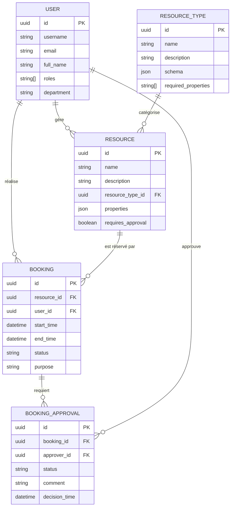

# Plan de Base de Données - Environnement de Développement SRR

## Objectifs Spécifiques

Ce plan détaille la conception et l'implémentation de la base de données PostgreSQL pour l'environnement de développement minimaliste du SRR. L'objectif est de créer un schéma simplifié mais fonctionnel qui reflète les entités principales du système et leurs relations, tout en permettant une évolution progressive vers le modèle complet.

## Dépendances

- [plan_01_infrastructure.md](./plan_01_infrastructure.md) : Configuration Docker pour PostgreSQL
- [plan_02_backend_core.md](./plan_02_backend_core.md) : Structure du backend et connexion à la BD
- Référence au modèle défini dans [DATA_MODEL.md](/doc/DATA_MODEL.md)

## Schéma Simplifié de la Base de Données

Pour l'environnement de développement, nous implémenterons un schéma simplifié qui couvre les entités principales :



## Modèles SQLAlchemy

### 1. Base du Modèle

```python
# app/db/base.py
from sqlalchemy.ext.declarative import declarative_base

Base = declarative_base()

# Import all models to ensure they are registered with SQLAlchemy
from app.models.user import User  # noqa
from app.models.resource_type import ResourceType  # noqa
from app.models.resource import Resource  # noqa
from app.models.booking import Booking  # noqa
from app.models.booking_approval import BookingApproval  # noqa
```

### 2. Modèle User

```python
# app/models/user.py
import uuid
from sqlalchemy import Column, String, DateTime, func, ARRAY
from sqlalchemy.dialects.postgresql import UUID
from sqlalchemy.orm import relationship

from app.db.base_class import Base

class User(Base):
    """
    [Class intent]
    Représente un utilisateur du système SRR synchronisé avec l'Active Directory.
    
    [Design principles]
    Fournit une représentation locale des attributs utilisateur essentiels à l'application.
    Ne stocke pas les mots de passe puisque l'authentification est déléguée à l'AD.
    
    [Implementation details]
    Utilise UUID comme clé primaire pour garantir l'unicité globale et faciliter la synchronisation.
    Implémentation minimale pour la phase de développement.
    """
    __tablename__ = "users"

    id = Column(UUID(as_uuid=True), primary_key=True, default=uuid.uuid4)
    username = Column(String(100), unique=True, nullable=False, index=True)
    email = Column(String(255), unique=True, nullable=False)
    full_name = Column(String(255), nullable=False)
    roles = Column(ARRAY(String), nullable=False, default=["user"])
    department = Column(String(255))
    
    # Relations - pour la phase minimale, nous omettons les détails avancés
    bookings = relationship("Booking", back_populates="user")
    approvals = relationship("BookingApproval", back_populates="approver")
    managed_resources = relationship("Resource", secondary="resource_managers")
```

### 3. Modèle ResourceType

```python
# app/models/resource_type.py
import uuid
from sqlalchemy import Column, String, Text, ARRAY
from sqlalchemy.dialects.postgresql import UUID, JSONB
from sqlalchemy.orm import relationship

from app.db.base_class import Base

class ResourceType(Base):
    """
    [Class intent]
    Définit les différents types de ressources disponibles dans le système.
    
    [Design principles]
    Utilise un schéma JSON flexible pour permettre des propriétés dynamiques selon le type.
    Centralise la définition des propriétés et contraintes par type de ressource.
    
    [Implementation details]
    Les ressources héritent des propriétés et contraintes définies dans leur type.
    Le schéma JSON définit les types, valeurs possibles et validations pour les propriétés.
    """
    __tablename__ = "resource_types"

    id = Column(UUID(as_uuid=True), primary_key=True, default=uuid.uuid4)
    name = Column(String(100), unique=True, nullable=False)
    description = Column(Text)
    schema = Column(JSONB, nullable=False, default={})
    required_properties = Column(ARRAY(String), nullable=False, default=[])
    
    # Relations
    resources = relationship("Resource", back_populates="resource_type")
```

### 4. Modèle Resource

```python
# app/models/resource.py
import uuid
from sqlalchemy import Column, String, Text, Boolean, ForeignKey, Table
from sqlalchemy.dialects.postgresql import UUID, JSONB
from sqlalchemy.orm import relationship

from app.db.base_class import Base

# Table d'association pour les gestionnaires de ressources
resource_managers = Table(
    "resource_managers",
    Base.metadata,
    Column("resource_id", UUID(as_uuid=True), ForeignKey("resources.id"), primary_key=True),
    Column("user_id", UUID(as_uuid=True), ForeignKey("users.id"), primary_key=True)
)

class Resource(Base):
    """
    [Class intent]
    Représente une ressource réservable dans le système SRR.
    
    [Design principles]
    Combine des propriétés de base communes à toutes les ressources avec des propriétés 
    dynamiques spécifiques au type stockées en JSON.
    
    [Implementation details]
    Les propriétés JSON sont validées contre le schéma défini dans le type de ressource.
    Version simplifiée pour l'environnement de développement.
    """
    __tablename__ = "resources"

    id = Column(UUID(as_uuid=True), primary_key=True, default=uuid.uuid4)
    name = Column(String(100), nullable=False)
    description = Column(Text)
    resource_type_id = Column(UUID(as_uuid=True), ForeignKey("resource_types.id"), nullable=False)
    properties = Column(JSONB, nullable=False, default={})
    requires_approval = Column(Boolean, nullable=False, default=False)
    
    # Relations
    resource_type = relationship("ResourceType", back_populates="resources")
    bookings = relationship("Booking", back_populates="resource")
    managers = relationship("User", secondary=resource_managers)
```

### 5. Modèle Booking

```python
# app/models/booking.py
import uuid
from sqlalchemy import Column, String, Text, ForeignKey, DateTime, CheckConstraint
from sqlalchemy.dialects.postgresql import UUID
from sqlalchemy.orm import relationship

from app.db.base_class import Base

class Booking(Base):
    """
    [Class intent]
    Représente une réservation de ressource par un utilisateur.
    
    [Design principles]
    Implémente un workflow d'état permettant de suivre le cycle de vie complet d'une réservation.
    
    [Implementation details]
    Version simplifiée pour le développement initial.
    Inclut une contrainte de validation pour garantir que end_time est après start_time.
    """
    __tablename__ = "bookings"

    id = Column(UUID(as_uuid=True), primary_key=True, default=uuid.uuid4)
    resource_id = Column(UUID(as_uuid=True), ForeignKey("resources.id"), nullable=False)
    user_id = Column(UUID(as_uuid=True), ForeignKey("users.id"), nullable=False)
    start_time = Column(DateTime(timezone=True), nullable=False)
    end_time = Column(DateTime(timezone=True), nullable=False)
    status = Column(String(20), nullable=False, default="pending")
    purpose = Column(Text, nullable=False)
    
    # Relations
    resource = relationship("Resource", back_populates="bookings")
    user = relationship("User", back_populates="bookings")
    approvals = relationship("BookingApproval", back_populates="booking")
    
    # Contraintes
    __table_args__ = (
        CheckConstraint('end_time > start_time', name='check_booking_end_after_start'),
    )
```

### 6. Modèle BookingApproval

```python
# app/models/booking_approval.py
import uuid
from sqlalchemy import Column, String, Text, ForeignKey, DateTime, func
from sqlalchemy.dialects.postgresql import UUID
from sqlalchemy.orm import relationship

from app.db.base_class import Base

class BookingApproval(Base):
    """
    [Class intent]
    Représente la validation d'une réservation par un gestionnaire.
    
    [Design principles]
    Implémente le processus d'approbation pour les ressources nécessitant validation.
    Conserve une trace auditable des décisions et leurs justifications.
    
    [Implementation details]
    Chaque approbation est liée à un booking et maintient son propre statut.
    """
    __tablename__ = "booking_approvals"

    id = Column(UUID(as_uuid=True), primary_key=True, default=uuid.uuid4)
    booking_id = Column(UUID(as_uuid=True), ForeignKey("bookings.id"), nullable=False)
    approver_id = Column(UUID(as_uuid=True), ForeignKey("users.id"), nullable=False)
    status = Column(String(20), nullable=False, default="pending")
    comment = Column(Text)
    decision_time = Column(DateTime(timezone=True), nullable=False, default=func.now())
    
    # Relations
    booking = relationship("Booking", back_populates="approvals")
    approver = relationship("User", back_populates="approvals")
```

## Configuration Alembic pour les Migrations

### 1. Configuration Alembic

```ini
# alembic.ini
[alembic]
script_location = alembic
prepend_sys_path = .
sqlalchemy.url = postgresql://postgres:password@db:5432/srr_dev
truncate_slug_length = 50

[post_write_hooks]
# Commenter les hooks pour l'environnement de développement

[loggers]
keys = root,sqlalchemy,alembic

[handlers]
keys = console

[formatters]
keys = generic

[logger_root]
level = INFO
handlers = console
qualname =

[logger_sqlalchemy]
level = WARN
handlers =
qualname = sqlalchemy.engine

[logger_alembic]
level = INFO
handlers =
qualname = alembic

[handler_console]
class = StreamHandler
args = (sys.stderr,)
level = NOTSET
formatter = generic

[formatter_generic]
format = %(levelname)-5.5s [%(name)s] %(message)s
datefmt = %H:%M:%S
```

### 2. Script d'environnement Alembic

```python
# alembic/env.py
import os
import sys
from logging.config import fileConfig

from sqlalchemy import engine_from_config, pool

from alembic import context

# Ajout du répertoire principal au path pour l'import des modèles
sys.path.insert(0, os.path.dirname(os.path.dirname(__file__)))

# Import des modèles
from app.db.base import Base  # noqa
from app.core.config import settings  # noqa

# Configuration Alembic
config = context.config
fileConfig(config.config_file_name)
target_metadata = Base.metadata

# URL de la base de données
config.set_main_option("sqlalchemy.url", settings.DATABASE_URL)

def run_migrations_online():
    """Exécute les migrations en mode 'online'."""
    connectable = engine_from_config(
        config.get_section(config.config_ini_section),
        prefix="sqlalchemy.",
        poolclass=pool.NullPool,
    )

    with connectable.connect() as connection:
        context.configure(
            connection=connection, 
            target_metadata=target_metadata,
            compare_type=True  # Détecte les changements de type
        )

        with context.begin_transaction():
            context.run_migrations()

# Exécution des migrations
run_migrations_online()
```

### 3. Migration Initiale

```python
# alembic/versions/001_initial_schema.py
"""initial schema

Revision ID: 001
Revises: 
Create Date: 2025-04-23 08:00:00.000000

"""
from alembic import op
import sqlalchemy as sa
from sqlalchemy.dialects import postgresql

# revision identifiers
revision = '001'
down_revision = None
branch_labels = None
depends_on = None

def upgrade():
    # Users
    op.create_table(
        'users',
        sa.Column('id', postgresql.UUID(as_uuid=True), primary_key=True),
        sa.Column('username', sa.String(100), nullable=False, unique=True),
        sa.Column('email', sa.String(255), nullable=False, unique=True),
        sa.Column('full_name', sa.String(255), nullable=False),
        sa.Column('roles', postgresql.ARRAY(sa.String()), nullable=False),
        sa.Column('department', sa.String(255)),
    )
    op.create_index(op.f('ix_users_username'), 'users', ['username'])

    # Resource Types
    op.create_table(
        'resource_types',
        sa.Column('id', postgresql.UUID(as_uuid=True), primary_key=True),
        sa.Column('name', sa.String(100), nullable=False, unique=True),
        sa.Column('description', sa.Text()),
        sa.Column('schema', postgresql.JSONB(astext_type=sa.Text()), nullable=False),
        sa.Column('required_properties', postgresql.ARRAY(sa.String()), nullable=False),
    )

    # Resources
    op.create_table(
        'resources',
        sa.Column('id', postgresql.UUID(as_uuid=True), primary_key=True),
        sa.Column('name', sa.String(100), nullable=False),
        sa.Column('description', sa.Text()),
        sa.Column('resource_type_id', postgresql.UUID(as_uuid=True), nullable=False),
        sa.Column('properties', postgresql.JSONB(astext_type=sa.Text()), nullable=False),
        sa.Column('requires_approval', sa.Boolean(), nullable=False),
        sa.ForeignKeyConstraint(['resource_type_id'], ['resource_types.id']),
    )

    # Resource Managers
    op.create_table(
        'resource_managers',
        sa.Column('resource_id', postgresql.UUID(as_uuid=True), nullable=False),
        sa.Column('user_id', postgresql.UUID(as_uuid=True), nullable=False),
        sa.ForeignKeyConstraint(['resource_id'], ['resources.id']),
        sa.ForeignKeyConstraint(['user_id'], ['users.id']),
        sa.PrimaryKeyConstraint('resource_id', 'user_id'),
    )

    # Bookings
    op.create_table(
        'bookings',
        sa.Column('id', postgresql.UUID(as_uuid=True), primary_key=True),
        sa.Column('resource_id', postgresql.UUID(as_uuid=True), nullable=False),
        sa.Column('user_id', postgresql.UUID(as_uuid=True), nullable=False),
        sa.Column('start_time', sa.DateTime(timezone=True), nullable=False),
        sa.Column('end_time', sa.DateTime(timezone=True), nullable=False),
        sa.Column('status', sa.String(20), nullable=False),
        sa.Column('purpose', sa.Text(), nullable=False),
        sa.ForeignKeyConstraint(['resource_id'], ['resources.id']),
        sa.ForeignKeyConstraint(['user_id'], ['users.id']),
        sa.CheckConstraint('end_time > start_time', name='check_booking_end_after_start'),
    )
    op.create_index('ix_bookings_resource_dates', 'bookings', ['resource_id', 'start_time', 'end_time'])
    op.create_index('ix_bookings_user', 'bookings', ['user_id'])
    op.create_index('ix_bookings_status', 'bookings', ['status'])

    # Booking Approvals
    op.create_table(
        'booking_approvals',
        sa.Column('id', postgresql.UUID(as_uuid=True), primary_key=True),
        sa.Column('booking_id', postgresql.UUID(as_uuid=True), nullable=False),
        sa.Column('approver_id', postgresql.UUID(as_uuid=True), nullable=False),
        sa.Column('status', sa.String(20), nullable=False),
        sa.Column('comment', sa.Text()),
        sa.Column('decision_time', sa.DateTime(timezone=True), nullable=False),
        sa.ForeignKeyConstraint(['booking_id'], ['bookings.id']),
        sa.ForeignKeyConstraint(['approver_id'], ['users.id']),
    )
    op.create_index('ix_booking_approvals_booking', 'booking_approvals', ['booking_id'])


def downgrade():
    op.drop_table('booking_approvals')
    op.drop_table('bookings')
    op.drop_table('resource_managers')
    op.drop_table('resources')
    op.drop_table('resource_types')
    op.drop_table('users')
```

## Données de Test (Seeds)

Pour faciliter le développement, nous fournirons des données de test initiales.

```python
# app/db/seeds.py
import uuid
from datetime import datetime, timedelta

from app.db.session import SessionLocal
from app.models.user import User
from app.models.resource_type import ResourceType
from app.models.resource import Resource
from app.models.booking import Booking
from app.models.booking_approval import BookingApproval

def create_sample_data():
    """
    [Function intent]
    Génère des données d'exemple pour le développement.
    
    [Design principles]
    Fournit un jeu de données minimal mais suffisant pour tester les fonctionnalités.
    
    [Implementation details]
    Insère des utilisateurs, types de ressources, ressources et réservations.
    """
    db = SessionLocal()
    try:
        # Vérifier si des données existent déjà
        if db.query(User).count() > 0:
            print("Des données existent déjà.")
            return
        
        # Créer quelques utilisateurs
        users = [
            User(
                id=uuid.UUID("550e8400-e29b-41d4-a716-446655440000"),
                username="admin",
                email="admin@example.com",
                full_name="Admin Système",
                roles=["admin", "user"],
                department="DSI",
            ),
            User(
                id=uuid.UUID("550e8400-e29b-41d4-a716-446655440001"),
                username="user",
                email="user@example.com",
                full_name="Utilisateur Standard",
                roles=["user"],
                department="Marketing",
            ),
            User(
                id=uuid.UUID("550e8400-e29b-41d4-a716-446655440002"),
                username="manager",
                email="manager@example.com",
                full_name="Gestionnaire de Ressources",
                roles=["resource_manager", "user"],
                department="Services Généraux",
            ),
        ]
        db.add_all(users)
        db.flush()
        
        # Créer un type de ressource "Salle de réunion"
        meeting_room_schema = {
            "properties": {
                "floor": {
                    "type": "integer",
                    "description": "Étage où se trouve la salle",
                    "minimum": 0
                },
                "has_projector": {
                    "type": "boolean",
                    "description": "Présence d'un projecteur"
                },
                "capacity": {
                    "type": "integer",
                    "description": "Nombre maximum de personnes",
                    "minimum": 1
                },
                "layout": {
                    "type": "string",
                    "enum": ["u_shape", "classroom", "boardroom", "theater"],
                    "description": "Configuration de la salle"
                }
            },
            "required": ["floor", "capacity", "layout"]
        }
        
        room_type = ResourceType(
            id=uuid.UUID("550e8400-e29b-41d4-a716-446655440010"),
            name="Salle de réunion",
            description="Espace dédié aux réunions et présentations",
            schema=meeting_room_schema,
            required_properties=["floor", "capacity", "layout"],
        )
        db.add(room_type)
        db.flush()
        
        # Créer quelques ressources (salles)
        resources = [
            Resource(
                id=uuid.UUID("550e8400-e29b-41d4-a716-446655440020"),
                name="Salle Neptune",
                description="Grande salle de réunion avec vue sur le parc",
                resource_type_id=uuid.UUID("550e8400-e29b-41d4-a716-446655440010"),
                properties={
                    "floor": 2,
                    "has_projector": True,
                    "capacity": 20,
                    "layout": "boardroom"
                },
                requires_approval=False,
            ),
            Resource(
                id=uuid.UUID("550e8400-e29b-41d4-a716-446655440021"),
                name="Salle Jupiter",
                description="Salle de conférence pour présentations importantes",
                resource_type_id=uuid.UUID("550e8400-e29b-41d4-a716-446655440010"),
                properties={
                    "floor": 3,
                    "has_projector": True,
                    "capacity": 50,
                    "layout": "theater"
                },
                requires_approval=True,
            ),
        ]
        db.add_all(resources)
        db.flush()
        
        # Créer une association gestionnaire de ressource
        resources[1].managers.append(users[2])  # manager gère Jupiter
        
        # Créer quelques réservations
        now = datetime.now()
        bookings = [
            Booking(
                id=uuid.UUID("550e8400-e29b-41d4-a716-446655440030"),
                resource_id=uuid.UUID("550e8400-e29b-41d4-a716-446655440020"),  # Neptune
                user_id=uuid.UUID("550e8400-e29b-41d4-a716-446655440001"),  # user standard
                start_time=now + timedelta(days=1, hours=10),
                end_time=now + timedelta(days=1, hours=12),
                status="confirmed",
                purpose="Réunion d'équipe marketing",
            ),
            Booking(
                id=uuid.UUID("550e8400-e29b-41d4-a716-446655440031"),
                resource_id=uuid.UUID("550e8400-e29b-41d4-a716-446655440021"),  # Jupiter
                user_id=uuid.UUID("550e8400-e29b-41d4-a716-446655440001"),  # user standard
                start_time=now + timedelta(days=2, hours=14),
                end_time=now + timedelta(days=2, hours=16),
                status="pending",
                purpose="Présentation projet XYZ",
            ),
        ]
        db.add_all(bookings)
        db.flush()
        
        # Créer une approbation
        approval = BookingApproval(
            id=uuid.UUID("550e8400-e29b-41d4-a716-446655440040"),
            booking_id=uuid.UUID("550e8400-e29b-41d4-a716-446655440031"),  # réservation Jupiter
            approver_id=uuid.UUID("550e8400-e29b-41d4-a716-446655440002"),  # manager
            status="pending",
            comment=None,
            decision_time=now,
        )
        db.add(approval)
        
        # Commit toutes les données
        db.commit()
        print("Données d'exemple créées avec succès.")
        
    except Exception as e:
        db.rollback()
        print(f"Erreur lors de la création des données: {e}")
    finally:
        db.close()
```

## Schémas Pydantic (Extraits)

Pour valider les données d'entrée/sortie de l'API, nous définissons des schémas Pydantic.

```python
# app/schemas/resource.py (exemple)
from typing import Dict, List, Optional, Any
from pydantic import UUID4, BaseModel, Field
from app.schemas.base import BaseSchema

class ResourceTypeBase(BaseSchema):
    """Base pour les schémas de type de ressource"""
    name: str
    description: Optional[str] = None
    schema: Dict[str, Any]
    required_properties: List[str] = []

class ResourceTypeCreate(ResourceTypeBase):
    """Données pour créer un type de ressource"""
    pass

class ResourceTypeResponse(ResourceTypeBase):
    """Réponse API pour un type de ressource"""
    id: UUID4

class ResourceBase(BaseSchema):
    """Base pour les schémas de ressource"""
    name: str
    description: Optional[str] = None
    properties: Dict[str, Any]
    requires_approval: bool = False

class ResourceCreate(ResourceBase):
    """Données pour créer une ressource"""
    resource_type_id: UUID4
    manager_ids: Optional[List[UUID4]] = None

class ResourceResponse(ResourceBase):
    """Réponse API pour une ressource"""
    id: UUID4
    resource_type_id: UUID4
    resource_type: ResourceTypeResponse
```

## Implémentation Étape par Étape

1. **Création de la structure de base**
   - Mettre en place les répertoires et fichiers de base
   - Configurer Alembic pour les migrations

2. **Implémentation des modèles**
   - Définir les modèles SQLAlchemy pour chaque entité
   - Mettre en place les relations entre les entités

3. **Configuration de la migration initiale**
   - Créer la migration Alembic pour le schéma initial
   - Vérifier la génération correcte des tables et contraintes

4. **Données de test**
   - Créer le script de chargement des données d'exemple
   - Vérifier l'insertion des données et les relations

5. **Validation de la base de données**
   - Tester les requêtes principales
   - Vérifier les contraintes et relations

## Critères de Validation

- ✅ Tous les modèles sont correctement définis avec les propriétés et relations nécessaires
- ✅ Les migrations Alembic s'exécutent sans erreur
- ✅ Les données de test sont insérées correctement
- ✅ Les requêtes de base fonctionnent (insertion, sélection, jointures)
- ✅ Les contraintes de validation sont respectées (par ex. date fin > date début)

## Considérations de Sécurité

- Chiffrement des données sensibles
- Validation stricte des entrées via Pydantic
- Indices appropriés pour éviter les problèmes de performance
- Gestion des échecs de validation
- Sauvegarde régulière de la base en développement

## Références

- [Documentation SQLAlchemy](https://docs.sqlalchemy.org/)
- [Documentation Alembic](https://alembic.sqlalchemy.org/en/latest/)
- [Documentation Pydantic](https://docs.pydantic.dev/)
- [DATA_MODEL.md](/doc/DATA_MODEL.md) pour le modèle de données complet
