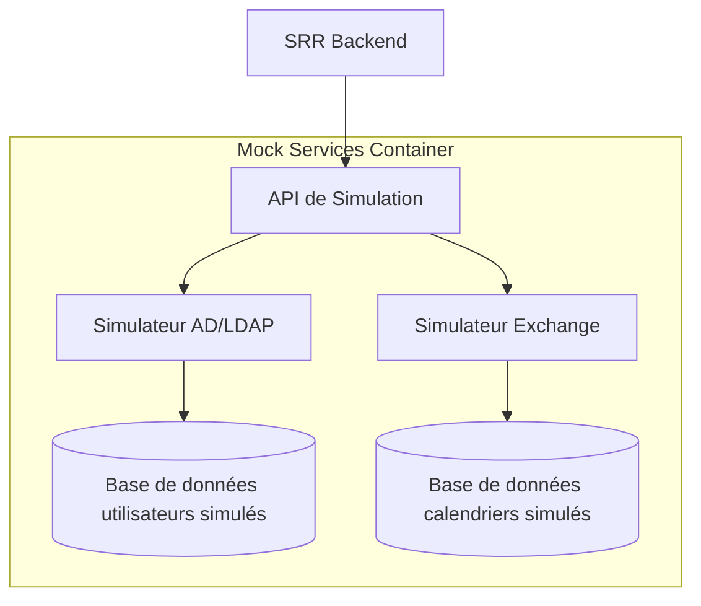

# Plan des Services Simulés - Environnement de Développement SRR

## Objectifs Spécifiques

Ce plan détaille la conception et l'implémentation des services simulés (mocks) pour l'environnement de développement minimaliste du SRR. L'objectif est de créer des simulations fonctionnelles des services externes dont dépend le système, comme l'Active Directory (AD/LDAP) et Microsoft Exchange, permettant ainsi de développer et tester l'application sans accès aux systèmes réels.

## Dépendances

- [plan_01_infrastructure.md](./plan_01_infrastructure.md) : Configuration Docker pour le service de simulation
- [plan_02_backend_core.md](./plan_02_backend_core.md) : Structure du backend qui utilisera ces services
- [plan_03_database.md](./plan_03_database.md) : Modèles de données liés aux utilisateurs et ressources

## Services à Simuler

### 1. Active Directory / LDAP

Le service AD/LDAP est utilisé pour:
- L'authentification des utilisateurs
- La récupération des informations utilisateurs (profils, groupes, départements)
- La gestion des autorisations basées sur les groupes d'utilisateurs

### 2. Microsoft Exchange

Le service Exchange est utilisé pour:
- La vérification de disponibilité des ressources (salles, équipements)
- La création/modification/suppression de réservations dans le calendrier Exchange
- La synchronisation des événements entre le SRR et les calendriers utilisateurs

## Architecture des Services Simulés



## Composants à Implémenter

### 1. API de Simulation

```python
# services/mocks/app.py
from fastapi import FastAPI, HTTPException, Depends, status
from fastapi.middleware.cors import CORSMiddleware
from typing import List, Optional, Dict, Any

from .ad_service import ADService
from .exchange_service import ExchangeService

app = FastAPI(
    title="SRR Mock Services",
    description="Simulations d'AD/LDAP et Exchange pour développement SRR",
    version="0.1.0"
)

# Configuration CORS
app.add_middleware(
    CORSMiddleware,
    allow_origins=["*"],
    allow_credentials=True,
    allow_methods=["*"],
    allow_headers=["*"],
)

# Instances des services
ad_service = ADService()
exchange_service = ExchangeService()

# Heartbeat
@app.get("/health")
def health_check():
    """
    [Function intent]
    Vérifie l'état des services simulés.
    
    [Design principles]
    Point d'entrée simple pour vérifier que les services sont opérationnels.
    
    [Implementation details]
    Renvoie un statut OK et la version du service.
    """
    return {"status": "healthy", "version": "0.1.0"}

# Inclusion des routers
from .routers import ad_router, exchange_router
app.include_router(ad_router.router, prefix="/ad", tags=["AD/LDAP"])
app.include_router(exchange_router.router, prefix="/exchange", tags=["Exchange"])

if __name__ == "__main__":
    import uvicorn
    uvicorn.run("app:app", host="0.0.0.0", port=8080, reload=True)
```

### 2. Service AD/LDAP Simulé

```python
# services/mocks/ad_service.py
import os
import json
import uuid
from typing import List, Dict, Optional, Any
from passlib.context import CryptContext

class ADService:
    """
    [Class intent]
    Simule un service Active Directory/LDAP pour l'authentification et la gestion des utilisateurs.
    
    [Design principles]
    Fournit les fonctionnalités minimales d'AD nécessaires au développement du SRR.
    Utilise un stockage en mémoire ou JSON pour les données utilisateurs.
    
    [Implementation details]
    Implémente les opérations basiques: authentification, recherche d'utilisateurs, récupération de groupes.
    """
    def __init__(self):
        """Initialise le service avec les utilisateurs par défaut ou depuis un fichier JSON"""
        self.users = []
        self.groups = []
        self.pwd_context = CryptContext(schemes=["bcrypt"], deprecated="auto")
        
        # Chargement des données depuis un fichier si spécifié
        mock_users_file = os.environ.get("MOCK_USERS_FILE")
        if mock_users_file and os.path.exists(mock_users_file):
            with open(mock_users_file, 'r') as f:
                data = json.load(f)
                self.users = data.get("users", [])
                self.groups = data.get("groups", [])
        else:
            # Utilisateurs par défaut si pas de fichier
            self._load_default_users()
    
    def _load_default_users(self):
        """Charge des utilisateurs par défaut pour le développement"""
        self.users = [
            {
                "id": str(uuid.uuid4()),
                "username": "admin",
                "password_hash": self.pwd_context.hash("admin123"),
                "email": "admin@example.com",
                "full_name": "Admin Système",
                "groups": ["SRR-Admins", "SRR-Users"],
                "department": "DSI",
                "position": "Administrateur système",
                "enabled": True
            },
            {
                "id": str(uuid.uuid4()),
                "username": "user",
                "password_hash": self.pwd_context.hash("user123"),
                "email": "user@example.com",
                "full_name": "Utilisateur Standard",
                "groups": ["SRR-Users"],
                "department": "Marketing",
                "position": "Chef de projet",
                "enabled": True
            },
            {
                "id": str(uuid.uuid4()),
                "username": "manager",
                "password_hash": self.pwd_context.hash("manager123"),
                "email": "manager@example.com",
                "full_name": "Gestionnaire de Ressources",
                "groups": ["SRR-ResourceManagers", "SRR-Users"],
                "department": "Services Généraux",
                "position": "Responsable logistique",
                "enabled": True
            }
        ]
        
        self.groups = [
            {
                "id": str(uuid.uuid4()),
                "name": "SRR-Admins",
                "description": "Administrateurs du système SRR"
            },
            {
                "id": str(uuid.uuid4()),
                "name": "SRR-Users",
                "description": "Utilisateurs du système SRR"
            },
            {
                "id": str(uuid.uuid4()),
                "name": "SRR-ResourceManagers",
                "description": "Gestionnaires des ressources"
            }
        ]
    
    def authenticate(self, username: str, password: str) -> Optional[Dict[str, Any]]:
        """
        [Function intent]
        Authentifie un utilisateur avec son nom d'utilisateur et mot de passe.
        
        [Design principles]
        Simule l'authentification LDAP/AD via bind.
        
        [Implementation details]
        Vérifie que l'utilisateur existe et que le mot de passe correspond.
        Retourne les informations utilisateur sans le hash du mot de passe si authentification réussie.
        """
        user = self.get_user_by_username(username)
        if not user or not user.get("enabled", False):
            return None
        
        if self.pwd_context.verify(password, user.get("password_hash", "")):
            # Ne pas renvoyer le hash du mot de passe
            user_info = user.copy()
            user_info.pop("password_hash", None)
            return user_info
        return None
    
    def get_user_by_username(self, username: str) -> Optional[Dict[str, Any]]:
        """
        [Function intent]
        Récupère un utilisateur par son nom d'utilisateur.
        
        [Design principles]
        Simule une recherche LDAP.
        
        [Implementation details]
        Recherche simple dans la liste des utilisateurs.
        """
        for user in self.users:
            if user.get("username") == username:
                return user
        return None
    
    def get_users(self, filter_str: str = None) -> List[Dict[str, Any]]:
        """
        [Function intent]
        Récupère la liste des utilisateurs, avec filtrage optionnel.
        
        [Design principles]
        Simule une recherche LDAP avec filtre.
        
        [Implementation details]
        Filtrage simple basé sur le nom d'utilisateur, email ou nom complet.
        """
        if not filter_str:
            return [u.copy() for u in self.users if u.get("enabled", False)]
        
        filter_str = filter_str.lower()
        filtered_users = []
        for user in self.users:
            if (not user.get("enabled", False)):
                continue
                
            if (filter_str in user.get("username", "").lower() or
                filter_str in user.get("email", "").lower() or
                filter_str in user.get("full_name", "").lower() or
                filter_str in user.get("department", "").lower()):
                
                user_info = user.copy()
                user_info.pop("password_hash", None)
                filtered_users.append(user_info)
        
        return filtered_users
    
    def get_user_groups(self, username: str) -> List[str]:
        """
        [Function intent]
        Récupère les groupes d'un utilisateur.
        
        [Design principles]
        Simule la recherche des groupes d'un utilisateur dans AD.
        
        [Implementation details]
        Récupère les groupes directement depuis l'utilisateur stocké.
        """
        user = self.get_user_by_username(username)
        if user:
            return user.get("groups", [])
        return []
```

### 3. Router AD/LDAP

```python
# services/mocks/routers/ad_router.py
from fastapi import APIRouter, HTTPException, Depends, status, Body
from typing import List, Dict, Any, Optional
from pydantic import BaseModel

from ..ad_service import ADService

router = APIRouter()
ad_service = ADService()

# Modèles Pydantic
class LoginCredentials(BaseModel):
    username: str
    password: str

class UserResponse(BaseModel):
    id: str
    username: str
    email: str
    full_name: str
    groups: List[str]
    department: Optional[str] = None
    position: Optional[str] = None

# Endpoints
@router.post("/login", response_model=UserResponse)
def login(credentials: LoginCredentials):
    """
    [Function intent]
    Authentifie un utilisateur et renvoie son profil.
    
    [Design principles]
    Endpoint simple simulant le bind LDAP.
    
    [Implementation details]
    Délègue à ADService.authenticate et renvoie les informations utilisateur.
    """
    user = ad_service.authenticate(credentials.username, credentials.password)
    if not user:
        raise HTTPException(
            status_code=status.HTTP_401_UNAUTHORIZED,
            detail="Identifiants invalides"
        )
    return user

@router.get("/users", response_model=List[UserResponse])
def get_users(filter: Optional[str] = None):
    """
    [Function intent]
    Récupère la liste des utilisateurs, avec filtrage optionnel.
    
    [Design principles]
    Endpoint simulant la recherche LDAP.
    
    [Implementation details]
    Délègue à ADService.get_users et applique un filtrage simple.
    """
    return ad_service.get_users(filter)

@router.get("/users/{username}", response_model=UserResponse)
def get_user(username: str):
    """
    [Function intent]
    Récupère les informations d'un utilisateur spécifique.
    
    [Design principles]
    Endpoint simulant la recherche LDAP d'un utilisateur spécifique.
    
    [Implementation details]
    Délègue à ADService.get_user_by_username et gère les cas d'erreur.
    """
    user = ad_service.get_user_by_username(username)
    if not user or not user.get("enabled", False):
        raise HTTPException(
            status_code=status.HTTP_404_NOT_FOUND,
            detail=f"Utilisateur '{username}' non trouvé"
        )
    
    # Ne pas renvoyer le hash du mot de passe
    user_info = user.copy()
    user_info.pop("password_hash", None)
    return user_info

@router.get("/users/{username}/groups", response_model=List[str])
def get_user_groups(username: str):
    """
    [Function intent]
    Récupère les groupes d'un utilisateur spécifique.
    
    [Design principles]
    Endpoint simulant la recherche des groupes d'un utilisateur dans AD.
    
    [Implementation details]
    Délègue à ADService.get_user_groups et gère les cas d'erreur.
    """
    user = ad_service.get_user_by_username(username)
    if not user or not user.get("enabled", False):
        raise HTTPException(
            status_code=status.HTTP_404_NOT_FOUND,
            detail=f"Utilisateur '{username}' non trouvé"
        )
    
    return ad_service.get_user_groups(username)
```

### 4. Service Exchange Simulé (Début)

```python
# services/mocks/exchange_service.py
import os
import json
import uuid
from datetime import datetime, timedelta
from typing import List, Dict, Optional, Any

class ExchangeService:
    """
    [Class intent]
    Simule un service Microsoft Exchange pour la gestion des calendriers et réservations.
    
    [Design principles]
    Fournit les fonctionnalités minimales d'Exchange nécessaires au développement du SRR.
    Utilise un stockage en mémoire ou JSON pour les données de calendrier.
    
    [Implementation details]
    Implémente les opérations basiques de calendrier: disponibilité, création/modification/suppression d'événements.
    """
    def __init__(self):
        """Initialise le service avec les calendriers par défaut ou depuis un fichier JSON"""
        self.calendars = {}
        self.resources = []
        
        # Chargement des données depuis un fichier si spécifié
        mock_resources_file = os.environ.get("MOCK_RESOURCES_FILE")
        if mock_resources_file and os.path.exists(mock_resources_file):
            with open(mock_resources_file, 'r') as f:
                data = json.load(f)
                self.resources = data.get("resources", [])
                self.calendars = data.get("calendars", {})
        else:
            # Ressources par défaut si pas de fichier
            self._load_default_resources()
    
    def _load_default_resources(self):
        """Charge des ressources et calendriers par défaut pour le développement"""
        # Ressources (salles, équipements)
        self.resources = [
            {
                "id": "room-neptune",
                "email": "salle.neptune@example.com",
                "name": "Salle Neptune",
                "type": "room",
                "capacity": 20,
                "features": ["projector", "videoconference"],
                "location": "Bâtiment A, Étage 2"
            },
            {
                "id": "room-jupiter",
                "email": "salle.jupiter@example.com",
                "name": "Salle Jupiter",
                "type": "room",
                "capacity": 50,
                "features": ["projector", "videoconference", "sound_system"],
                "location": "Bâtiment A, Étage 3"
            },
            {
                "id": "projector-1",
                "email": "projecteur1@example.com",
                "name": "Projecteur Mobile 1",
                "type": "equipment",
                "features": ["portable", "hdmi", "wireless"],
                "location": "Service Audiovisuel"
            }
        ]
        
        # Calendriers vides pour chaque ressource
        self.calendars = {resource["id"]: [] for resource in self.resources}
        
        # Quelques événements par défaut
        now = datetime.now()
        
        # Événement pour Salle Neptune
        self.calendars["room-neptune"].append({
            "id": str(uuid.uuid4()),
            "subject": "Réunion d'équipe",
            "organizer": "user@example.com",
            "start": (now + timedelta(days=1, hours=10)).isoformat(),
            "end": (now + timedelta(days=1, hours=12)).isoformat(),
            "attendees": ["user@example.com", "manager@example.com"]
        })
        
        # Événement pour Salle Jupiter
        self.calendars["room-jupiter"].append({
            "id": str(uuid.uuid4()),
            "subject": "Présentation projet",
            "organizer": "manager@example.com",
            "start": (now + timedelta(days=2, hours=14)).isoformat(),
            "end": (now + timedelta(days=2, hours=16)).isoformat(),
            "attendees": ["admin@example.com", "manager@example.com", "user@example.com"]
        })
    
    def get_resources(self, resource_type: Optional[str] = None) -> List[Dict[str, Any]]:
        """
        [Function intent]
        Récupère la liste des ressources disponibles, filtrées par type optionnellement.
        
        [Design principles]
        Simule la recherche de ressources Exchange.
        
        [Implementation details]
        Filtre simple par type de ressource.
        """
        if not resource_type:
            return self.resources
        
        return [r for r in self.resources if r.get("type") == resource_type]
    
    def get_resource_by_id(self, resource_id: str) -> Optional[Dict[str, Any]]:
        """
        [Function intent]
        Récupère une ressource par son identifiant.
        
        [Design principles]
        Simule la recherche d'une ressource spécifique.
        
        [Implementation details]
        Recherche simple par ID dans la liste des ressources.
        """
        for resource in self.resources:
            if resource.get("id") == resource_id:
                return resource
        return None
    
    def check_availability(self, resource_id: str, start: datetime, end: datetime) -> bool:
        """
        [Function intent]
        Vérifie la disponibilité d'une ressource sur une plage horaire.
        
        [Design principles]
        Simule la vérification de disponibilité Exchange.
        
        [Implementation details]
        Vérifie s'il existe des conflits dans le calendrier de la ressource.
        """
        if resource_id not in self.calendars:
            return False
        
        calendar = self.calendars[resource_id]
        for event in calendar:
            event_start = datetime.fromisoformat(event["start"])
            event_end = datetime.fromisoformat(event["end"])
            
            # Vérification de chevauchement
            if (start < event_end and end > event_start):
                return False  # Conflit trouvé
        
        return True  # Pas de conflit
    
    def create_event(
        self, resource_id: str, subject: str, organizer: str,
        start: datetime, end: datetime, attendees: List[str]
    ) -> Dict[str, Any]:
        """
        [Function intent]
        Crée un événement dans le calendrier d'une ressource.
        
        [Design principles]
        Simule la création d'événement Exchange.
        
        [Implementation details]
        Vérifie la disponibilité puis ajoute l'événement au calendrier.
        """
        if not self.get_resource_by_id(resource_id):
            raise ValueError(f"Ressource '{resource_id}' non trouvée")
        
        if not self.check_availability(resource_id, start, end):
            raise ValueError(f"Ressource '{resource_id}' non disponible sur la période")
        
        event = {
            "id": str(uuid.uuid4()),
            "subject": subject,
            "organizer": organizer,
            "start": start.isoformat(),
            "end": end.isoformat(),
            "attendees": attendees
        }
        
        if resource_id not in self.calendars:
            self.calendars[resource_id] = []
        
        self.calendars[resource_id].append(event)
        return event
```

### 5. Router Exchange (Début)

```python
# services/mocks/routers/exchange_router.py
from fastapi import APIRouter, HTTPException, Depends, status, Query
from typing import List, Dict, Any, Optional
from datetime import datetime
from pydantic import BaseModel

from ..exchange_service import ExchangeService

router = APIRouter()
exchange_service = ExchangeService()

# Modèles Pydantic
class ResourceResponse(BaseModel):
    id: str
    email: str
    name: str
    type: str
    capacity: Optional[int] = None
    features: Optional[List[str]] = None
    location: Optional[str] = None

class EventRequest(BaseModel):
    subject: str
    organizer: str
    start: datetime
    end: datetime
    attendees: List[str]

class EventResponse(BaseModel):
    id: str
    subject: str
    organizer: str
    start: datetime
    end: datetime
    attendees: List[str]

class AvailabilityRequest(BaseModel):
    start: datetime
    end: datetime

class AvailabilityResponse(BaseModel):
    available: bool

# Endpoints
@router.get("/resources", response_model=List[ResourceResponse])
def get_resources(type: Optional[str] = None):
    """
    [Function intent]
    Récupère la liste des ressources disponibles.
    
    [Design principles]
    Endpoint simulant la recherche de ressources Exchange.
    
    [Implementation details]
    Délègue à ExchangeService.get_resources avec filtrage optionnel par type.
    """
    return exchange_service.get_resources(type)

@router.get("/resources/{resource_id}", response_model=ResourceResponse)
def get_resource(resource_id: str):
    """
    [Function intent]
    Récupère les détails d'une ressource spécifique.
    
    [Design principles]
    Endpoint simulant la récupération d'une ressource Exchange.
    
    [Implementation details]
    Délègue à ExchangeService.get_resource_by_id et gère les cas d'erreur.
    """
    resource = exchange_service.get_resource_by_id(resource_id)
    if not resource:
        raise HTTPException(
            status_code=status.HTTP_404_NOT_FOUND,
            detail=f"Ressource '{resource_id}' non trouvée"
        )
    return resource

@router.post("/resources/{resource_id}/check-availability", response_model=AvailabilityResponse)
def check_availability(resource_id: str, request: AvailabilityRequest):
    """
    [Function intent]
    Vérifie la disponibilité d'une ressource sur une plage horaire.
    
    [Design principles]
    Endpoint simulant la vérification de disponibilité Exchange.
    
    [Implementation details]
    Délègue à ExchangeService.check_availability et renvoie le résultat.
    """
    resource = exchange_service.get_resource_by_id(resource_id)
    if not resource:
        raise HTTPException(
            status_code=status.HTTP_404_NOT_FOUND,
            detail=f"Ressource '{resource_id}' non trouvée"
        )
    
    available = exchange_service.check_availability(
        resource_id=resource_id,
        start=request.start,
        end=request.end
    )
    
    return {"available": available}
```

## Implémentation Étape par Étape

1. **Configuration du service mock**
   - Mettre en place le conteneur Docker comme indiqué dans [plan_01_infrastructure.md](./plan_01_infrastructure.md)
   - Installer les dépendances nécessaires (FastAPI, uvicorn, passlib, etc.)
   - Créer la structure de base du projet

2. **Implémentation des services simulés**
   - Développer le service AD/LDAP pour l'authentification
   - Développer le service Exchange pour la gestion des ressources
   - Créer les données de test pour les deux services

3. **Développement de l'API**
   - Implémenter les endpoints REST pour les fonctionnalités AD/LDAP
   - Implémenter les endpoints REST pour les fonctionnalités Exchange
   - Ajouter les validations et gestion d'erreurs

4. **Documentation de l'API**
   - Générer la documentation OpenAPI
   - Documenter les endpoints et leur utilisation
   - Fournir des exemples d'utilisation

5. **Tests et validation**
   - Tester chaque endpoint avec des cas valides et invalides
   - Valider l'intégration avec le backend SRR

## Dépendances du Service Mock

```bash
# requirements.txt pour le service mock
fastapi==0.103.1
uvicorn[standard]==0.23.2
python-jose[cryptography]==3.3.0
passlib[bcrypt]==1.7.4
python-multipart==0.0.6
python-dotenv==1.0.0
```

## Critères de Validation

- ✅ Le service AD/LDAP permet d'authentifier des utilisateurs
- ✅ Le service AD/LDAP permet de récupérer les informations utilisateurs
- ✅ Le service Exchange permet de lister les ressources disponibles
- ✅ Le service Exchange permet de vérifier la disponibilité des ressources
- ✅ Le service Exchange permet de gérer les réservations
- ✅ Tous les endpoints sont correctement documentés via OpenAPI
- ✅ Les données de test sont cohérentes et suffisantes pour le développement

## Considérations de Sécurité

Même s'il s'agit de services simulés pour le développement, certains aspects de sécurité sont à considérer :

- Ne pas utiliser les identifiants de test en production
- Limiter l'accès au service mock à l'environnement de développement
- Ne pas stocker d'informations sensibles dans les données de test
- Simuler les bonnes pratiques de sécurité comme en production (validation des entrées, gestion des erreurs, etc.)

## Notes Additionnelles

- Le service mock est volontairement simplifié pour faciliter le développement
- Il ne reproduit pas toutes les fonctionnalités des services réels
- Des fonctionnalités supplémentaires peuvent être ajoutées selon les besoins

## Références

- [Documentation FastAPI](https://fastapi.tiangolo.com/)
- [Documentation Microsoft Exchange Web Services](https://learn.microsoft.com/fr-fr/exchange/client-developer/exchange-web-services/start-using-web-services-in-exchange)
- [Documentation Active Directory/LDAP](https://learn.microsoft.com/fr-fr/windows-server/identity/ad-ds/get-started/virtual-dc/active-directory-domain-services-overview)
