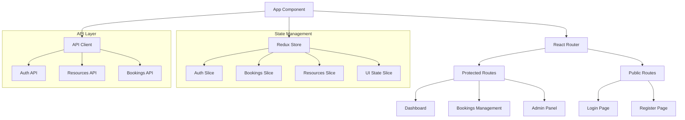

# Plan du Frontend Core - Environnement de Développement SRR

## Objectifs Spécifiques

Ce plan détaille la conception et l'implémentation du frontend React pour l'environnement de développement minimaliste du SRR. L'objectif est de créer une interface utilisateur fonctionnelle et modulaire qui s'intégrera avec le backend et permettra de valider les interactions utilisateur de base.

## Dépendances

- [plan_01_infrastructure.md](./plan_01_infrastructure.md) : Configuration Docker pour le service frontend
- [plan_02_backend_core.md](./plan_02_backend_core.md) : Structure du backend à laquelle le frontend se connectera
- [plan_04_mock_services.md](./plan_04_mock_services.md) : Services simulés avec lesquels interagir

## Architecture Frontend

### 1. Structure Générale

```
frontend/
├── public/                 # Fichiers statiques
│   ├── index.html          # Page HTML principale
│   ├── favicon.ico         # Icône du site
│   └── assets/             # Ressources statiques
├── src/                    # Code source
│   ├── index.js            # Point d'entrée
│   ├── App.js              # Composant racine
│   ├── api/                # Couche d'accès à l'API
│   ├── components/         # Composants réutilisables
│   ├── contexts/           # Contextes React
│   ├── hooks/              # Hooks personnalisés
│   ├── layouts/            # Composants de mise en page
│   ├── pages/              # Composants de page
│   ├── routes/             # Configuration des routes
│   ├── services/           # Services partagés
│   ├── store/              # État global de l'application (Redux)
│   ├── styles/             # Styles partagés
│   └── utils/              # Utilitaires
├── .env                    # Variables d'environnement
├── package.json            # Dépendances et scripts
├── .eslintrc.js            # Configuration ESLint
└── README.md               # Documentation
```

### 2. Diagramme d'Architecture



## Composants à Implémenter

### 1. Configuration de Base React

```jsx
// src/index.js
import React from 'react';
import ReactDOM from 'react-dom/client';
import { Provider } from 'react-redux';
import { BrowserRouter } from 'react-router-dom';

import App from './App';
import { store } from './store';
import './styles/index.css';

const root = ReactDOM.createRoot(document.getElementById('root'));
root.render(
  <React.StrictMode>
    <Provider store={store}>
      <BrowserRouter>
        <App />
      </BrowserRouter>
    </Provider>
  </React.StrictMode>
);
```

```jsx
// src/App.js
import React from 'react';
import { Routes, Route, Navigate } from 'react-router-dom';
import { ThemeProvider } from '@mui/material/styles';

import theme from './styles/theme';
import Layout from './layouts/MainLayout';
import ProtectedRoute from './routes/ProtectedRoute';
import LoginPage from './pages/auth/LoginPage';
import DashboardPage from './pages/dashboard/DashboardPage';
import BookingsPage from './pages/bookings/BookingsPage';
import ResourcesPage from './pages/resources/ResourcesPage';

function App() {
  return (
    <ThemeProvider theme={theme}>
      <Routes>
        {/* Public routes */}
        <Route path="/login" element={<LoginPage />} />
        
        {/* Protected routes */}
        <Route element={<ProtectedRoute />}>
          <Route element={<Layout />}>
            <Route path="/" element={<Navigate to="/dashboard" replace />} />
            <Route path="/dashboard" element={<DashboardPage />} />
            <Route path="/bookings" element={<BookingsPage />} />
            <Route path="/resources" element={<ResourcesPage />} />
          </Route>
        </Route>

        {/* Not found */}
        <Route path="*" element={<Navigate to="/" replace />} />
      </Routes>
    </ThemeProvider>
  );
}

export default App;
```

### 2. Configuration du Store Redux

```jsx
// src/store/index.js
import { configureStore } from '@reduxjs/toolkit';
import authReducer from './slices/authSlice';
import bookingsReducer from './slices/bookingsSlice';
import resourcesReducer from './slices/resourcesSlice';
import uiReducer from './slices/uiSlice';

export const store = configureStore({
  reducer: {
    auth: authReducer,
    bookings: bookingsReducer,
    resources: resourcesReducer,
    ui: uiReducer,
  },
  middleware: (getDefaultMiddleware) =>
    getDefaultMiddleware({
      serializableCheck: {
        // Ignore specific action types or paths for non-serializable values
        ignoredActions: ['auth/loginSuccess'],
      },
    }),
});

export type RootState = ReturnType<typeof store.getState>;
export type AppDispatch = typeof store.dispatch;
```

### 3. Exemple d'une Slice Redux

```jsx
// src/store/slices/authSlice.js
import { createSlice, createAsyncThunk } from '@reduxjs/toolkit';
import authService from '../../services/authService';

export const login = createAsyncThunk(
  'auth/login',
  async ({ username, password }, { rejectWithValue }) => {
    try {
      return await authService.login(username, password);
    } catch (error) {
      return rejectWithValue(error.response?.data || 'Erreur de connexion');
    }
  }
);

export const logout = createAsyncThunk('auth/logout', async () => {
  await authService.logout();
});

const initialState = {
  user: null,
  token: localStorage.getItem('token') || null,
  loading: false,
  error: null,
  isAuthenticated: !!localStorage.getItem('token'),
};

const authSlice = createSlice({
  name: 'auth',
  initialState,
  reducers: {
    clearError: (state) => {
      state.error = null;
    },
  },
  extraReducers: (builder) => {
    builder
      .addCase(login.pending, (state) => {
        state.loading = true;
        state.error = null;
      })
      .addCase(login.fulfilled, (state, action) => {
        state.loading = false;
        state.isAuthenticated = true;
        state.user = action.payload.user;
        state.token = action.payload.token;
      })
      .addCase(login.rejected, (state, action) => {
        state.loading = false;
        state.error = action.payload;
      })
      .addCase(logout.fulfilled, (state) => {
        state.user = null;
        state.token = null;
        state.isAuthenticated = false;
      });
  },
});

export const { clearError } = authSlice.actions;
export default authSlice.reducer;
```

### 4. Service de Communication API

```jsx
// src/api/apiClient.js
import axios from 'axios';

const API_URL = process.env.REACT_APP_API_URL || 'http://localhost:8000/api/v1';

const apiClient = axios.create({
  baseURL: API_URL,
  headers: {
    'Content-Type': 'application/json',
  },
});

// Intercepteur pour ajouter le token aux requêtes
apiClient.interceptors.request.use(
  (config) => {
    const token = localStorage.getItem('token');
    if (token) {
      config.headers['Authorization'] = `Bearer ${token}`;
    }
    return config;
  },
  (error) => {
    return Promise.reject(error);
  }
);

// Intercepteur pour gérer les erreurs de réponse
apiClient.interceptors.response.use(
  (response) => response,
  (error) => {
    const originalRequest = error.config;
    
    // Si erreur 401 (non autorisé), déconnecter l'utilisateur
    if (error.response?.status === 401 && !originalRequest._retry) {
      // Rediriger vers la page de login
      localStorage.removeItem('token');
      localStorage.removeItem('user');
      window.location.href = '/login';
    }
    
    return Promise.reject(error);
  }
);

export default apiClient;
```

```jsx
// src/services/authService.js
import apiClient from '../api/apiClient';

const login = async (username, password) => {
  const response = await apiClient.post('/auth/login', { username, password });
  if (response.data.token) {
    localStorage.setItem('token', response.data.token);
    localStorage.setItem('user', JSON.stringify(response.data.user));
  }
  return response.data;
};

const logout = () => {
  localStorage.removeItem('token');
  localStorage.removeItem('user');
};

const getCurrentUser = () => {
  const userStr = localStorage.getItem('user');
  return userStr ? JSON.parse(userStr) : null;
};

const authService = {
  login,
  logout,
  getCurrentUser,
};

export default authService;
```

### 5. Composants de Protection des Routes

```jsx
// src/routes/ProtectedRoute.js
import { Navigate, Outlet } from 'react-router-dom';
import { useSelector } from 'react-redux';

const ProtectedRoute = () => {
  const { isAuthenticated } = useSelector((state) => state.auth);
  
  if (!isAuthenticated) {
    // Rediriger vers la page de connexion si l'utilisateur n'est pas authentifié
    return <Navigate to="/login" replace />;
  }

  // Si authentifié, afficher les composants enfants
  return <Outlet />;
};

export default ProtectedRoute;
```

### 6. Layouts Principaux

```jsx
// src/layouts/MainLayout.js
import React from 'react';
import { Outlet } from 'react-router-dom';
import { Box, CssBaseline } from '@mui/material';
import Navbar from '../components/navigation/Navbar';
import Sidebar from '../components/navigation/Sidebar';

const MainLayout = () => {
  const [open, setOpen] = React.useState(true);
  const toggleDrawer = () => setOpen(!open);

  return (
    <Box sx={{ display: 'flex' }}>
      <CssBaseline />
      <Navbar open={open} toggleDrawer={toggleDrawer} />
      <Sidebar open={open} toggleDrawer={toggleDrawer} />
      <Box
        component="main"
        sx={{
          flexGrow: 1,
          p: 3,
          mt: 8,
          ml: open ? 30 : 7,
          transition: (theme) => theme.transitions.create('margin', {
            easing: theme.transitions.easing.sharp,
            duration: theme.transitions.duration.leavingScreen,
          }),
        }}
      >
        <Outlet />
      </Box>
    </Box>
  );
};

export default MainLayout;
```

### 7. Thème et Style (Material-UI)

```jsx
// src/styles/theme.js
import { createTheme } from '@mui/material/styles';

const theme = createTheme({
  palette: {
    primary: {
      main: '#3f51b5',
    },
    secondary: {
      main: '#f50057',
    },
    background: {
      default: '#f5f5f5',
      paper: '#ffffff',
    },
  },
  typography: {
    fontFamily: [
      'Roboto',
      'Arial',
      'sans-serif',
    ].join(','),
    h1: {
      fontSize: '2.5rem',
      fontWeight: 500,
    },
    h2: {
      fontSize: '2rem',
      fontWeight: 500,
    },
    h3: {
      fontSize: '1.75rem',
      fontWeight: 500,
    },
    h4: {
      fontSize: '1.5rem',
      fontWeight: 500,
    },
    h5: {
      fontSize: '1.25rem',
      fontWeight: 500,
    },
    h6: {
      fontSize: '1rem',
      fontWeight: 500,
    },
  },
  components: {
    MuiButton: {
      styleOverrides: {
        root: {
          borderRadius: 8,
          textTransform: 'none',
        },
      },
    },
    MuiCard: {
      styleOverrides: {
        root: {
          borderRadius: 12,
          boxShadow: '0px 2px 4px rgba(0, 0, 0, 0.1)',
        },
      },
    },
  },
});

export default theme;
```

### 8. Composant de Page d'Authentification

```jsx
// src/pages/auth/LoginPage.js
import React, { useState, useEffect } from 'react';
import { useDispatch, useSelector } from 'react-redux';
import { useNavigate } from 'react-router-dom';
import {
  Container,
  Box,
  TextField,
  Button,
  Typography,
  Paper,
  Alert,
  CircularProgress,
} from '@mui/material';

import { login, clearError } from '../../store/slices/authSlice';

const LoginPage = () => {
  const [credentials, setCredentials] = useState({
    username: '',
    password: '',
  });
  const { loading, error, isAuthenticated } = useSelector((state) => state.auth);
  const dispatch = useDispatch();
  const navigate = useNavigate();

  useEffect(() => {
    // Si déjà authentifié, rediriger vers le dashboard
    if (isAuthenticated) {
      navigate('/dashboard');
    }
  }, [isAuthenticated, navigate]);

  const handleChange = (e) => {
    const { name, value } = e.target;
    setCredentials((prev) => ({ ...prev, [name]: value }));
    if (error) dispatch(clearError());
  };

  const handleSubmit = async (e) => {
    e.preventDefault();
    dispatch(login(credentials));
  };

  return (
    <Container component="main" maxWidth="xs">
      <Box
        sx={{
          marginTop: 8,
          display: 'flex',
          flexDirection: 'column',
          alignItems: 'center',
        }}
      >
        <Paper
          elevation={3}
          sx={{
            p: 4,
            display: 'flex',
            flexDirection: 'column',
            alignItems: 'center',
            width: '100%',
          }}
        >
          <Typography component="h1" variant="h5">
            Système de Réservation de Ressources
          </Typography>
          <Typography variant="subtitle1" sx={{ mt: 1 }}>
            Connexion
          </Typography>

          {error && (
            <Alert severity="error" sx={{ mt: 2, width: '100%' }}>
              {error}
            </Alert>
          )}

          <Box component="form" onSubmit={handleSubmit} sx={{ mt: 3, width: '100%' }}>
            <TextField
              margin="normal"
              required
              fullWidth
              id="username"
              label="Nom d'utilisateur"
              name="username"
              autoComplete="username"
              autoFocus
              value={credentials.username}
              onChange={handleChange}
              disabled={loading}
            />
            <TextField
              margin="normal"
              required
              fullWidth
              name="password"
              label="Mot de passe"
              type="password"
              id="password"
              autoComplete="current-password"
              value={credentials.password}
              onChange={handleChange}
              disabled={loading}
            />
            <Button
              type="submit"
              fullWidth
              variant="contained"
              sx={{ mt: 3, mb: 2 }}
              disabled={loading}
            >
              {loading ? <CircularProgress size={24} /> : 'Se connecter'}
            </Button>
          </Box>
        </Paper>
      </Box>
    </Container>
  );
};

export default LoginPage;
```

## Dépendances Frontend

```json
{
  "name": "srr-frontend",
  "version": "0.1.0",
  "private": true,
  "dependencies": {
    "@emotion/react": "^11.11.0",
    "@emotion/styled": "^11.11.0",
    "@mui/icons-material": "^5.11.16",
    "@mui/material": "^5.13.0",
    "@mui/x-date-pickers": "^6.4.0",
    "@reduxjs/toolkit": "^1.9.5",
    "axios": "^1.4.0",
    "date-fns": "^2.30.0",
    "jwt-decode": "^3.1.2",
    "react": "^18.2.0",
    "react-dom": "^18.2.0",
    "react-redux": "^8.0.5",
    "react-router-dom": "^6.11.1",
    "react-scripts": "5.0.1"
  },
  "devDependencies": {
    "@testing-library/jest-dom": "^5.16.5",
    "@testing-library/react": "^14.0.0",
    "@testing-library/user-event": "^14.4.3",
    "eslint": "^8.40.0",
    "eslint-plugin-react": "^7.32.2",
    "eslint-plugin-react-hooks": "^4.6.0"
  },
  "scripts": {
    "start": "react-scripts start",
    "build": "react-scripts build",
    "test": "react-scripts test",
    "eject": "react-scripts eject"
  },
  "browserslist": {
    "production": [
      ">0.2%",
      "not dead",
      "not op_mini all"
    ],
    "development": [
      "last 1 chrome version",
      "last 1 firefox version",
      "last 1 safari version"
    ]
  }
}
```

## Implémentation Étape par Étape

1. **Mise en place de l'environnement React**
   - Configurer Create React App ou une configuration personnalisée
   - Installer les dépendances principales (React Router, Redux Toolkit, Material-UI)
   - Configurer ESLint et Prettier pour le formatage du code

2. **Configuration du routage et de la sécurité**
   - Définir les routes publiques et protégées
   - Implémenter le mécanisme de protection des routes
   - Mettre en place la redirection basée sur l'état d'authentification

3. **Gestion de l'état avec Redux**
   - Configurer le store Redux
   - Implémenter les slices pour l'authentification, les réservations et les ressources
   - Créer les actions asynchrones pour communiquer avec l'API

4. **Composants UI et layout**
   - Création du thème d'application
   - Implémentation des composants de layout (Navbar, Sidebar, etc.)
   - Développement des composants réutilisables (formulaires, cartes, tableaux, etc.)

5. **Pages principales**
   - Page de connexion
   - Tableau de bord
   - Gestion des ressources
   - Création et gestion des réservations

6. **Communication API**
   - Configuration d'Axios avec intercepteurs
   - Services pour chaque domaine d'API (auth, ressources, réservations)
   - Gestion des erreurs et de la déconnexion automatique

7. **Tests et optimisation**
   - Tests unitaires pour les composants critiques
   - Tests d'intégration pour les flux principaux
   - Optimisations de performance (memoization, code splitting, etc.)

## Fonctionnalités Minimales à Implémenter

1. **Authentification**
   - Connexion avec nom d'utilisateur/mot de passe
   - Stockage et vérification du token JWT
   - Déconnexion et gestion de session

2. **Gestion des Ressources**
   - Affichage de la liste des ressources disponibles
   - Filtrage par type de ressource et disponibilité
   - Vue détaillée d'une ressource

3. **Gestion des Réservations**
   - Création d'une nouvelle réservation
   - Visualisation des réservations existantes
   - Annulation d'une réservation

## Critères de Validation

- ✅ L'utilisateur peut s'authentifier via la page de connexion
- ✅ L'utilisateur authentifié est redirigé vers le tableau de bord
- ✅ Les routes sont protégées contre les accès non autorisés
- ✅ L'utilisateur peut voir la liste des ressources disponibles
- ✅ L'utilisateur peut effectuer une réservation de ressource
- ✅ L'application est responsive et fonctionne sur différents appareils
- ✅ Les appels API sont correctement implémentés avec gestion d'erreur

## Notes sur l'Approche Mobile-First

Pour l'environnement de développement initial, nous nous concentrerons sur une expérience desktop fonctionnelle, tout en maintenant la capacité à s'adapter aux appareils mobiles grâce à:

1. Utilisation des composants Material-UI qui sont responsive par défaut
2. Mise en œuvre de layouts flexibles qui s'adaptent aux différentes tailles d'écran
3. Utilisation des points de rupture pour ajuster l'interface selon la taille d'écran

Une approche plus approfondie du responsive design sera envisagée dans les phases ultérieures de développement.

## Références

- [Documentation React](https://reactjs.org/docs/getting-started.html)
- [Documentation Redux Toolkit](https://redux-toolkit.js.org/)
- [Documentation Material-UI](https://mui.com/getting-started/usage/)
- [Documentation React Router](https://reactrouter.com/en/main)
- [UX_DESIGN.md](/doc/UX_DESIGN.md) pour les maquettes et guides de style
