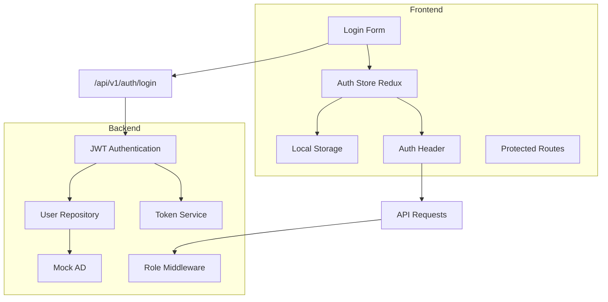

# Plan d'Implémentation du Système d'Authentification SRR

## Documentation de Référence

- [DESIGN.md](/doc/DESIGN.md) : Architecture globale du système et sécurité
- [DATA_MODEL.md](/doc/DATA_MODEL.md) : Modèle utilisateur et rôles
- [API.md](/doc/API.md) : Endpoints d'authentification et structure des JWT
- [SECURITY.md](/doc/SECURITY.md) : Exigences de sécurité du système

## Objectifs

Ce module implémente le système d'authentification et d'autorisation pour l'environnement de développement du SRR. Il couvre :

1. L'authentification des utilisateurs (simulée/mock pendant le développement)
2. La gestion des JWT (JSON Web Tokens)
3. Le système d'autorisation basé sur les rôles (RBAC)
4. La protection des routes API
5. La gestion des sessions côté client

## Architecture du Module d'Authentification

## Composants à Implémenter

### 1. Backend - Core Authentication

#### 1.1 JWT Configuration et Middleware

**Fichier**: `backend/app/core/security.py`

Ce fichier contiendra les fonctions essentielles pour la gestion des JWT:
- `create_access_token`: Crée un JWT pour l'accès aux API
- `create_refresh_token`: Crée un refresh token pour renouvellement de session
- `verify_password`: Vérifie les mots de passe (pour auth locale en dev)
- `get_current_user`: Dépendance FastAPI pour extraire l'utilisateur du JWT
- `check_permissions`: Middleware pour vérifier les rôles et permissions

#### 1.2 Schémas Pydantic pour Authentification

**Fichier**: `backend/app/schemas/token.py`

Ce fichier contiendra les modèles Pydantic:
- `Token`: Réponse de l'API d'authentification (access_token, refresh_token)
- `TokenPayload`: Structure interne du JWT décodé
- `LoginRequest`: Corps de requête pour l'authentification
- `RefreshRequest`: Corps de requête pour rafraîchir un token

#### 1.3 Endpoints d'authentification

**Fichier**: `backend/app/api/v1/endpoints/auth.py`

Endpoints FastAPI:
- `POST /auth/login`: Authentification et génération de token
- `POST /auth/refresh`: Rafraîchissement d'un token expiré
- `POST /auth/logout`: Déconnexion et invalidation de token

#### 1.4 Service Utilisateur

**Fichier**: `backend/app/services/user.py`

Service pour:
- Authentification des utilisateurs (via mock AD en dev)
- Opérations CRUD sur les utilisateurs
- Gestion des rôles et permissions

#### 1.5 Service Mock AD/LDAP

**Fichier**: `backend/app/services/mock_ad.py`

En environnement de développement, ce service simule un serveur Active Directory:
- Authentification locale avec utilisateurs en base de données
- Simulation de groupes AD pour les rôles
- Données de test pour le développement

### 2. Frontend - Authentication Components

#### 2.1 Slice Redux pour l'Authentification

**Fichier**: `frontend/src/store/slices/authSlice.js`

Gestion d'état Redux pour:
- Actions d'authentification (login, refresh, logout)
- État de l'utilisateur connecté
- Gestion des erreurs d'authentification
- Persistence des tokens

#### 2.2 Composant Login

**Fichier**: `frontend/src/components/auth/LoginForm.jsx`

Formulaire de connexion avec:
- Validation des entrées
- Gestion des erreurs
- Redirection après connexion réussie

#### 2.3 Protection des Routes

**Fichier**: `frontend/src/components/auth/ProtectedRoute.jsx`

Composant Higher-Order pour:
- Vérifier l'authentification avant d'afficher une route
- Rediriger vers login si non authentifié
- Vérifier les permissions/rôles si nécessaire

#### 2.4 Service API Authentifié

**Fichier**: `frontend/src/services/api.js`

Client API avec:
- Intercepteurs pour ajouter les tokens aux requêtes
- Gestion du rafraîchissement automatique des tokens expirés
- Redirection vers login en cas d'échec d'authentification

## Considérations de Sécurité

- Les tokens JWT seront signés avec un algorithme sécurisé (HS256)
- Les refresh tokens auront une durée de validité plus longue mais utiliseront une clé différente
- Validation stricte de toutes les entrées utilisateur
- Stockage sécurisé des tokens côté client (localStorage avec considération pour httpOnly cookies en prod)
- Messages d'erreur génériques pour éviter la divulgation d'informations

## Scénarios de Test

1. **Authentification réussie**
   - Entrée: identifiants valides
   - Résultat attendu: JWT retourné et stocké, redirection vers dashboard

2. **Authentification échouée**
   - Entrée: identifiants invalides
   - Résultat attendu: message d'erreur approprié, pas de redirection

3. **Rafraîchissement de token**
   - Entrée: refresh token valide
   - Résultat attendu: nouveau JWT généré

4. **Accès à une route protégée**
   - Entrée: utilisateur authentifié avec rôle approprié
   - Résultat attendu: accès accordé à la ressource

5. **Tentative d'accès non autorisé**
   - Entrée: utilisateur authentifié sans rôle approprié
   - Résultat attendu: erreur 403, accès refusé

## Implémentation Progressive

1. Configurer la structure JWT de base et le middleware FastAPI
2. Implémenter le service mock AD pour l'authentification en développement
3. Développer les endpoints d'API pour login/refresh/logout
4. Créer les composants React pour l'authentification utilisateur
5. Implémenter la protection des routes basée sur les rôles
6. Mettre en place le rafraîchissement automatique des tokens
