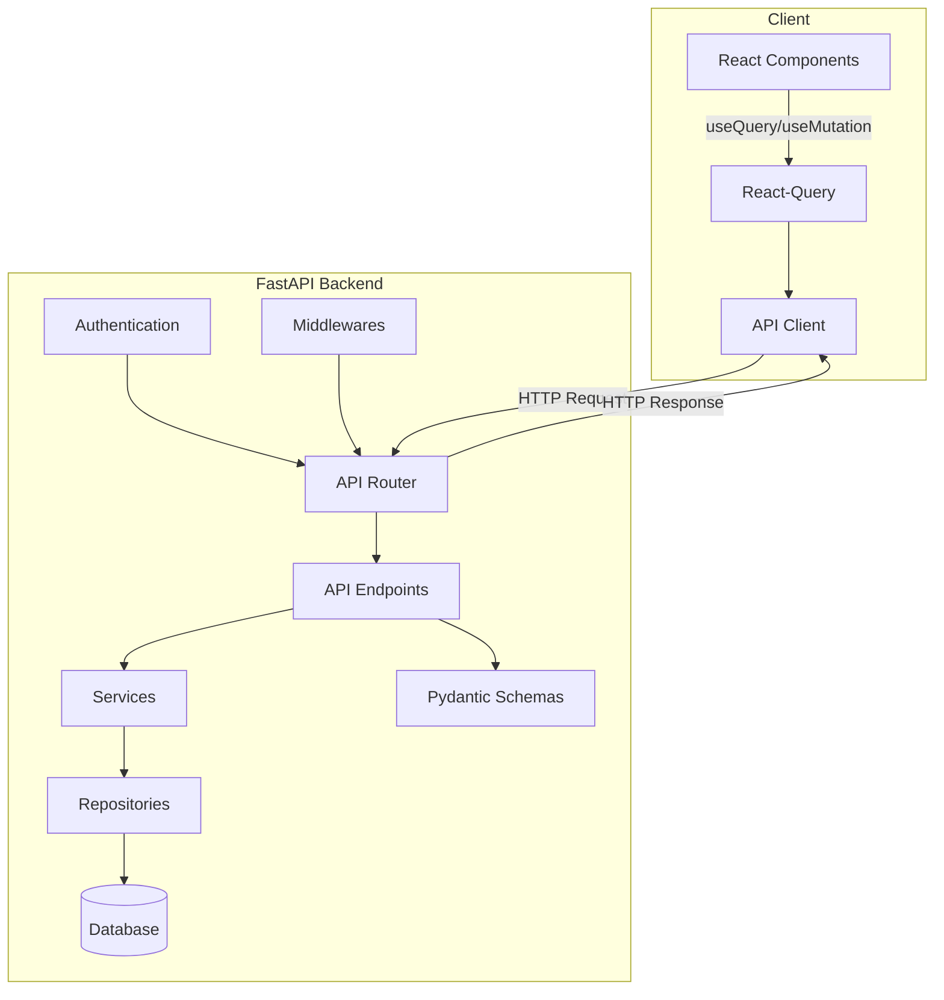

# Plan d'Intégration API du SRR

## Documentation de Référence

- [DESIGN.md](/doc/DESIGN.md) : Architecture globale du système
- [API.md](/doc/API.md) : Spécifications détaillées de l'API REST
- [DATA_MODEL.md](/doc/DATA_MODEL.md) : Structure des données et relations

## Objectifs

Ce module définit l'implémentation des endpoints API essentiels pour l'environnement de développement du SRR. Il couvre :

1. La structure des routes API en accord avec les spécifications
2. L'implémentation des endpoints CRUD pour les ressources principales
3. La validation des entrées/sorties avec Pydantic
4. Le mapping entre les modèles SQLAlchemy et les schémas Pydantic
5. La gestion des erreurs et exceptions
6. L'intégration côté client avec le frontend React

## Architecture de l'API



## Endpoints API à Implémenter (Version Minimale)

Pour l'environnement de développement, nous allons implémenter un sous-ensemble des endpoints définis dans [API.md](/doc/API.md), suffisant pour couvrir les fonctionnalités essentielles :

### Authentification (déjà défini dans le plan d'authentification)
- `POST /api/v1/auth/login`
- `POST /api/v1/auth/refresh`
- `POST /api/v1/auth/logout`

### Types de ressources
- `GET /api/v1/resource-types` : Lister les types de ressources
- `GET /api/v1/resource-types/{id}` : Détails d'un type de ressource

### Ressources
- `GET /api/v1/resources` : Rechercher et filtrer les ressources
- `GET /api/v1/resources/{id}` : Détails d'une ressource
- `GET /api/v1/resources/{id}/availability` : Vérifier la disponibilité
- `POST /api/v1/resources` : Créer une ressource (admin)

### Réservations
- `GET /api/v1/bookings` : Lister les réservations
- `GET /api/v1/bookings/{id}` : Détails d'une réservation
- `POST /api/v1/bookings` : Créer une réservation
- `PUT /api/v1/bookings/{id}` : Modifier une réservation
- `DELETE /api/v1/bookings/{id}` : Annuler une réservation

### Utilisateurs
- `GET /api/v1/users/profile` : Profil de l'utilisateur courant

## Composants à Implémenter

### 1. Structure Router API FastAPI

#### 1.1 Router principal

**Fichier**: `backend/app/api/api_v1/api.py`

```python
"""
[Source file intent]
Point d'entrée principal pour les routes API v1 du SRR.

[Source file design principles]
Organisation modulaire des routes par domaine fonctionnel.
Structure claire et extensible pour faciliter l'ajout de nouveaux endpoints.

[Source file constraints]
Doit maintenir la cohérence des préfixes d'URL et des versions d'API.

[Dependencies]
from fastapi import APIRouter
from app.api.api_v1.endpoints import auth, resources, resource_types, bookings, users
"""

from fastapi import APIRouter
from app.api.api_v1.endpoints import auth, resources, resource_types, bookings, users

api_router = APIRouter()

# Inclusion des différents modules de routes
api_router.include_router(auth.router, prefix="/auth", tags=["authentication"])
api_router.include_router(resource_types.router, prefix="/resource-types", tags=["resource-types"])
api_router.include_router(resources.router, prefix="/resources", tags=["resources"])
api_router.include_router(bookings.router, prefix="/bookings", tags=["bookings"])
api_router.include_router(users.router, prefix="/users", tags=["users"])
```

### 2. Implémentation des Endpoints

#### 2.1 Resource Types

**Fichier**: `backend/app/api/api_v1/endpoints/resource_types.py`

Implémentation des routes pour la gestion des types de ressources :
- Liste des types de ressources
- Détail d'un type de ressource

#### 2.2 Resources

**Fichier**: `backend/app/api/api_v1/endpoints/resources.py`

Implémentation des routes pour la gestion des ressources :
- Recherche et filtrage des ressources
- Détail d'une ressource
- Vérification de disponibilité
- Création d'une ressource (admin)

#### 2.3 Bookings

**Fichier**: `backend/app/api/api_v1/endpoints/bookings.py`

Implémentation des routes pour la gestion des réservations :
- Liste des réservations
- Détail d'une réservation
- Création d'une réservation
- Modification d'une réservation
- Annulation d'une réservation

#### 2.4 Users

**Fichier**: `backend/app/api/api_v1/endpoints/users.py`

Implémentation des routes pour la gestion des utilisateurs :
- Profil de l'utilisateur courant

### 3. Schémas Pydantic

#### 3.1 Resource Types Schema

**Fichier**: `backend/app/schemas/resource_type.py`

Définition des schémas Pydantic pour les types de ressources :
- ResourceTypeBase: Attributs communs
- ResourceTypeCreate: Pour la création
- ResourceTypeUpdate: Pour la mise à jour
- ResourceTypeInDB: Représentation en base de données
- ResourceType: Représentation pour l'API

#### 3.2 Resource Schema

**Fichier**: `backend/app/schemas/resource.py`

Définition des schémas Pydantic pour les ressources :
- ResourceBase: Attributs communs
- ResourceCreate: Pour la création
- ResourceUpdate: Pour la mise à jour
- ResourceInDB: Représentation en base de données
- Resource: Représentation pour l'API
- ResourceAvailability: Pour la disponibilité

#### 3.3 Booking Schema

**Fichier**: `backend/app/schemas/booking.py`

Définition des schémas Pydantic pour les réservations :
- BookingBase: Attributs communs
- BookingCreate: Pour la création
- BookingUpdate: Pour la mise à jour
- BookingInDB: Représentation en base de données
- Booking: Représentation pour l'API
- BookingWithDetails: Représentation détaillée

#### 3.4 User Schema

**Fichier**: `backend/app/schemas/user.py`

Définition des schémas Pydantic pour les utilisateurs :
- UserBase: Attributs communs
- UserCreate: Pour la création
- UserUpdate: Pour la mise à jour
- UserInDB: Représentation en base de données
- User: Représentation pour l'API
- UserProfile: Représentation du profil

### 4. Services Métier

#### 4.1 Resource Type Service

**Fichier**: `backend/app/services/resource_type_service.py`

Service pour la gestion des types de ressources, avec les méthodes :
- get_all(): Récupérer tous les types
- get_by_id(): Récupérer un type par ID
- create(): Créer un nouveau type (admin)
- update(): Mettre à jour un type (admin)

#### 4.2 Resource Service

**Fichier**: `backend/app/services/resource_service.py`

Service pour la gestion des ressources, avec les méthodes :
- search(): Rechercher des ressources avec filtres
- get_by_id(): Récupérer une ressource par ID
- create(): Créer une nouvelle ressource (admin)
- update(): Mettre à jour une ressource (admin)
- check_availability(): Vérifier la disponibilité

#### 4.3 Booking Service

**Fichier**: `backend/app/services/booking_service.py`

Service pour la gestion des réservations, avec les méthodes :
- get_all(): Récupérer toutes les réservations (avec filtres)
- get_by_id(): Récupérer une réservation par ID
- create(): Créer une nouvelle réservation
- update(): Mettre à jour une réservation
- cancel(): Annuler une réservation
- has_conflicts(): Vérifier les conflits de réservation

### 5. Integration Frontend

#### 5.1 API Client

**Fichier**: `frontend/src/services/api.js`

Client API pour le frontend, avec les fonctionnalités :
- Configuration Axios
- Intercepteurs pour les en-têtes d'authentification
- Gestion des erreurs
- Rafraîchissement automatique du token

#### 5.2 Hooks API React Query

**Fichier**: `frontend/src/hooks/api/useResources.js`

Hooks React Query pour la gestion des ressources :
- useResources(): Récupérer la liste des ressources
- useResource(): Récupérer une ressource par ID
- useResourceAvailability(): Vérifier la disponibilité
- useCreateResource(): Créer une ressource

**Fichier**: `frontend/src/hooks/api/useBookings.js`

Hooks React Query pour la gestion des réservations :
- useBookings(): Récupérer la liste des réservations
- useBooking(): Récupérer une réservation par ID
- useCreateBooking(): Créer une réservation
- useUpdateBooking(): Mettre à jour une réservation
- useCancelBooking(): Annuler une réservation

## Documentation d'API

### 1. Interface OpenAPI/Swagger

FastAPI génère automatiquement une documentation OpenAPI/Swagger accessible à l'URL `/docs`. Cette documentation sera configurée pour :

- Afficher les schémas de requêtes et réponses
- Permettre de tester les endpoints directement dans l'interface
- Documenter les sécurités (JWT)
- Grouper les endpoints par tags

### 2. Tests Postman

Une collection Postman sera créée pour tester manuellement l'API, incluant :
- Les différents endpoints
- Les variables d'environnement pour l'URL de base et les tokens
- Les scripts de pré-requête pour l'authentification

## Tests d'Intégration API

Des tests d'intégration seront créés pour valider les endpoints API :
- Tests de scénarios de requêtes valides
- Tests de gestion des erreurs (entrées invalides)
- Tests de permissions (accès non autorisés)
- Tests de bout en bout des flux fonctionnels

## Implémentation Progressive

1. Configurer la structure de base des routes et endpoints
2. Implémenter les schémas Pydantic de base
3. Développer les services métier essentiels
4. Implémenter les endpoints API minimaux
5. Créer le client API frontend
6. Finaliser les hooks React Query
7. Documenter l'API dans Swagger
8. Créer les tests d'intégration
