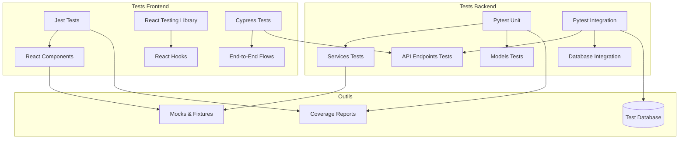

# Plan de Tests pour l'Environnement de Développement SRR

## Documentation de Référence

- [DESIGN.md](/doc/DESIGN.md) : Architecture globale du système
- [DATA_MODEL.md](/doc/DATA_MODEL.md) : Structure des données et relations
- [API.md](/doc/API.md) : Spécifications détaillées de l'API REST

## Objectifs

Ce module définit la stratégie de test pour l'environnement de développement SRR, visant à assurer la qualité et la conformité du code avec les spécifications. Il couvre :

1. Les tests unitaires pour les composants individuels
2. Les tests d'intégration pour les interactions entre composants
3. Les tests de bout en bout pour les scénarios utilisateur
4. La mise en place des outils et frameworks de test
5. La définition des métriques de qualité et de couverture de code
6. L'intégration des tests dans le processus de développement

## Architecture de la Suite de Tests



## Vue d'ensemble de la Stratégie de Test

### Niveaux de Test

1. **Tests Unitaires** : Validation des composants individuels en isolation
   - Backend : Services, Modèles, Schémas
   - Frontend : Composants React, Hooks, Store Redux

2. **Tests d'Intégration** : Validation des interactions entre composants
   - Backend : Endpoints API, Intégration avec la base de données
   - Frontend : Interactions entre composants, Intégration avec l'API

3. **Tests E2E** : Validation des scénarios utilisateur complets
   - Cypress pour tester l'application de bout en bout

### Frameworks et Outils

#### Backend
- **Pytest** : Framework principal pour tous les tests backend
- **pytest-asyncio** : Extension pour tester le code asynchrone
- **pytest-cov** : Mesure de la couverture de code
- **SQLAlchemy test fixtures** : Pour l'isolation de la base de données

#### Frontend
- **Jest** : Framework principal pour les tests unitaires frontend
- **React Testing Library** : Pour tester les composants React
- **Mock Service Worker** : Pour simuler les appels API
- **Cypress** : Pour les tests E2E

## 1. Stratégie de Test Backend

### 1.1 Tests Unitaires

#### Configuration des tests unitaires

**Fichier**: `backend/tests/conftest.py`

Ce fichier configurera l'environnement de test unitaire avec :
- Des fixtures Pytest pour l'isolation des tests
- Des objets mock pour simuler les dépendances
- L'initialisation des services nécessaires

```python
"""
[Source file intent]
Configuration du framework de test pour les tests unitaires backend.

[Source file design principles]
Centralisation des fixtures communes pour maximiser la réutilisation.
Isolation des tests pour garantir qu'ils n'interfèrent pas entre eux.

[Source file constraints]
Doit prendre en charge les tests asynchrones pour FastAPI.
"""

import pytest
import asyncio
from unittest.mock import Mock

from app.db.base import Base
from app.core.config import settings

# Mock database session
@pytest.fixture
def mock_db_session():
    return Mock()

# Mock du repository
@pytest.fixture
def mock_repository():
    return Mock()

# Mock pour l'authentification
@pytest.fixture
def mock_user():
    return Mock(
        id="00000000-0000-0000-0000-000000000001",
        username="testuser",
        email="test@example.com",
        roles=["user"],
        is_active=True
    )
```

#### Tests des Services

**Fichier**: `backend/tests/services/test_resource_service.py`

Les tests unitaires des services incluront :
- Validation de la logique métier
- Vérification du comportement avec différentes entrées
- Simulation des dépendances (repositories, autres services)
- Cas d'erreur et exceptions

```python
"""
[Source file intent]
Tests unitaires pour le service de gestion des ressources.

[Source file design principles]
Vérification exhaustive de la logique métier indépendamment des autres couches.
Utilisation de mocks pour isoler les dépendances.

[Source file constraints]
S'assure que chaque test est autonome et ne dépend pas d'un état global.
"""

import pytest
import uuid
from unittest.mock import Mock, patch
from datetime import datetime, timedelta

from app.services.resource_service import ResourceService
from app.models.resource import Resource
from app.schemas.resource import ResourceCreate, ResourceUpdate

@pytest.fixture
def resource_service(mock_repository):
    return ResourceService(repository=mock_repository)

class TestResourceService:
    def test_get_resource_by_id_found(self, resource_service, mock_repository):
        # Arrange
        resource_id = uuid.uuid4()
        expected_resource = Resource(id=resource_id, name="Test Resource")
        mock_repository.get.return_value = expected_resource
        
        # Act
        result = resource_service.get_by_id(resource_id)
        
        # Assert
        mock_repository.get.assert_called_once_with(resource_id)
        assert result == expected_resource
        
    def test_get_resource_by_id_not_found(self, resource_service, mock_repository):
        # Arrange
        resource_id = uuid.uuid4()
        mock_repository.get.return_value = None
        
        # Act
        result = resource_service.get_by_id(resource_id)
        
        # Assert
        mock_repository.get.assert_called_once_with(resource_id)
        assert result is None
```

#### Tests des Modèles

**Fichier**: `backend/tests/models/test_booking_model.py`

Ces tests valideront :
- La structure des modèles de données
- Les contraintes et validations
- Les méthodes spécifiques aux modèles

```python
"""
[Source file intent]
Tests unitaires pour le modèle Booking qui vérifient sa structure et comportement.

[Source file design principles]
Vérification des contraintes et validations du modèle.
Couverture des cas limites et des règles métier intégrées au modèle.

[Source file constraints]
Se concentre sur la validation du modèle sans dépendance à la base de données réelle.
"""

import pytest
from datetime import datetime, timedelta
import uuid

from app.models.booking import Booking
from app.models.resource import Resource
from app.models.user import User

class TestBookingModel:
    def test_booking_creation(self):
        # Arrange
        resource_id = uuid.uuid4()
        user_id = uuid.uuid4()
        start_time = datetime.now()
        end_time = start_time + timedelta(hours=2)
        
        # Act
        booking = Booking(
            resource_id=resource_id,
            user_id=user_id,
            start_time=start_time,
            end_time=end_time,
            status="pending",
            purpose="Test booking"
        )
        
        # Assert
        assert booking.resource_id == resource_id
        assert booking.user_id == user_id
        assert booking.start_time == start_time
        assert booking.end_time == end_time
        assert booking.status == "pending"
        assert booking.purpose == "Test booking"
    
    def test_booking_relationships(self):
        # Test des relations entre Booking et autres modèles
        pass
```

### 1.2 Tests d'Intégration

#### Configuration des Tests d'Intégration

**Fichier**: `backend/tests/integration/conftest.py`

Cette configuration inclura :
- Une base de données de test isolée
- Des fixtures pour créer et nettoyer les données de test
- L'initialisation de l'application FastAPI

```python
"""
[Source file intent]
Configuration des tests d'intégration avec une base de données de test réelle.

[Source file design principles]
Isolation complète de l'environnement de test pour garantir la reproductibilité.
Setup/teardown automatique pour chaque test.

[Source file constraints]
Utilise une base de données PostgreSQL de test séparée.
"""

import pytest
import asyncio
from sqlalchemy.ext.asyncio import create_async_engine, AsyncSession
from sqlalchemy.orm import sessionmaker
from fastapi.testclient import TestClient

from app.main import app
from app.db.base import Base
from app.core.config import settings
from app.db.session import get_db

# Base de données de test
TEST_DATABASE_URL = settings.DATABASE_URL.replace("/srr", "/srr_test")
engine = create_async_engine(TEST_DATABASE_URL)
TestingSessionLocal = sessionmaker(engine, expire_on_commit=False, class_=AsyncSession)

@pytest.fixture(scope="session")
def event_loop():
    loop = asyncio.get_event_loop()
    yield loop
    loop.close()

@pytest.fixture(scope="session")
async def setup_db():
    # Create tables
    async with engine.begin() as conn:
        await conn.run_sync(Base.metadata.drop_all)
        await conn.run_sync(Base.metadata.create_all)
    yield
    # Cleanup
    async with engine.begin() as conn:
        await conn.run_sync(Base.metadata.drop_all)

@pytest.fixture
async def db_session(setup_db):
    async with TestingSessionLocal() as session:
        yield session
        await session.rollback()

# Override database dependency
@pytest.fixture
def client(db_session):
    async def override_get_db():
        try:
            yield db_session
        finally:
            pass
    
    app.dependency_overrides[get_db] = override_get_db
    with TestClient(app) as c:
        yield c
    app.dependency_overrides = {}
```

#### Tests des Endpoints API

**Fichier**: `backend/tests/integration/api/test_resource_api.py`

Ces tests vérifieront :
- Les réponses HTTP des endpoints
- La validation des données d'entrée
- L'intégration avec la base de données
- La logique de contrôle d'accès

```python
"""
[Source file intent]
Tests d'intégration pour les endpoints API de gestion des ressources.

[Source file design principles]
Vérification des interactions complètes entre API, services et base de données.
Contrôle des permissions et autorisations.

[Source file constraints]
Utilise une base de données de test réelle mais isolée.
"""

import pytest
import uuid
from fastapi.testclient import TestClient

from app.tests.utils.resource import create_test_resource
from app.tests.utils.user import create_test_user, get_token_headers

class TestResourceEndpoints:
    @pytest.mark.asyncio
    async def test_get_resources_list(self, client, db_session):
        # Arrange
        # Créer des ressources de test
        await create_test_resource(db_session, name="Salle A")
        await create_test_resource(db_session, name="Salle B")
        
        # Act
        response = client.get("/api/v1/resources/")
        
        # Assert
        assert response.status_code == 200
        data = response.json()
        assert "data" in data
        assert len(data["data"]) == 2
        assert data["data"][0]["name"] == "Salle A"
        assert data["data"][1]["name"] == "Salle B"
    
    @pytest.mark.asyncio
    async def test_create_resource_admin_only(self, client, db_session):
        # Arrange - Créer un admin et un utilisateur standard
        admin_user = await create_test_user(db_session, is_admin=True)
        standard_user = await create_test_user(db_session, is_admin=False)
        
        admin_headers = get_token_headers(admin_user)
        user_headers = get_token_headers(standard_user)
        
        resource_data = {
            "name": "Nouvelle Salle",
            "description": "Salle pour tests",
            "resource_type_id": str(uuid.uuid4()),
            "properties": {"floor": 1}
        }
        
        # Act & Assert - L'admin peut créer une ressource
        response_admin = client.post(
            "/api/v1/resources/",
            headers=admin_headers,
            json=resource_data
        )
        assert response_admin.status_code == 201
        
        # L'utilisateur standard ne peut pas créer une ressource
        response_user = client.post(
            "/api/v1/resources/",
            headers=user_headers,
            json=resource_data
        )
        assert response_user.status_code == 403  # Forbidden
```

## 2. Stratégie de Test Frontend

### 2.1 Tests Unitaires React

#### Configuration Jest

**Fichier**: `frontend/jest.config.js`

Configuration de base pour Jest:
- Support des modules ESM
- Mocks globaux
- Rapports de couverture de code

```javascript
/**
 * [Source file intent]
 * Configuration de Jest pour les tests frontend du projet SRR.
 * 
 * [Source file design principles]
 * Configuration optimale pour l'écosystème React/MUI/Redux.
 * Support des modules modernes et du DOM.
 * 
 * [Source file constraints]
 * Doit être compatible avec React 18 et TypeScript si utilisé.
 */

module.exports = {
  testEnvironment: "jsdom",
  moduleNameMapper: {
    // Gestion des imports de CSS, images, etc.
    "\\.(css|less|scss|sass)$": "identity-obj-proxy",
    "\\.(jpg|jpeg|png|gif|svg)$": "<rootDir>/src/tests/fileMock.js"
  },
  setupFilesAfterEnv: [
    "<rootDir>/src/tests/setupTests.js"
  ],
  transform: {
    "^.+\\.(js|jsx|ts|tsx)$": "babel-jest"
  },
  collectCoverageFrom: [
    "src/**/*.{js,jsx,ts,tsx}",
    "!src/tests/**",
    "!src/index.js",
    "!src/reportWebVitals.js",
  ],
  coverageThreshold: {
    global: {
      statements: 70,
      branches: 60,
      functions: 70,
      lines: 70
    }
  }
};
```

#### Tests de Composants React

**Fichier**: `frontend/src/components/resource/ResourceCard.test.jsx`

Tests des composants UI React:
- Rendu correct des éléments
- Comportement des interactions utilisateur
- Gestion des props et des états
- Cas limites et erreurs

```javascript
/**
 * [Source file intent]
 * Tests unitaires pour le composant ResourceCard affichant les détails d'une ressource.
 * 
 * [Source file design principles]
 * Tests centrés sur l'utilisateur avec React Testing Library.
 * Validation du comportement plutôt que de l'implémentation.
 * 
 * [Source file constraints]
 * Isolation des tests par rapport aux API externes.
 */

import React from 'react';
import { render, screen, fireEvent } from '@testing-library/react';
import { BrowserRouter } from 'react-router-dom';
import ResourceCard from './ResourceCard';

// Mock des props
const mockResource = {
  id: '550e8400-e29b-41d4-a716-446655440010',
  name: 'Salle Neptune',
  description: 'Grande salle de réunion',
  location: 'Bâtiment A',
  capacity: 20,
  resource_type: {
    name: 'Salle de réunion',
    icon: 'meeting_room',
    color: '#4285F4'
  },
  properties: {
    floor: 2,
    has_projector: true,
    has_videoconference: true
  }
};

// Helper pour rendre le composant avec le routeur
const renderWithRouter = (ui) => {
  return render(<BrowserRouter>{ui}</BrowserRouter>);
};

describe('ResourceCard Component', () => {
  test('renders resource information correctly', () => {
    // Arrange & Act
    renderWithRouter(<ResourceCard resource={mockResource} />);
    
    // Assert
    expect(screen.getByText('Salle Neptune')).toBeInTheDocument();
    expect(screen.getByText('Grande salle de réunion')).toBeInTheDocument();
    expect(screen.getByText('Bâtiment A')).toBeInTheDocument();
    expect(screen.getByText('Capacité: 20 personnes')).toBeInTheDocument();
  });
  
  test('shows property chips correctly', () => {
    // Arrange & Act
    renderWithRouter(<ResourceCard resource={mockResource} />);
    
    // Assert
    expect(screen.getByText('Étage: 2')).toBeInTheDocument();
    expect(screen.getByText('Projecteur')).toBeInTheDocument();
    expect(screen.getByText('Visioconférence')).toBeInTheDocument();
  });
  
  test('navigates to detail page when clicking on view button', () => {
    // Arrange
    const navigateMock = jest.fn();
    jest.mock('react-router-dom', () => ({
      ...jest.requireActual('react-router-dom'),
      useNavigate: () => navigateMock
    }));
    
    // Act
    renderWithRouter(<ResourceCard resource={mockResource} />);
    fireEvent.click(screen.getByText('Voir détails'));
    
    // Assert
    expect(navigateMock).toHaveBeenCalledWith(`/resources/${mockResource.id}`);
  });
});
```

#### Tests des Hooks React Query

**Fichier**: `frontend/src/hooks/api/useResources.test.js`

Tests des hooks personnalisés pour les API:
- Comportement en cas de succès
- Gestion des erreurs
- Comportement de chargement
- Paramètres de requête

```javascript
/**
 * [Source file intent]
 * Tests unitaires pour le hook useResources gérant les requêtes API des ressources.
 * 
 * [Source file design principles]
 * Test de l'intégration entre React Query et l'API.
 * Vérification des différents états (loading, success, error).
 * 
 * [Source file constraints]
 * Utilise MSW pour mocker les appels API.
 */

import { renderHook, act } from '@testing-library/react-hooks';
import { QueryClient, QueryClientProvider } from 'react-query';
import { rest } from 'msw';
import { setupServer } from 'msw/node';
import { useResources } from './useResources';

// Setup du client React Query pour les tests
const createWrapper = () => {
  const queryClient = new QueryClient({
    defaultOptions: {
      queries: {
        retry: false,
      },
    },
  });
  return ({ children }) => (
    <QueryClientProvider client={queryClient}>{children}</QueryClientProvider>
  );
};

// Mock des données API
const mockResources = [
  { id: '1', name: 'Salle A' },
  { id: '2', name: 'Salle B' }
];

// Setup du serveur MSW
const server = setupServer(
  rest.get('/api/v1/resources', (req, res, ctx) => {
    return res(ctx.json({
      data: mockResources,
      pagination: { total_items: 2, total_pages: 1, current_page: 1, per_page: 10 }
    }));
  })
);

beforeAll(() => server.listen());
afterEach(() => server.resetHandlers());
afterAll(() => server.close());

describe('useResources Hook', () => {
  test('fetches resources successfully', async () => {
    // Arrange
    const wrapper = createWrapper();
    
    // Act
    const { result, waitFor } = renderHook(() => useResources(), { wrapper });
    
    // Assert
    await waitFor(() => result.current.isSuccess);
    expect(result.current.data.data).toEqual(mockResources);
    expect(result.current.data.pagination.total_items).toBe(2);
  });
  
  test('handles API errors correctly', async () => {
    // Arrange - Forcer une erreur
    server.use(
      rest.get('/api/v1/resources', (req, res, ctx) => {
        return res(ctx.status(500), ctx.json({ error: 'Server error' }));
      })
    );
    const wrapper = createWrapper();
    
    // Act
    const { result, waitFor } = renderHook(() => useResources(), { wrapper });
    
    // Assert
    await waitFor(() => result.current.isError);
    expect(result.current.error).toBeDefined();
  });
});
```

#### Tests du Store Redux

**Fichier**: `frontend/src/store/slices/authSlice.test.js`

Tests des reducers et actions Redux:
- Changements d'état corrects
- Actions asynchrones
- Intégration avec l'API

```javascript
/**
 * [Source file intent]
 * Tests unitaires pour le store Redux d'authentification.
 * 
 * [Source file design principles]
 * Vérification complète de la logique de gestion d'état.
 * Test des actions asynchrones et des reducers.
 * 
 * [Source file constraints]
 * Isolation des tests de l'API réelle.
 */

import configureMockStore from 'redux-mock-store';
import thunk from 'redux-thunk';
import fetchMock from 'jest-fetch-mock';
import authReducer, { login, logout, refreshToken, authSlice } from './authSlice';

// Configuration du mock store
const middlewares = [thunk];
const mockStore = configureMockStore(middlewares);

// Setup fetch mock
fetchMock.enableMocks();

describe('Auth Redux Slice', () => {
  // Reset before each test
  beforeEach(() => {
    fetchMock.resetMocks();
  });

  test('should handle initial state', () => {
    // Arrange
    const initialState = undefined;
    
    // Act
    const result = authReducer(initialState, { type: 'unknown' });
    
    // Assert
    expect(result).toEqual({
      user: null,
      token: null,
      refreshToken: null,
      isAuthenticated: false,
      loading: false,
      error: null
    });
  });

  test('should handle successful login', async () => {
    // Arrange
    const mockResponse = {
      token: 'test-token',
      refresh_token: 'test-refresh-token',
      user: { id: '1', username: 'testuser' }
    };
    fetchMock.mockResponseOnce(JSON.stringify(mockResponse));
    
    const store = mockStore({});
    const credentials = { username: 'testuser', password: 'password' };
    
    // Act
    await store.dispatch(login(credentials));
    
    // Assert
    const actions = store.getActions();
    expect(actions[0].type).toEqual(login.pending.type);
    expect(actions[1].type).toEqual(login.fulfilled.type);
    expect(actions[1].payload).toEqual(mockResponse);
    
    // Test reducer state update
    const newState = authReducer(
      { user: null, token: null, isAuthenticated: false, loading: true },
      actions[1]
    );
    expect(newState).toEqual({
      user: mockResponse.user,
      token: mockResponse.token,
      refreshToken: mockResponse.refresh_token,
      isAuthenticated: true,
      loading: false,
      error: null
    });
  });
  
  test('should handle login failure', async () => {
    // Arrange
    fetchMock.mockRejectOnce(new Error('Invalid credentials'));
    
    const store = mockStore({});
    const credentials = { username: 'testuser', password: 'wrongpassword' };
    
    // Act
    await store.dispatch(login(credentials));
    
    // Assert
    const actions = store.getActions();
    expect(actions[0].type).toEqual(login.pending.type);
    expect(actions[1].type).toEqual(login.rejected.type);
    
    // Test reducer state update
    const newState = authReducer(
      { user: null, token: null, isAuthenticated: false, loading: true },
      actions[1]
    );
    expect(newState.loading).toBe(false);
    expect(newState.error).not.toBeNull();
    expect(newState.isAuthenticated).toBe(false);
  });
});
```

### 2.2 Tests E2E avec Cypress

#### Configuration Cypress

**Fichier**: `frontend/cypress.config.js`

Configuration de Cypress:
- URL de base
- Gestion de la base de données de test
- Commands personnalisés

```javascript
/**
 * [Source file intent]
 * Configuration de Cypress pour les tests end-to-end.
 * 
 * [Source file design principles]
 * Configuration des tests E2E avec accès à la base de données pour setup/teardown.
 * Organisation des tests par fonctionnalité métier.
 * 
 * [Source file constraints]
 * Nécessite une base de données de test dédiée.
 */

const { defineConfig } = require("cypress");
const { Pool } = require("pg");

// Configuration de la base de données de test pour les tests E2E
const pool = new Pool({
  host: "localhost",
  port: 5432,
  database: "srr_test",
  user: "postgres",
  password: "password"
});

module.exports = defineConfig({
  e2e: {
    baseUrl: "http://localhost:3000",
    setupNodeEvents(on, config) {
      // Tasks pour manipuler la base de données directement
      on("task", {
        async resetDatabase() {
          // Nettoyer les tables
          await pool.query("DELETE FROM bookings");
          await pool.query("DELETE FROM resource_availabilities");
          // Re-créer les données de test
          await createTestData();
          return null;
        },
        async createBooking({ resourceId, date, startTime, endTime, userId }) {
          // Créer une réservation pour les tests
          const result = await pool.query(
            `INSERT INTO bookings (
              resource_id, user_id, start_time, end_time, status, purpose
            ) VALUES ($1, $2, $3, $4, 'confirmed', 'Test booking')
            RETURNING id`,
            [resourceId, userId, `${date}T${startTime}:00Z`, `${date}T${endTime}:00Z`]
          );
          return result.rows[0].id;
        }
      });
    },
  },
  env: {
    apiUrl: "http://localhost:8000/api/v1",
  },
  viewportWidth: 1280,
  viewportHeight: 720,
});
```

#### Tests E2E du Flux de Réservation

**Fichier**: `frontend/cypress/e2e/booking_flow.cy.js`

Tests du processus de réservation complet:
- Authentification
- Recherche de ressource
- Sélection d'un créneau
- Création de la réservation
- Vérification du résultat

```javascript
/**
 * [Source file intent]
 * Tests E2E pour le flux complet de réservation d'une ressource.
 * 
 * [Source file design principles]
 * Test du parcours utilisateur de bout en bout.
 * Validation de l'intégration complète des composants.
 * 
 * [Source file constraints]
 * Nécessite un backend fonctionnel avec des données de test.
 */

describe("Flux de réservation", () => {
  beforeEach(() => {
    // Réinitialiser l'état de la base de données
    cy.task("resetDatabase");
    
    // Login utilisateur
    cy.visit("/login");
    cy.get("[data-testid=username]").type("user@example.com");
    cy.get("[data-testid=password]").type("password123");
    cy.get("[data-testid=login-button]").click();
    
    // Vérifier que le login a réussi
    cy.url().should("include", "/dashboard");
  });
  
  it("permet de réserver une ressource avec succès", () => {
    // 1. Naviguer vers la recherche de ressources
    cy.get("[data-testid=nav-search]").click();
    cy.url().should("include", "/search");
    
    // 2. Filtrer les ressources
    cy.get("[data-testid=resource-type-select]").click();
    cy.contains("Salle de réunion").click();
    cy.get("[data-testid=capacity-input]").clear().type("10");
    cy.get("[data-testid=search-button]").click();
    
    // 3. Sélectionner une ressource dans les résultats
    cy.contains("Salle Neptune").click();
    cy.url().should("include", "/resources/");
    
    // 4. Sélectionner un créneau disponible
    const tomorrow = new Date();
    tomorrow.setDate(tomorrow.getDate() + 1);
    const formattedDate = tomorrow.toISOString().split("T")[0];
    
    cy.get("[data-testid=date-picker]").type(formattedDate);
    cy.get("[data-testid=time-slot]").contains("10:00 - 11:00").click();
    
    // 5. Remplir le formulaire de réservation
    cy.get("[data-testid=booking-purpose]").type("Réunion d'équipe");
    cy.get("[data-testid=booking-participants]").clear().type("5");
    cy.get("[data-testid=booking-submit]").click();
    
    // 6. Vérifier la confirmation
    cy.contains("Réservation confirmée").should("be.visible");
    cy.contains("Salle Neptune").should("be.visible");
    cy.contains("Réunion d'équipe").should("be.visible");
    
    // 7. Vérifier que la réservation apparaît dans les réservations de l'utilisateur
    cy.get("[data-testid=nav-bookings]").click();
    cy.url().should("include", "/bookings");
    cy.contains("Salle Neptune").should("be.visible");
    cy.contains(formattedDate).should("be.visible");
  });
  
  it("affiche un message d'erreur lors d'un conflit de réservation", () => {
    // 1. Créer une réservation existante pour le créneau
    const tomorrow = new Date();
    tomorrow.setDate(tomorrow.getDate() + 1);
    const formattedDate = tomorrow.toISOString().split("T")[0];
    
    cy.task("createBooking", {
      resourceId: "550e8400-e29b-41d4-a716-446655440010", // ID de Salle Neptune
      userId: "550e8400-e29b-41d4-a716-446655440400", // ID d'un utilisateur de test
      date: formattedDate,
      startTime: "10:00",
      endTime: "11:00"
    });
    
    // 2. Essayer de réserver le même créneau
    cy.visit("/resources/550e8400-e29b-41d4-a716-446655440010");
    cy.get("[data-testid=date-picker]").type(formattedDate);
    
    // 3. Vérifier que le créneau est marqué comme indisponible
    cy.get("[data-testid=time-slot]").contains("10:00 - 11:00")
      .should("have.class", "unavailable")
      .should("be.disabled");
  });
});
```

## 3. Métriques et Qualité du Code

### 3.1 Couverture de Code

#### Objectifs de couverture

| Composant | Lignes | Branches | Fonctions |
|-----------|--------|----------|-----------|
| Backend Services | 90% | 80% | 85% |
| Backend API | 85% | 75% | 80% |
| Frontend Components | 80% | 70% | 75% |
| Store Redux | 90% | 85% | 85% |

#### Rapports de couverture

- Backend: Pytest-cov avec génération de rapports HTML
- Frontend: Jest avec rapports de couverture et intégration dans CI

### 3.2 Linting et Formatage

#### Backend (Python)

**Fichier**: `backend/setup.cfg`

Configuration du linting Python:
- Flake8 pour le linting
- Black pour le formatage
- isort pour l'ordre des imports

```ini
[flake8]
max-line-length = 100
exclude = .git,__pycache__,build,dist,.env,.venv,alembic
ignore = E203,W503

[isort]
profile = black
line_length = 100
```

#### Frontend (JavaScript/TypeScript)

**Fichier**: `frontend/.eslintrc.js`

Configuration ESLint pour le frontend:
- Règles AirBnB comme base
- Règles spécifiques pour React et hooks
- Prettier pour le formatage

```javascript
module.exports = {
  extends: [
    "eslint:recommended",
    "plugin:react/recommended",
    "plugin:react-hooks/recommended",
    "prettier"
  ],
  plugins: ["react", "react-hooks", "prettier"],
  parserOptions: {
    ecmaVersion: 2021,
    sourceType: "module",
    ecmaFeatures: {
      jsx: true
    }
  },
  rules: {
    "prettier/prettier": "error",
    "react/prop-types": "error",
    "react-hooks/rules-of-hooks": "error",
    "react-hooks/exhaustive-deps": "warn"
  },
  settings: {
    react: {
      version: "detect"
    }
  }
};
```

## 4. Intégration CI/CD pour les Tests

### 4.1 Workflow CI GitHub Actions

**Fichier**: `.github/workflows/test.yml`

Pipeline CI pour automatiser les tests:
- Exécution des tests unitaires et d'intégration
- Vérification de la couverture de code
- Linting et formatage
- Construction des artefacts

```yaml
name: Test and Build

on:
  push:
    branches: [ main, develop ]
  pull_request:
    branches: [ main, develop ]

jobs:
  backend-tests:
    runs-on: ubuntu-latest
    services:
      postgres:
        image: postgres:14
        env:
          POSTGRES_USER: postgres
          POSTGRES_PASSWORD: postgres
          POSTGRES_DB: srr_test
        ports:
          - 5432:5432
        options: >-
          --health-cmd pg_isready
          --health-interval 10s
          --health-timeout 5s
          --health-retries 5
      
    steps:
      - uses: actions/checkout@v3
      
      - name: Set up Python
        uses: actions/setup-python@v4
        with:
          python-version: '3.11'
          
      - name: Install dependencies
        run: |
          cd backend
          python -m pip install --upgrade pip
          pip install -r requirements-dev.txt
          pip install -e .
          
      - name: Lint with flake8
        run: |
          cd backend
          flake8 .
          
      - name: Run unit tests
        run: |
          cd backend
          pytest tests/unit -v --cov=app
          
      - name: Run integration tests
        run: |
          cd backend
          pytest tests/integration -v --cov=app --cov-append
          
      - name: Upload coverage report
        uses: actions/upload-artifact@v3
        with:
          name: backend-coverage
          path: backend/htmlcov/

  frontend-tests:
    runs-on: ubuntu-latest
    
    steps:
      - uses: actions/checkout@v3
      
      - name: Set up Node.js
        uses: actions/setup-node@v3
        with:
          node-version: '18'
          
      - name: Install dependencies
        run: |
          cd frontend
          npm ci
          
      - name: Lint with ESLint
        run: |
          cd frontend
          npm run lint
          
      - name: Run unit tests
        run: |
          cd frontend
          npm test -- --coverage
          
      - name: Upload coverage report
        uses: actions/upload-artifact@v3
        with:
          name: frontend-coverage
          path: frontend/coverage/
          
      - name: Build
        run: |
          cd frontend
          npm run build
```

## 5. Plan d'Implémentation des Tests

### 5.1 Phase 1: Setup de l'infrastructure de test

- Configuration de l'environnement Pytest
- Configuration de l'environnement Jest
- Base de données de test PostgreSQL
- Mise en place des outils de linting et formatage

### 5.2 Phase 2: Tests Backend

- Tests unitaires des services essentiels
- Tests d'intégration pour les endpoints API principaux
- Tests de la couche d'authentification

### 5.3 Phase 3: Tests Frontend

- Tests unitaires des composants React clés
- Tests des hooks React Query
- Tests du store Redux

### 5.4 Phase 4: Tests E2E

- Configuration de Cypress
- Tests du flux de réservation de ressources
- Tests du flux d'authentification

### 5.5 Phase 5: Intégration CI/CD

- Mise en place du workflow GitHub Actions
- Configuration des rapports de couverture
- Vérification automatique du linting

## 6. Bonnes Pratiques

1. **Isolation des tests**: Chaque test doit être isolé et ne pas dépendre des résultats d'autres tests
2. **Données de test claires**: Utiliser des factory methods pour générer des données de test cohérentes
3. **Tests lisibles**: Utiliser la convention AAA (Arrange-Act-Assert) pour structurer les tests
4. **Tests performants**: Minimiser l'utilisation de la base de données réelle quand possible
5. **Mocking judicieux**: Mock uniquement les dépendances externes, pas les fonctionnalités internes
6. **Tests significatifs**: Tester les comportements et pas l'implémentation
7. **Tests maintenables**: Factoriser le code de test commun dans des helpers et fixtures
