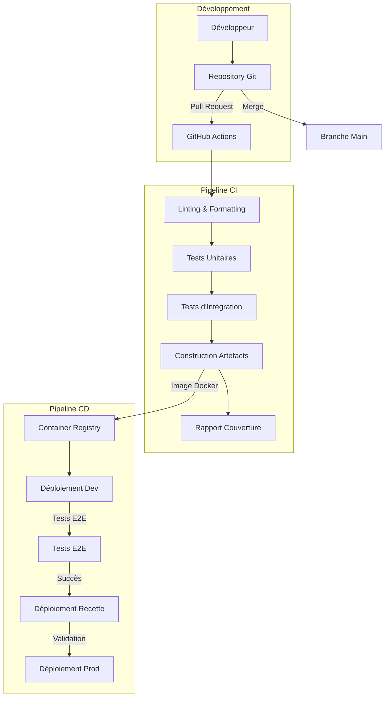
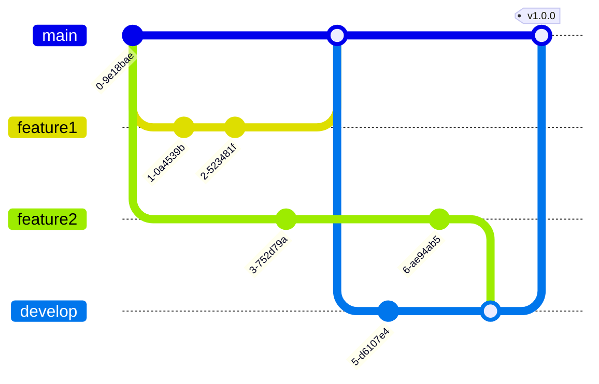

# Plan CI/CD pour l'Environnement de Développement SRR

## Documentation de Référence

- [DESIGN.md](/doc/DESIGN.md) : Architecture globale du système
- [plan_01_infrastructure.md](./plan_01_infrastructure.md) : Infrastructure technique
- [plan_08_testing.md](./plan_08_testing.md) : Stratégie de tests

## Objectifs

Ce module définit le plan de mise en place d'un pipeline d'intégration continue et de déploiement continu (CI/CD) pour l'environnement de développement du SRR. Les objectifs sont :

1. Automatiser les tests et validations du code
2. Assurer la qualité constante des livraisons
3. Accélérer les cycles de développement et de déploiement
4. Faciliter la détection précoce des régressions
5. Standardiser les processus de construction et déploiement

## Architecture CI/CD



## Composants à Implémenter

### 1. Configuration GitHub Actions

#### 1.1 Workflow Tests et Construction

**Fichier**: `.github/workflows/build-test.yml`

Workflow principal pour les tests et la construction des artefacts :

```yaml
name: Build and Test

on:
  push:
    branches: [ main, develop ]
  pull_request:
    branches: [ main, develop ]

jobs:
  backend-lint-test:
    runs-on: ubuntu-latest
    services:
      postgres:
        image: postgres:14
        env:
          POSTGRES_USER: postgres
          POSTGRES_PASSWORD: postgres
          POSTGRES_DB: srr_test
        ports:
          - 5432:5432
        options: >-
          --health-cmd pg_isready
          --health-interval 10s
          --health-timeout 5s
          --health-retries 5
      redis:
        image: redis:alpine
        ports:
          - 6379:6379
        options: >-
          --health-cmd "redis-cli ping"
          --health-interval 10s
          --health-timeout 5s
          --health-retries 5
    
    steps:
      - uses: actions/checkout@v3
      
      - name: Set up Python
        uses: actions/setup-python@v4
        with:
          python-version: '3.11'
          
      - name: Install dependencies
        run: |
          cd backend
          python -m pip install --upgrade pip
          pip install -r requirements-dev.txt
          pip install -e .
          
      - name: Lint with flake8
        run: |
          cd backend
          flake8 . --count --select=E9,F63,F7,F82 --show-source --statistics
          flake8 . --count --exit-zero --max-complexity=10 --max-line-length=100 --statistics
          
      - name: Check formatting with black
        run: |
          cd backend
          black --check .
          
      - name: Run unit tests
        run: |
          cd backend
          pytest tests/unit -v --cov=app --cov-report=xml
          
      - name: Run integration tests
        run: |
          cd backend
          pytest tests/integration -v --cov=app --cov-append --cov-report=xml
          
      - name: Upload coverage to Codecov
        uses: codecov/codecov-action@v3
        with:
          file: ./backend/coverage.xml
          flags: backend
          fail_ci_if_error: false

  frontend-lint-test:
    runs-on: ubuntu-latest
    
    steps:
      - uses: actions/checkout@v3
      
      - name: Set up Node.js
        uses: actions/setup-node@v3
        with:
          node-version: '18'
          
      - name: Install dependencies
        run: |
          cd frontend
          npm ci
          
      - name: Lint with ESLint
        run: |
          cd frontend
          npm run lint
          
      - name: Check formatting with Prettier
        run: |
          cd frontend
          npm run format:check
          
      - name: Run unit tests
        run: |
          cd frontend
          npm test -- --coverage --watchAll=false
          
      - name: Upload coverage to Codecov
        uses: codecov/codecov-action@v3
        with:
          file: ./frontend/coverage/coverage-final.json
          flags: frontend
          fail_ci_if_error: false
          
      - name: Build frontend
        run: |
          cd frontend
          npm run build

  docker-build:
    needs: [backend-lint-test, frontend-lint-test]
    runs-on: ubuntu-latest
    if: success() && (github.ref == 'refs/heads/main' || github.ref == 'refs/heads/develop')
    
    steps:
      - uses: actions/checkout@v3
      
      - name: Set up Docker Buildx
        uses: docker/setup-buildx-action@v2
        
      - name: Login to GitHub Container Registry
        uses: docker/login-action@v2
        with:
          registry: ghcr.io
          username: ${{ github.actor }}
          password: ${{ secrets.GITHUB_TOKEN }}
      
      - name: Build and push backend image
        uses: docker/build-push-action@v4
        with:
          context: ./backend
          push: true
          tags: ghcr.io/${{ github.repository }}/backend:${{ github.sha }},ghcr.io/${{ github.repository }}/backend:latest
          cache-from: type=gha
          cache-to: type=gha,mode=max
          
      - name: Build and push frontend image
        uses: docker/build-push-action@v4
        with:
          context: ./frontend
          push: true
          tags: ghcr.io/${{ github.repository }}/frontend:${{ github.sha }},ghcr.io/${{ github.repository }}/frontend:latest
          cache-from: type=gha
          cache-to: type=gha,mode=max
```

#### 1.2 Workflow Déploiement

**Fichier**: `.github/workflows/deploy.yml`

Workflow pour le déploiement automatisé dans les environnements :

```yaml
name: Deploy

on:
  workflow_run:
    workflows: ["Build and Test"]
    branches: [main, develop]
    types:
      - completed

jobs:
  deploy-dev:
    runs-on: ubuntu-latest
    if: ${{ github.event.workflow_run.conclusion == 'success' && github.ref == 'refs/heads/develop' }}
    environment: development
    
    steps:
      - uses: actions/checkout@v3
      
      - name: Install AWS CLI
        uses: aws-actions/configure-aws-credentials@v2
        with:
          aws-access-key-id: ${{ secrets.AWS_ACCESS_KEY_ID }}
          aws-secret-access-key: ${{ secrets.AWS_SECRET_ACCESS_KEY }}
          aws-region: eu-west-3
      
      - name: Deploy to development
        run: |
          aws ecs update-service --cluster srr-dev-cluster --service srr-dev-backend --force-new-deployment
          aws ecs update-service --cluster srr-dev-cluster --service srr-dev-frontend --force-new-deployment
          echo "Waiting for services to stabilize..."
          aws ecs wait services-stable --cluster srr-dev-cluster --services srr-dev-backend srr-dev-frontend
          
      - name: Run E2E tests
        run: |
          cd frontend
          npm ci
          npm run test:e2e -- --config baseUrl=https://dev.srr.example.com
          
      - name: Post deployment notification
        if: always()
        uses: actions/github-script@v6
        with:
          script: |
            const status = "${{ job.status }}";
            const message = status == 'success' 
              ? '✅ Dev deployment succeeded: https://dev.srr.example.com' 
              : '❌ Dev deployment failed';
            github.rest.issues.createComment({
              issue_number: context.issue.number,
              owner: context.repo.owner,
              repo: context.repo.repo,
              body: message
            });

  deploy-recette:
    runs-on: ubuntu-latest
    needs: deploy-dev
    if: ${{ github.event.workflow_run.conclusion == 'success' && github.ref == 'refs/heads/main' }}
    environment: recette
    
    steps:
      - uses: actions/checkout@v3
      
      - name: Install AWS CLI
        uses: aws-actions/configure-aws-credentials@v2
        with:
          aws-access-key-id: ${{ secrets.AWS_ACCESS_KEY_ID }}
          aws-secret-access-key: ${{ secrets.AWS_SECRET_ACCESS_KEY }}
          aws-region: eu-west-3
      
      - name: Deploy to recette
        run: |
          aws ecs update-service --cluster srr-recette-cluster --service srr-recette-backend --force-new-deployment
          aws ecs update-service --cluster srr-recette-cluster --service srr-recette-frontend --force-new-deployment
          echo "Waiting for services to stabilize..."
          aws ecs wait services-stable --cluster srr-recette-cluster --services srr-recette-backend srr-recette-frontend
          
      - name: Post deployment notification
        if: always()
        uses: actions/github-script@v6
        with:
          script: |
            const status = "${{ job.status }}";
            const message = status == 'success' 
              ? '✅ Recette deployment succeeded: https://recette.srr.example.com' 
              : '❌ Recette deployment failed';
            github.rest.issues.createComment({
              issue_number: context.issue.number,
              owner: context.repo.owner,
              repo: context.repo.repo,
              body: message
            });
```

### 2. Configuration Docker

#### 2.1 Backend Dockerfile

**Fichier**: `backend/Dockerfile`

```Dockerfile
# Étape de build
FROM python:3.11-slim as build

WORKDIR /app

# Installation des dépendances de build
RUN apt-get update && apt-get install -y --no-install-recommends \
    build-essential \
    && rm -rf /var/lib/apt/lists/*

# Copie des fichiers de dépendance
COPY requirements.txt .
COPY setup.py .

# Installation des dépendances dans un environnement virtuel
RUN python -m venv /opt/venv
ENV PATH="/opt/venv/bin:$PATH"

RUN pip install --no-cache-dir --upgrade pip && \
    pip install --no-cache-dir -r requirements.txt && \
    pip install --no-cache-dir -e .

# Étape finale
FROM python:3.11-slim

WORKDIR /app

# Copie de l'environnement virtuel depuis l'étape de build
COPY --from=build /opt/venv /opt/venv
ENV PATH="/opt/venv/bin:$PATH"

# Copie du code
COPY . .

# Utilisateur non-root
RUN useradd -m appuser
USER appuser

# Variables d'environnement
ENV PYTHONUNBUFFERED=1 \
    PYTHONDONTWRITEBYTECODE=1 \
    PORT=8000

# Exposer le port
EXPOSE ${PORT}

# Commande de démarrage
CMD ["uvicorn", "app.main:app", "--host", "0.0.0.0", "--port", "${PORT}"]
```

#### 2.2 Frontend Dockerfile

**Fichier**: `frontend/Dockerfile`

```Dockerfile
# Étape de build
FROM node:18-alpine as build

WORKDIR /app

# Copie et installation des dépendances
COPY package.json package-lock.json ./
RUN npm ci

# Copie du code source
COPY . .

# Build de l'application
RUN npm run build

# Étape finale avec Nginx
FROM nginx:alpine

# Copie de la configuration nginx
COPY nginx.conf /etc/nginx/conf.d/default.conf

# Copie des fichiers statiques depuis l'étape de build
COPY --from=build /app/build /usr/share/nginx/html

# Utilisateur non-root
RUN chown -R nginx:nginx /usr/share/nginx/html && \
    chmod -R 755 /usr/share/nginx/html && \
    chown -R nginx:nginx /var/cache/nginx && \
    chown -R nginx:nginx /var/log/nginx && \
    touch /var/run/nginx.pid && \
    chown -R nginx:nginx /var/run/nginx.pid

USER nginx

# Exposer le port
EXPOSE 80

# Commande par défaut de l'image Nginx
CMD ["nginx", "-g", "daemon off;"]
```

#### 2.3 Configuration Nginx pour le Frontend

**Fichier**: `frontend/nginx.conf`

```nginx
server {
    listen 80;
    server_name localhost;
    
    root /usr/share/nginx/html;
    index index.html;
    
    # Support for Single Page Application
    location / {
        try_files $uri $uri/ /index.html;
    }
    
    # Cache control for static assets
    location ~* \.(?:css|js|jpg|jpeg|png|gif|ico|svg)$ {
        expires 1M;
        add_header Cache-Control "public";
    }
    
    # API proxy for development
    location /api/ {
        proxy_pass http://backend:8000/api/;
        proxy_http_version 1.1;
        proxy_set_header Upgrade $http_upgrade;
        proxy_set_header Connection 'upgrade';
        proxy_set_header Host $host;
        proxy_set_header X-Real-IP $remote_addr;
        proxy_set_header X-Forwarded-For $proxy_add_x_forwarded_for;
        proxy_set_header X-Forwarded-Proto $scheme;
        proxy_cache_bypass $http_upgrade;
    }
    
    # Health check endpoint
    location /health {
        access_log off;
        return 200 'ok';
        add_header Content-Type text/plain;
    }
}
```

### 3. Configuration AWS

#### 3.1 Infrastructure AWS CloudFormation/CDK

**Fichier**: `infrastructure/srr-stack.ts`

Ce fichier contient la définition de l'infrastructure AWS CDK pour le déploiement :

```typescript
import * as cdk from 'aws-cdk-lib';
import * as ec2 from 'aws-cdk-lib/aws-ec2';
import * as ecs from 'aws-cdk-lib/aws-ecs';
import * as ecr from 'aws-cdk-lib/aws-ecr';
import * as elbv2 from 'aws-cdk-lib/aws-elasticloadbalancingv2';
import * as rds from 'aws-cdk-lib/aws-rds';
import * as s3 from 'aws-cdk-lib/aws-s3';
import * as logs from 'aws-cdk-lib/aws-logs';
import * as iam from 'aws-cdk-lib/aws-iam';
import * as secretsmanager from 'aws-cdk-lib/aws-secretsmanager';
import { Construct } from 'constructs';

export class SrrStack extends cdk.Stack {
  constructor(scope: Construct, id: string, props?: cdk.StackProps) {
    super(scope, id, props);

    // VPC et Subnets
    const vpc = new ec2.Vpc(this, 'SrrVpc', {
      maxAzs: 2,
      natGateways: 1
    });

    // Base de données PostgreSQL
    const dbSecurityGroup = new ec2.SecurityGroup(this, 'DbSecurityGroup', {
      vpc,
      description: 'Allow database access from within VPC',
      allowAllOutbound: true
    });

    const dbCredentials = new secretsmanager.Secret(this, 'DbCredentials', {
      secretName: `${id}-db-credentials`,
      generateSecretString: {
        secretStringTemplate: JSON.stringify({ username: 'postgres' }),
        generateStringKey: 'password',
        excludePunctuation: true,
        includeSpace: false
      }
    });

    const dbInstance = new rds.DatabaseInstance(this, 'Database', {
      engine: rds.DatabaseInstanceEngine.postgres({ version: rds.PostgresEngineVersion.VER_14 }),
      instanceType: ec2.InstanceType.of(ec2.InstanceClass.BURSTABLE3, ec2.InstanceSize.SMALL),
      credentials: rds.Credentials.fromSecret(dbCredentials),
      vpc,
      vpcSubnets: { subnetType: ec2.SubnetType.PRIVATE_WITH_EGRESS },
      securityGroups: [dbSecurityGroup],
      allocatedStorage: 20,
      backupRetention: cdk.Duration.days(7),
      deletionProtection: false,
      databaseName: 'srr',
      multiAz: false,  // Développement seulement, true pour production
    });

    // ECS Cluster
    const cluster = new ecs.Cluster(this, 'SrrCluster', {
      vpc: vpc
    });

    // Backend Service
    const backendTaskDefinition = new ecs.FargateTaskDefinition(this, 'BackendTask', {
      memoryLimitMiB: 512,
      cpu: 256,
    });

    // Ajouter les permissions pour accéder au secret
    dbCredentials.grantRead(backendTaskDefinition.taskRole);

    // Backend Container
    const backendContainer = backendTaskDefinition.addContainer('BackendContainer', {
      image: ecs.ContainerImage.fromRegistry('ghcr.io/organisation/srr/backend:latest'),
      logging: ecs.LogDrivers.awsLogs({
        streamPrefix: 'backend',
        logRetention: logs.RetentionDays.ONE_WEEK
      }),
      environment: {
        'DATABASE_HOST': dbInstance.instanceEndpoint.hostname,
        'DATABASE_NAME': 'srr',
        'DATABASE_PORT': '5432'
      },
      secrets: {
        'DATABASE_USERNAME': ecs.Secret.fromSecretsManager(dbCredentials, 'username'),
        'DATABASE_PASSWORD': ecs.Secret.fromSecretsManager(dbCredentials, 'password')
      },
      portMappings: [{ containerPort: 8000 }]
    });

    // Frontend Container
    const frontendTaskDefinition = new ecs.FargateTaskDefinition(this, 'FrontendTask', {
      memoryLimitMiB: 512,
      cpu: 256
    });

    const frontendContainer = frontendTaskDefinition.addContainer('FrontendContainer', {
      image: ecs.ContainerImage.fromRegistry('ghcr.io/organisation/srr/frontend:latest'),
      logging: ecs.LogDrivers.awsLogs({
        streamPrefix: 'frontend',
        logRetention: logs.RetentionDays.ONE_WEEK
      }),
      portMappings: [{ containerPort: 80 }]
    });

    // Services ECS
    const backendService = new ecs.FargateService(this, 'BackendService', {
      cluster,
      taskDefinition: backendTaskDefinition,
      desiredCount: 2,
      assignPublicIp: false,
      securityGroups: [
        new ec2.SecurityGroup(this, 'BackendSecurityGroup', {
          vpc,
          description: 'Allow HTTP inbound to backend',
          allowAllOutbound: true
        })
      ]
    });

    const frontendService = new ecs.FargateService(this, 'FrontendService', {
      cluster,
      taskDefinition: frontendTaskDefinition,
      desiredCount: 2,
      assignPublicIp: false,
      securityGroups: [
        new ec2.SecurityGroup(this, 'FrontendSecurityGroup', {
          vpc,
          description: 'Allow HTTP inbound to frontend',
          allowAllOutbound: true
        })
      ]
    });

    // Load Balancer
    const lb = new elbv2.ApplicationLoadBalancer(this, 'SrrALB', {
      vpc,
      internetFacing: true,
      loadBalancerName: `${id}-alb`
    });

    // Frontend Target Group
    const frontendTG = new elbv2.ApplicationTargetGroup(this, 'FrontendTargetGroup', {
      vpc,
      port: 80,
      protocol: elbv2.ApplicationProtocol.HTTP,
      targetType: elbv2.TargetType.IP,
      healthCheck: {
        path: '/health',
        interval: cdk.Duration.seconds(30),
        timeout: cdk.Duration.seconds(5)
      }
    });
    frontendService.attachToApplicationTargetGroup(frontendTG);

    // Backend Target Group
    const backendTG = new elbv2.ApplicationTargetGroup(this, 'BackendTargetGroup', {
      vpc,
      port: 8000,
      protocol: elbv2.ApplicationProtocol.HTTP,
      targetType: elbv2.TargetType.IP,
      healthCheck: {
        path: '/api/v1/health',
        interval: cdk.Duration.seconds(30),
        timeout: cdk.Duration.seconds(5)
      }
    });
    backendService.attachToApplicationTargetGroup(backendTG);

    // Frontend Listener
    const frontendListener = lb.addListener('FrontendListener', {
      port: 80,
      defaultTargetGroups: [frontendTG]
    });

    // Backend Listener Rule
    frontendListener.addTargetGroups('BackendRule', {
      targetGroups: [backendTG],
      priority: 10,
      conditions: [elbv2.ListenerCondition.pathPatterns(['/api/*'])]
    });

    // Outputs
    new cdk.CfnOutput(this, 'LoadBalancerDNS', {
      value: lb.loadBalancerDnsName
    });
  }
}
```

### 4. Scripts d'automatisation

#### 4.1 Script de déploiement local

**Fichier**: `scripts/deploy-local.sh`

```bash
#!/bin/bash
set -e

# Variables
BACKEND_DIR="./backend"
FRONTEND_DIR="./frontend"
DOCKER_COMPOSE_FILE="./docker-compose.yml"

echo "🚀 Déploiement local du SRR"
echo "----------------------------"

# Vérification des prérequis
echo "Vérification des prérequis..."
command -v docker >/dev/null 2>&1 || { echo "❌ Docker n'est pas installé"; exit 1; }
command -v docker-compose >/dev/null 2>&1 || { echo "❌ Docker Compose n'est pas installé"; exit 1; }

# Arrêt des conteneurs précédents
echo "Arrêt des conteneurs précédents..."
docker-compose -f $DOCKER_COMPOSE_FILE down

# Construction des images
echo "Construction de l'image backend..."
docker build -t srr-backend:local $BACKEND_DIR

echo "Construction de l'image frontend..."
docker build -t srr-frontend:local $FRONTEND_DIR

# Démarrage des conteneurs
echo "Démarrage des conteneurs..."
docker-compose -f $DOCKER_COMPOSE_FILE up -d

# Attente que tout soit prêt
echo "Attente du démarrage des services..."
sleep 5

# Vérification des services
echo "Vérification des services..."
curl -s http://localhost:8000/api/v1/health > /dev/null && echo "✅ Backend opérationnel" || echo "❌ Backend non disponible"
curl -s http://localhost:3000/health > /dev/null && echo "✅ Frontend opérationnel" || echo "❌ Frontend non disponible"

echo "----------------------------"
echo "🎉 Déploiement terminé!"
echo "Frontend: http://localhost:3000"
echo "Backend API: http://localhost:8000/api/v1"
echo "Swagger: http://localhost:8000/docs"
```

## Stratégie de Déploiement

### 1. Environnements

#### Dev (Développement)
- Déploiement automatique à chaque push sur la branche `develop`
- Configuration simplifiée avec données de test
- Accessible uniquement aux développeurs

#### Recette
- Déploiement automatique à chaque push sur la branche `main` après tests réussis
- Configuration similaire à la production avec données anonymisées
- Accessible aux stakeholders et testeurs

#### Prod (Production)
- Déploiement manuel après validation en recette
- Configuration complète et sécurisée
- Accessible aux utilisateurs finaux

### 2. Stratégie de Branches Git



- **main** : Code stable prêt pour la production
- **develop** : Intégration continue des fonctionnalités terminées
- **feature/xxx** : Branches de développement de fonctionnalités
- **hotfix/xxx** : Corrections urgentes basées sur la branche main

### 3. Stratégie de Versionnement

- Versionnement sémantique (SemVer): MAJOR.MINOR.PATCH
- Tags Git pour marquer les versions
- Changelog automatique généré à partir des commits

## Plan d'Implémentation

### Phase 1 : Configuration de Base
1. Mise en place du dépôt Git avec structure de branches
2. Configuration des fichiers Dockerfile pour backend et frontend
3. Création du fichier docker-compose.yml pour l'environnement local

### Phase 2 : Intégration Continue
1. Configuration des workflows GitHub Actions pour les tests
2. Mise en place des rapports de couverture de code
3. Configuration de la construction des images Docker

### Phase 3 : Déploiement Continu
1. Configuration de l'infrastructure AWS avec CDK
2. Mise en place du workflow de déploiement dans les environnements
3. Configuration des tests E2E post-déploiement

### Phase 4 : Monitoring
1. Configuration de la journalisation centralisée avec CloudWatch
2. Mise en place d'alertes sur les métriques clés
3. Configuration des tableaux de bord de monitoring

## Métriques de Succès

1. **Temps de build** : < 5 minutes pour le pipeline complet
2. **Taux de réussite des builds** : > 95%
3. **Temps de déploiement** : < 10 minutes par environnement
4. **Fréquence de déploiement** : Capacité à déployer plusieurs fois par jour

## Sécurité dans le Pipeline

1. **Analyse de code statique** : Intégration de SonarCloud pour détecter les problèmes de qualité
2. **Scanner de dépendances** : Détection des vulnérabilités dans les packages
3. **Scanner de conteneurs** : Analyse des images Docker pour les vulnérabilités
4. **Tests de sécurité** : Validation des configurations de sécurité avant déploiement

## Bonnes Pratiques

1. **Infrastructure as Code** : Toute l'infrastructure est définie dans le code
2. **Immutabilité** : Artefacts construits une seule fois et déployés dans plusieurs environnements
3. **Idempotence** : Les déploiements peuvent être réexécutés sans effet secondaire
4. **Rollback automatisé** : Capacité à revenir rapidement à une version stable en cas de problème
5. **Tests automatisés** : Validation complète avant tout déploiement
