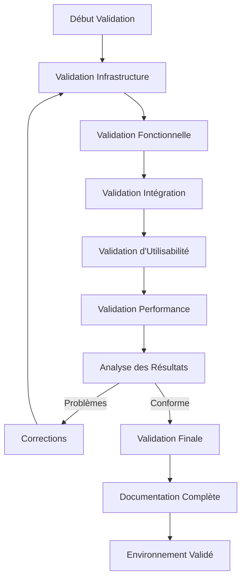

# Plan de Validation de l'Environnement de Développement SRR

## Documentation de Référence

- [DESIGN.md](/doc/DESIGN.md) : Architecture globale du système
- [plan_overview.md](./plan_overview.md) : Vue d'ensemble du plan
- [plan_08_testing.md](./plan_08_testing.md) : Stratégie de tests

## Objectifs

Ce module définit les critères, méthodes et scénarios pour valider l'environnement de développement du SRR une fois mis en place. Il vise à :

1. Confirmer que tous les composants fonctionnent correctement ensemble
2. Vérifier que les fonctionnalités essentielles sont opérationnelles
3. S'assurer que l'environnement est utilisable par les développeurs
4. Valider que l'architecture répond aux exigences techniques
5. Identifier les éventuelles corrections ou améliorations nécessaires

## Processus de Validation



## Méthodes de Validation

### 1. Checklists de Validation

Des listes de contrôle détaillées seront utilisées pour valider chaque composant de l'environnement. Ces listes couvriront :

- La présence et le bon fonctionnement de tous les composants requis
- La configuration correcte de chaque composant
- Les interactions entre les différents composants
- La disponibilité des outils et utilitaires nécessaires

### 2. Scénarios de Test

Des scénarios de test spécifiques seront exécutés pour valider les fonctionnalités clés de l'environnement de développement.

### 3. Revue Technique

Une revue technique approfondie sera effectuée pour s'assurer que l'implémentation est conforme à la conception définie dans les documents de référence.

### 4. Session de Développement Simulée

Une session de développement typique sera simulée pour évaluer l'expérience développeur et la productivité dans l'environnement.

## Critères de Validation par Composant

### 1. Infrastructure

#### 1.1 Docker et Services

| Critère | Méthode | Succès |
|---------|---------|--------|
| Docker est installé et fonctionnel | Exécuter `docker --version` | Affichage de la version |
| docker-compose est installé | Exécuter `docker-compose --version` | Affichage de la version |
| Images Docker construites correctement | Exécuter `docker images` | Images backend et frontend présentes |
| Démarrage des conteneurs | Exécuter `docker-compose up -d` | Tous les conteneurs démarrent sans erreur |
| Réseau Docker configuré | Vérifier `docker network ls` | Réseau SRR présent |
| Volumes persistants | Vérifier `docker volume ls` | Volumes PostgreSQL et Redis présents |

#### 1.2 Base de Données

| Critère | Méthode | Succès |
|---------|---------|--------|
| PostgreSQL accessible | Se connecter avec `psql` | Connexion établie |
| Tables créées | Requête SQL `\dt` | Les tables principales sont présentes |
| Migrations appliquées | Vérifier la table `alembic_version` | Version actuelle correcte |
| Données de test chargées | Requêtes SQL de comptage | Présence des données de base |
| Redis fonctionnel | Commande `redis-cli ping` | Réponse "PONG" |

### 2. Backend

#### 2.1 API Core

| Critère | Méthode | Succès |
|---------|---------|--------|
| Serveur FastAPI démarré | Accès `http://localhost:8000` | Page de bienvenue |
| Documentation Swagger disponible | Accès `http://localhost:8000/docs` | Interface Swagger fonctionnelle |
| Structure des endpoints conforme | Revue de la documentation OpenAPI | Endpoints conformes à API.md |
| Endpoints de santé | GET `/api/v1/health` | Réponse 200 OK |

#### 2.2 Module d'Authentification

| Critère | Méthode | Succès |
|---------|---------|--------|
| Création d'utilisateur | Utiliser le script de seed | Utilisateur créé en base |
| Login utilisateur | POST `/api/v1/auth/login` | JWT retourné |
| Validation token | Appel API avec token | Réponse 200 OK |
| Refresh token | POST `/api/v1/auth/refresh` | Nouveau token généré |
| Logout | POST `/api/v1/auth/logout` | Token invalidé |

#### 2.3 Services Mock

| Critère | Méthode | Succès |
|---------|---------|--------|
| Service Mock AD disponible | Requête au service | Réponse correcte |
| Authentification mock | Login avec utilisateur de test | Authentification réussie |
| Service Mock Exchange | Requête de disponibilité | Données de calendrier retournées |
| Simulation de notification | Test d'envoi | Notification capturée dans les logs |

### 3. Frontend

#### 3.1 Application React

| Critère | Méthode | Succès |
|---------|---------|--------|
| Application React chargée | Accès `http://localhost:3000` | Interface utilisateur affichée |
| Rendu des composants | Inspection visuelle | Composants rendus correctement |
| Intégration Material-UI | Inspection des styles | Design cohérent |
| Responsive design | Tester sur différentes tailles | Adaptation correcte |

#### 3.2 Intégration API

| Critère | Méthode | Succès |
|---------|---------|--------|
| API client configuré | Inspection du code | Configuration correcte |
| Appels API React Query | Utiliser le navigateur React | Hooks fonctionnels |
| Gestion des erreurs | Provoquer une erreur API | Message d'erreur approprié |
| Intercepteurs d'authentification | Expirer un token | Refresh automatique |

### 4. Workflows Fonctionnels

#### 4.1 Recherche et Réservation

| Critère | Méthode | Succès |
|---------|---------|--------|
| Recherche ressources | Tester la recherche de salle | Résultats affichés |
| Filtrage | Appliquer des filtres | Résultats filtrés correctement |
| Visualisation disponibilité | Afficher calendrier d'une ressource | Disponibilités affichées |
| Création réservation | Créer une réservation test | Réservation enregistrée en base |

#### 4.2 Gestion des Ressources

| Critère | Méthode | Succès |
|---------|---------|--------|
| Création ressource (admin) | Créer une ressource test | Ressource créée en base |
| Modification ressource | Modifier une ressource | Modifications persistantes |
| Désactivation ressource | Désactiver une ressource | Ressource marquée inactive |

## Scénarios de Validation Complets

### Scénario 1 : Cycle complet de réservation

1. **Utilisateur standard** :
   - Se connecte avec identifiants de test
   - Recherche des salles disponibles pour demain
   - Filtre par capacité (min 10 personnes)
   - Vérifie la disponibilité d'une salle
   - Réserve un créneau de 14h à 16h
   - Confirme la réservation
   - Vérifie la réservation dans son tableau de bord

2. **Administrateur** :
   - Se connecte avec identifiants admin
   - Consulte les réservations du jour
   - Vérifie les détails d'une réservation spécifique
   - Modifie le statut d'une réservation

### Scénario 2 : Gestion des ressources

1. **Administrateur** :
   - Crée un nouveau type de ressource "Matériel informatique"
   - Configure les propriétés spécifiques
   - Crée une ressource de ce type
   - Vérifie que la ressource est recherchable
   - Modifie ses caractéristiques
   - Désactive la ressource temporairement

2. **Utilisateur standard** :
   - Recherche de la ressource nouvellement créée
   - Vérifie que les filtres fonctionnent avec les nouvelles propriétés
   - Essaie de réserver la ressource désactivée (doit échouer)

### Scénario 3 : Session de développement simulée

1. **Développeur** :
   - Clone le dépôt Git
   - Démarre l'environnement Docker avec `docker-compose up -d`
   - Lance les migrations `alembic upgrade head`
   - Crée une nouvelle fonctionnalité (ex: trieur de ressources)
   - Exécute les tests unitaires
   - Soumet un commit et une PR
   - Vérifie les pipelines CI

## Outils de Validation

### 1. Scripts de Validation Automatisés

**Fichier**: `scripts/validate-env.sh`

Ce script exécutera automatiquement des vérifications de base sur l'environnement :

```bash
#!/bin/bash
set -e

echo "🔍 Validation de l'environnement SRR"
echo "-----------------------------------"

# Variables
BACKEND_URL="http://localhost:8000"
FRONTEND_URL="http://localhost:3000"

# Vérification des services
echo "📋 Vérification des services Docker"
docker ps --format "{{.Names}}: {{.Status}}" | grep "srr"

# Vérification de la base de données
echo "📋 Vérification de la base de données"
docker exec srr-postgres pg_isready -d srr -U postgres && echo "✅ PostgreSQL: OK" || echo "❌ PostgreSQL: Erreur"

# Vérification du backend
echo "📋 Vérification du backend FastAPI"
curl -s $BACKEND_URL/api/v1/health > /dev/null && echo "✅ Backend API: OK" || echo "❌ Backend API: Erreur"
curl -s $BACKEND_URL/docs > /dev/null && echo "✅ Swagger: OK" || echo "❌ Swagger: Erreur"

# Vérification du frontend
echo "📋 Vérification du frontend React"
curl -s $FRONTEND_URL > /dev/null && echo "✅ Frontend: OK" || echo "❌ Frontend: Erreur"

# Vérification des migrations
echo "📋 Vérification des migrations Alembic"
docker exec srr-backend alembic current

echo "-----------------------------------"
echo "✅ Validation terminée!"
```

### 2. Formulaire de Validation

Un formulaire de validation sera rempli par l'équipe lors de la mise en place de l'environnement :

**Fichier**: `scratchpad/srr_dev_environment_plan/validation_form.md`

```markdown
# Formulaire de Validation SRR

## Informations Générales
- Date de validation : _________________
- Version validée : _________________
- Validateur(s) : _________________

## Résultats de Validation

### Infrastructure
- [ ] Docker et conteneurs : ✅/❌
- [ ] Base de données : ✅/❌
- [ ] Networking : ✅/❌

### Backend
- [ ] API Core : ✅/❌
- [ ] Authentification : ✅/❌
- [ ] Services Mock : ✅/❌
- [ ] Migrations : ✅/❌

### Frontend
- [ ] Application React : ✅/❌
- [ ] Intégration API : ✅/❌
- [ ] Interface utilisateur : ✅/❌
- [ ] Responsive Design : ✅/❌

### CI/CD
- [ ] Tests automatisés : ✅/❌
- [ ] Build pipeline : ✅/❌
- [ ] Déploiement : ✅/❌

## Problèmes Identifiés
1. 
2.
3.

## Recommandations
1.
2.
3.

## Décision Finale
- [ ] Environnement validé sans réserve
- [ ] Environnement validé avec corrections mineures requises
- [ ] Environnement non validé, corrections majeures requises

## Signatures
_________________
```

## Critères de Validation Globaux

Pour que l'environnement soit considéré comme validé, il doit satisfaire les critères suivants :

1. **Complétude** : Tous les composants prévus sont présents et configurés
2. **Fonctionnalité** : Tous les workflows principaux fonctionnent correctement
3. **Stabilité** : L'environnement est stable et fonctionnel pendant au moins 24h
4. **Développement** : Il est possible de développer de nouvelles fonctionnalités
5. **Performance** : Les temps de réponse sont acceptables pour le développement
6. **Documentation** : La documentation est complète et à jour

## Plan d'Action Post-Validation

Après la validation initiale, un plan d'action sera établi pour :

1. Corriger les éventuels problèmes identifiés lors de la validation
2. Améliorer les aspects qui nécessitent une optimisation
3. Compléter la documentation avec les informations manquantes
4. Former les développeurs à l'utilisation de l'environnement
5. Établir un processus de maintenance continue

## Métriques de Validation

Pour quantifier le succès de la validation, les métriques suivantes seront utilisées :

| Métrique | Objectif | Méthode de mesure |
|----------|----------|-------------------|
| Taux de réussite des tests | > 95% | Rapport de test automatisé |
| Couverture de code | > 80% | Outils de mesure de couverture |
| Temps de démarrage de l'environnement | < 5 minutes | Chronomètre |
| Temps de réponse API | < 200ms | Tests de performance |
| Stabilité | Pas de plantage sur 24h | Monitoring continu |
| Feedback développeurs | Score > 4/5 | Enquête de satisfaction |

## Risques et Mitigations

| Risque | Impact | Probabilité | Mitigation |
|--------|--------|-------------|------------|
| Infrastructure incorrecte | Élevé | Faible | Tests d'infrastructure automatisés |
| Intégration défaillante | Élevé | Moyenne | Tests d'intégration complets |
| Performance insuffisante | Moyen | Moyenne | Tests de charge et optimisations |
| Problèmes environnement | Moyen | Élevée | Documentation détaillée, images Docker |
| Erreurs de configuration | Élevé | Moyenne | Configuration par code, validation |

## Conclusion

Ce plan de validation fournit un cadre complet pour assurer que l'environnement de développement SRR est correctement mis en place et prêt à être utilisé par les équipes de développement. Il garantit que tous les composants nécessaires sont présents, correctement configurés et fonctionnent ensemble de manière optimale.

La réussite de cette validation est une étape cruciale avant de commencer le développement des fonctionnalités métier du SRR, car elle permet de s'assurer que les développeurs disposent d'un environnement stable, performant et conforme aux exigences techniques.
