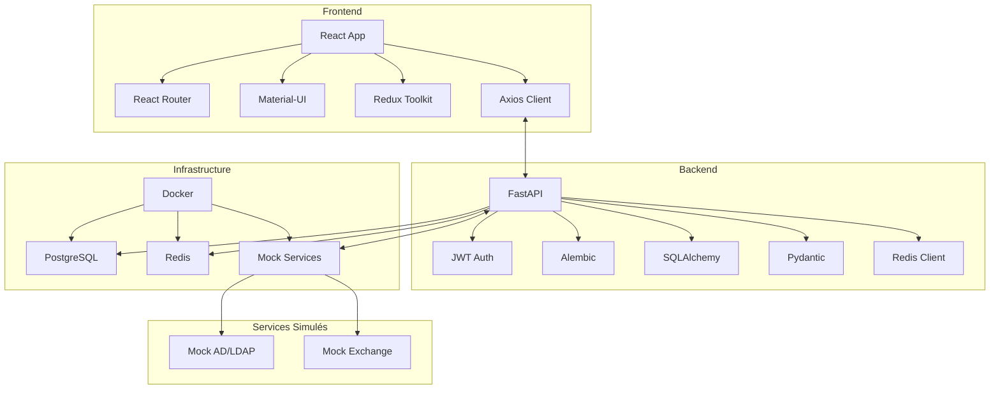
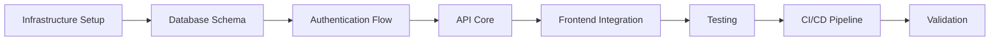

# Plan d'Implémentation pour un Environnement de Développement Minimaliste du SRR

## ⚠️ CRITICAL: CODING ASSISTANT MUST READ THESE DOCUMENTATION FILES COMPLETELY BEFORE EXECUTING ANY TASKS IN THIS PLAN
- [DESIGN.md](/doc/DESIGN.md) : Architecture globale du système
- [DATA_MODEL.md](/doc/DATA_MODEL.md) : Structure des données et relations
- [API.md](/doc/API.md) : Spécifications des interfaces de programmation
- [DESIGN_DECISIONS.md](/doc/DESIGN_DECISIONS.md) : Décisions récentes sur l'environnement de développement
- [DOCUMENT_RELATIONSHIPS.md](/doc/DOCUMENT_RELATIONSHIPS.md) : Relations entre les documents

## Objectif du Plan

Ce plan définit l'implémentation d'un **environnement de développement minimaliste** pour le Système de Réservation de Ressources (SRR). L'objectif est de mettre en place une infrastructure technique fonctionnelle permettant de **valider l'intégration des briques d'architecture** sans implémenter la logique métier complexe à ce stade.

## Principes Directeurs

1. **Minimalisme Fonctionnel** : Seules les fonctionnalités essentielles pour valider l'architecture seront implémentées
2. **Complétude Technique** : Toutes les briques d'architecture prévues seront présentes, même de façon simplifiée
3. **Isolation des Composants** : Chaque composant pourra être testé indépendamment
4. **Documentation Continue** : Tous les choix d'implémentation seront documentés
5. **Préparation pour l'Évolution** : L'architecture doit permettre l'ajout de la logique métier par la suite

## Architecture Technique Cible

## Composants du Plan

Le plan est structuré en modules indépendants mais interconnectés. Chaque module est détaillé dans un fichier séparé :

1. [Infrastructure](./plan_01_infrastructure.md) : Docker, réseau, persistance
2. [Backend Core](./plan_02_backend_core.md) : Structure FastAPI, configuration
3. [Database](./plan_03_database.md) : Schéma PostgreSQL minimal, migrations
4. [Mock Services](./plan_04_mock_services.md) : Simulation AD/LDAP et Exchange
5. [Frontend Core](./plan_05_frontend_core.md) : Structure React, thème, routing
6. [Authentication](./plan_06_authentication.md) : JWT, autorisation
7. [API Integration](./plan_07_api_integration.md) : Endpoints essentiels, client API
8. [Testing](./plan_08_testing.md) : Tests unitaires et d'intégration
9. [CI/CD](./plan_09_ci_cd.md) : Pipeline simple, déploiement dev
10. [Validation](./plan_10_validation.md) : Scénarios de test, critères de succès

## Cycle de Vie Simplifié

## Simplifications Acceptables vs Points Non-Négociables

### Simplifications Acceptables
- Un seul type de ressource (salles de réunion) sera implémenté
- Rôles utilisateur limités à deux types (utilisateur standard et administrateur)
- Pas de workflows de validation complexes
- Pas d'intégration réelle avec Exchange
- Interface utilisateur minimaliste mais utilisable

### Points Non-Négociables
- Architecture en couches complète et respectant DESIGN.md
- Sécurité de base (authentification, autorisation)
- Isolation claire entre les composants
- Tests automatisés pour les fonctionnalités de base
- Gestion des erreurs et exceptions
- Documentation technique complète

## Cas de Test Minimal pour Validation

Pour valider l'environnement, le système devra supporter un flux simple qui exercera tous les composants :

1. Un utilisateur s'authentifie
2. Il recherche une ressource disponible (salle de réunion)
3. Il effectue une réservation simple
4. Il visualise ses réservations

## Durée Estimée d'Implémentation

- Effort total estimé : **20 jours**
- Planning détaillé dans le fichier de progression : [plan_progress.md](./plan_progress.md)

## Prochaines étapes

Pour suivre l'avancement du projet, consulter régulièrement le fichier [plan_progress.md](./plan_progress.md) qui contient le statut à jour de chaque module et les prochaines étapes à réaliser.
